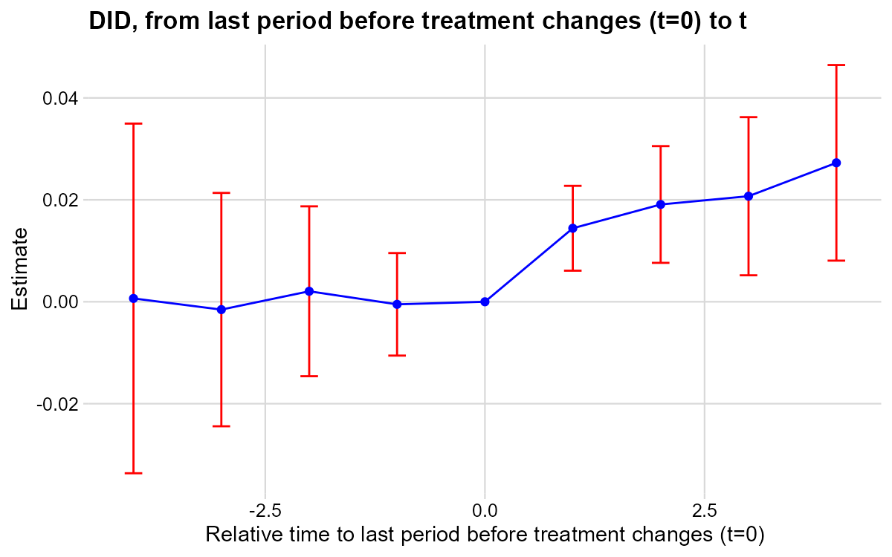
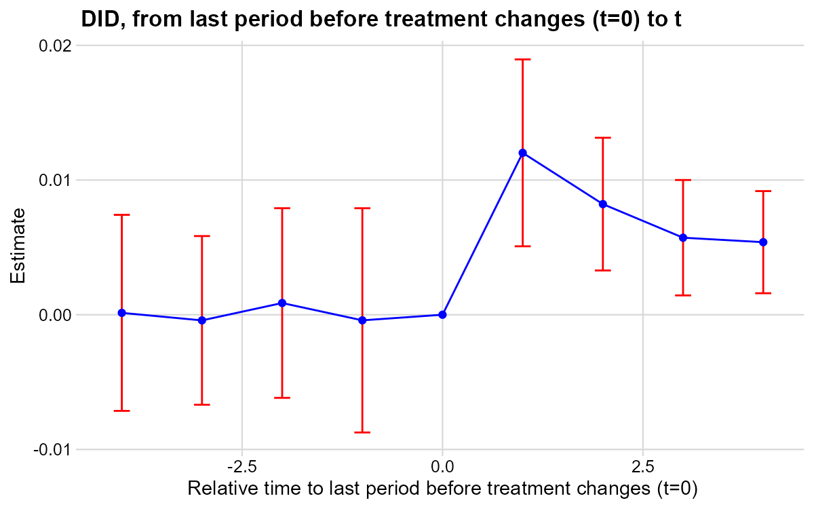

**Research Question:** What is the effect of daily newspapers on presidential voter turnout?

**Data:** Imbalanced panel of 1,195 US counties, presidential election years 1868–1928. Treatment `numdailies` is discrete multivalued and on-and-off. Outcome: `prestout` (voter turnout rate).

---

## T7: Verify Treatment Design

::: {.panel-tabset}

### Stata

```stata
* ssc install did_multiplegt_dyn, replace
copy "https://raw.githubusercontent.com/anzonyquispe/did_book/main/did_applied_book/data/gentzkowetal_didtextbook.dta" "gentzkowetal_didtextbook.dta", replace
use "gentzkowetal_didtextbook.dta", clear
xtset cnty90 year
bysort cnty90 (year): gen first_numdailies = numdailies[1]
tab first_numdailies
gen d_numdailies = .
bysort cnty90 (year): replace d_numdailies = numdailies - numdailies[_n-1]
tab d_numdailies
```

```
first_numda |
      ilies |      Freq.     Percent        Cum.
------------+-----------------------------------
          0 |     13,264       78.62       78.62
          1 |      1,113        6.60       85.21
          2 |      1,332        7.89       93.11
          3 |        523        3.10       96.21
          4 |        253        1.50       97.71
          5 |        185        1.10       98.80
          6 |        101        0.60       99.40
          7 |         21        0.12       99.53
          9 |         16        0.09       99.62
         11 |         16        0.09       99.72
         12 |         16        0.09       99.81
         16 |         16        0.09       99.91
         33 |         16        0.09      100.00
------------+-----------------------------------
      Total |     16,872      100.00

d_numdailie |
          s |      Freq.     Percent        Cum.
------------+-----------------------------------
         -9 |          1        0.01        0.01
         -6 |          1        0.01        0.01
         -4 |         11        0.07        0.08
         -3 |         25        0.16        0.24
         -2 |        187        1.19        1.44
         -1 |      1,618       10.32       11.76
          0 |     11,089       70.73       82.49
          1 |      2,226       14.20       96.69
          2 |        410        2.62       99.30
          3 |         76        0.48       99.79
          4 |         25        0.16       99.95
          5 |          5        0.03       99.98
          6 |          1        0.01       99.99
          8 |          2        0.01      100.00
------------+-----------------------------------
      Total |     15,677      100.00
```

`d_numdailies` takes both positive and negative values — confirming on-and-off treatment.

### R

```r
# install.packages(c("DIDmultiplegtDYN", "polars", "haven", "dplyr"))
library(haven)
library(dplyr)
library(DIDmultiplegtDYN)
library(polars)

load(url("https://raw.githubusercontent.com/anzonyquispe/did_book/main/did_applied_book/data/gentzkowetal_didtextbook.RData"))

df %>%
  group_by(cnty90) %>% arrange(year) %>%
  mutate(first_numdailies = first(numdailies)) %>%
  ungroup() %>%
  count(first_numdailies) %>% print(n = 20)

df %>%
  group_by(cnty90) %>% arrange(year) %>%
  mutate(d_numdailies = numdailies - lag(numdailies)) %>%
  ungroup() %>%
  count(d_numdailies) %>% print(n = 20)
```

```
# A tibble: 13 × 2
   first_numdailies     n
              <dbl> <int>
 1                0 13264
 2                1  1113
 3                2  1332
 4                3   523
 5                4   253
 6                5   185
 7                6   101
 8                7    21
 9                9    16
10               11    16
11               12    16
12               16    16
13               33    16

# A tibble: 15 × 2
   d_numdailies     n
          <dbl> <int>
 1           -9     1
 2           -6     1
 3           -4    11
 4           -3    25
 5           -2   187
 6           -1  1618
 7            0 11089
 8            1  2226
 9            2   410
10            3    76
11            4    25
12            5     5
13            6     1
14            8     2
15           NA  1195
```

`d_numdailies` takes both positive and negative values — confirming on-and-off treatment.

### Python

```python
# pip install did-multiplegt-dyn pandas pyarrow
import pandas as pd
from did_multiplegt_dyn import did_multiplegt_dyn

df = pd.read_parquet("https://raw.githubusercontent.com/anzonyquispe/did_book/main/did_applied_book/data/gentzkowetal_didtextbook.parquet")

df = df.sort_values(["cnty90","year"])
df["first_numdailies"] = df.groupby("cnty90")["numdailies"].transform("first")
df["d_numdailies"] = df.groupby("cnty90")["numdailies"].diff()

print(df["first_numdailies"].value_counts().sort_index())
print(df["d_numdailies"].value_counts().sort_index())
```

```
first_numdailies
0     13264
1      1113
2      1332
3       523
4       253
5       185
6       101
7        21
9        16
11       16
12       16
16       16
33       16
Name: count, dtype: int64

d_numdailies
-9.0        1
-6.0        1
-4.0       11
-3.0       25
-2.0      187
-1.0     1618
 0.0    11089
 1.0     2226
 2.0      410
 3.0       76
 4.0       25
 5.0        5
 6.0        1
 8.0        2
Name: count, dtype: int64
```

:::

---

## T8: Non-Normalized Event-Study Effects

::: {.panel-tabset}

### Stata

```stata
* ssc install did_multiplegt_dyn, replace
copy "https://raw.githubusercontent.com/anzonyquispe/did_book/main/did_applied_book/data/gentzkowetal_didtextbook.dta" "gentzkowetal_didtextbook.dta", replace
use "gentzkowetal_didtextbook.dta", clear

did_multiplegt_dyn prestout cnty90 year numdailies, effects(4) placebo(4) effects_equal("all")
```

```
--------------------------------------------------------------------------------
             Estimation of treatment effects: Event-study effects
--------------------------------------------------------------------------------

             |  Estimate         SE      LB CI      UB CI          N  Switchers
-------------+------------------------------------------------------------------
    Effect_1 |  .0144244   .0042477   .0060992   .0227497       5674       1119
    Effect_2 |  .0190899   .0058429   .0076381   .0305418       4648       1054
    Effect_3 |  .0207147   .0079164   .0051989   .0362305       3750        984
    Effect_4 |  .0272653   .0097924   .0080727    .046458       2980        917
--------------------------------------------------------------------------------
Test of joint nullity of the effects  : p-value = .00681389
Test of equality of the effects       : p-value = .41515197

  Av_tot_eff |  .0160565   .0047761   .0066956   .0254174       8659       4074
Average number of time periods over which a treatment's effect is accumulated = 2.4376

   Placebo_1 | -.0005025   .0051322  -.0105615   .0095565       4471        902
   Placebo_2 |  .0020594   .0085031  -.0146063   .0187251       2778        746
   Placebo_3 | -.0015365   .0116825  -.0244337   .0213607       1644        604
   Placebo_4 |  .0006573   .0175032  -.0336483   .0349628        910        441
--------------------------------------------------------------------------------
Test of joint nullity of the placebos : p-value = .99219793
```


### R

```r
# install.packages(c("DIDmultiplegtDYN", "polars"))
library(DIDmultiplegtDYN)
library(polars)

load(url("https://raw.githubusercontent.com/anzonyquispe/did_book/main/did_applied_book/data/gentzkowetal_didtextbook.RData"))

res_t8 <- did_multiplegt_dyn(
  df            = df,
  outcome       = "prestout",
  group         = "cnty90",
  time          = "year",
  treatment     = "numdailies",
  effects       = 4,
  placebo       = 4,
  effects_equal = "all"
)
print(res_t8)
res_t8$plot
```

```
----------------------------------------------------------------------
       Estimation of treatment effects: Event-study effects
----------------------------------------------------------------------
             Estimate SE      LB CI   UB CI   N     Switchers
Effect_1     0.01442  0.00425 0.00610 0.02275 5,674 1,119
Effect_2     0.01909  0.00584 0.00764 0.03054 4,648 1,054
Effect_3     0.02071  0.00792 0.00520 0.03623 3,750 984
Effect_4     0.02727  0.00979 0.00807 0.04646 2,980 917

Test of joint nullity of the effects : p-value = 0.0068
Test of equality of the effects : p-value = 0.4152

  Av_tot_eff |  0.01606  0.00478  0.00670  0.02542  8,659  4,074
Average number of time periods over which a treatment effect is accumulated: 2.4376

Placebo_1    -0.00050 0.00513 -0.01056  0.00956 4,418 902
Placebo_2     0.00206 0.00850 -0.01461  0.01873 2,764 746
Placebo_3    -0.00154 0.01168 -0.02443  0.02136 1,636 604
Placebo_4     0.00066 0.01750 -0.03365  0.03496   907 441

Test of joint nullity of the placebos : p-value = 0.9922
```



### Python

```python
# pip install py-did-multiplegt-dyn pandas pyarrow
import pandas as pd
import polars as pl
import matplotlib
matplotlib.use('Agg')
import matplotlib.pyplot as plt
from did_multiplegt_dyn import DidMultiplegtDyn

df = pd.read_parquet("https://raw.githubusercontent.com/anzonyquispe/did_book/main/did_applied_book/data/gentzkowetal_didtextbook.parquet")

res_t8 = DidMultiplegtDyn(
    df=pl.from_pandas(df), outcome="prestout", group="cnty90",
    time="year", treatment="numdailies",
    effects=4, placebo=4, effects_equal=True
)
res_t8.fit()
res_t8.summary()
res_t8.plot()
plt.savefig("ch09_fig5_newspapers_nonnorm_py.png", dpi=150, bbox_inches="tight")
plt.close()
```

```
----------------------------------------------------------------------
       Estimation of treatment effects: Event-study effects
----------------------------------------------------------------------
             Estimate  SE       LB CI    UB CI    N     Switchers
Effect_1     0.014424  0.004248 0.006099 0.022750 5674  1119
Effect_2     0.019090  0.005843 0.007638 0.030542 4648  1054
Effect_3     0.020715  0.007916 0.005199 0.036230 3750  984
Effect_4     0.027265  0.009792 0.008073 0.046458 2980  917

Test of joint nullity of the effects  : p-value = 0.006814
Test of equality of the effects       : p-value = 0.415152

  Av_tot_eff |  0.016056  0.004776  0.006696  0.025417  8659  4074
Average number of time periods over which a treatment's effect is accumulated = 2.4376

Placebo_1    -0.000503 0.005132 -0.010562  0.009557 4471 902
Placebo_2     0.002059 0.008503 -0.014606  0.018725 2778 746
Placebo_3    -0.001537 0.011683 -0.024434  0.021361 1644 604
Placebo_4     0.000657 0.017503 -0.033648  0.034963  910 441

Test of joint nullity of the placebos : p-value = 0.992198
```


:::

**Interpretation:** Being exposed to a weakly larger number of newspapers for one electoral cycle increases turnout by 1.4pp. Effects grow up to 2.7pp after four cycles. Pre-trends are jointly insignificant (p = 0.99).

---

## T9: Treatment Path Descriptions

::: {.panel-tabset}

### Stata

```stata
* ssc install did_multiplegt_dyn, replace
copy "https://raw.githubusercontent.com/anzonyquispe/did_book/main/did_applied_book/data/gentzkowetal_didtextbook.dta" "gentzkowetal_didtextbook.dta", replace
use "gentzkowetal_didtextbook.dta", clear

did_multiplegt_dyn prestout cnty90 year numdailies, effects(2) design(0.8, console)
```

```
--------------------------------------------------------------------------------
             Estimation of treatment effects: Event-study effects
--------------------------------------------------------------------------------

             |  Estimate         SE      LB CI      UB CI          N  Switchers
-------------+------------------------------------------------------------------
    Effect_1 |  .0144244   .0042477   .0060992   .0227497       5674       1119
    Effect_2 |  .0190899   .0058429   .0076381   .0305418       4648       1054
--------------------------------------------------------------------------------
Test of joint nullity of the effects : p-value = .00148173

  Av_tot_eff |   .014327    .003989   .0065087   .0221454       6754       2173
Average number of time periods over which a treatment's effect is accumulated = 1.5211379

--------------------------------------------------------------------------------
          Detection of treatment paths - 2 periods after first switch
--------------------------------------------------------------------------------

             |   #Groups    %Groups        ℓ=0        ℓ=1        ℓ=2
-------------+-------------------------------------------------------
  TreatPath1 |       343      32.15          0          1          1
  TreatPath2 |       187      17.53          0          1          0
  TreatPath3 |       131      12.28          0          1          2
  TreatPath4 |        57      5.342          0          2          2
  TreatPath5 |        47      4.405          0          2          1
  TreatPath6 |        33      3.093          1          2          2
  TreatPath7 |        30      2.812          0          1          3
  TreatPath8 |        22      2.062          2          3          2
  TreatPath9 |        20      1.874          2          1          1
--------------------------------------------------------------------------------
Treatment paths detected in at least 80.00% of the switching groups: Total % = 81.54%
```

### R

```r
# install.packages(c("DIDmultiplegtDYN", "polars"))
library(DIDmultiplegtDYN)
library(polars)

load(url("https://raw.githubusercontent.com/anzonyquispe/did_book/main/did_applied_book/data/gentzkowetal_didtextbook.RData"))

res_t9 <- did_multiplegt_dyn(
  df        = df,
  outcome   = "prestout",
  group     = "cnty90",
  time      = "year",
  treatment = "numdailies",
  effects   = 2,
  design    = list(0.8, "console")
)
print(res_t9)
```

```
----------------------------------------------------------------------
       Estimation of treatment effects: Event-study effects
----------------------------------------------------------------------
             Estimate SE      LB CI   UB CI   N     Switchers
Effect_1     0.01442  0.00425 0.00610 0.02275 5,674 1,119
Effect_2     0.01909  0.00584 0.00764 0.03054 4,648 1,054

Test of joint nullity of the effects : p-value = 0.0015

  Av_tot_eff |  0.01433  0.00399  0.00651  0.02215  6,754  2,173
Average number of time periods over which a treatment effect is accumulated: 1.5211

----------------------------------------------------------------------
    Detection of treatment paths - 2 periods after first switch
----------------------------------------------------------------------
           N   Share ℓ=0 ℓ=1 ℓ=2
TreatPath1 343 32.15 0   1   1
TreatPath2 187 17.53 0   1   0
TreatPath3 131 12.28 0   1   2
TreatPath4  57  5.34 0   2   2
TreatPath5  47  4.40 0   2   1
TreatPath6  33  3.09 1   2   2
TreatPath7  30  2.81 0   1   3
TreatPath8  22  2.06 2   3   2
TreatPath9  20  1.87 2   1   1

Treatment paths detected in at least 80.00% of the 1067 switching groups (Total % = 81.54%)
```

### Python

```python
# pip install py-did-multiplegt-dyn pandas pyarrow
import pandas as pd
import polars as pl
from did_multiplegt_dyn import DidMultiplegtDyn

df = pd.read_parquet("https://raw.githubusercontent.com/anzonyquispe/did_book/main/did_applied_book/data/gentzkowetal_didtextbook.parquet")

res_t9 = DidMultiplegtDyn(
    df=pl.from_pandas(df), outcome="prestout", group="cnty90",
    time="year", treatment="numdailies",
    effects=2, design=(0.8, "console")
)
res_t9.fit()
res_t9.summary()
```

```
================================================================================
  Detection of treatment paths - 2 periods after first switch
================================================================================
             #Groups    %Groups  l=0  l=1  l=2
TreatPath1       343  32.146204  0.0  1.0  1.0
TreatPath2       187  17.525773  0.0  1.0  0.0
TreatPath3       131  12.277413  0.0  1.0  2.0
TreatPath4        57   5.342081  0.0  2.0  2.0
TreatPath5        47   4.404873  0.0  2.0  1.0
TreatPath6        33   3.092784  1.0  2.0  2.0
TreatPath7        30   2.811621  0.0  1.0  3.0
TreatPath8        22   2.061856  2.0  3.0  2.0
TreatPath9        20   1.874414  2.0  1.0  1.0
TreatPath10       18   1.686973  2.0  3.0  3.0
================================================================================
Treatment paths detected in switching groups: 1067
Total % shown: 83.22%

================================================================================
             Estimation of treatment effects: Event-study effects
================================================================================
               Block  Estimate       SE     LB CI    UB CI      N  Switchers
            Effect_1  0.014424 0.004248  0.006099 0.022750 5674.0     1119.0
            Effect_2  0.019090 0.005843  0.007638 0.030542 4648.0     1054.0
Average_Total_Effect  0.014327 0.003989  0.006509 0.022145 6754.0     2173.0
           Placebo_1 -0.000502 0.005132 -0.010561 0.009557 4471.0      902.0
================================================================================
Test of joint nullity of the effects: p-value = 0.001482
```

:::

**Interpretation:** 32% of effects in Effect_2 come from counties that went from 0 to 1 newspaper and stayed. 17.5% come from counties that gained then lost a newspaper (on-and-off).

---

## T10: Normalized Event-Study Effects

::: {.panel-tabset}

### Stata

```stata
* ssc install did_multiplegt_dyn, replace
copy "https://raw.githubusercontent.com/anzonyquispe/did_book/main/did_applied_book/data/gentzkowetal_didtextbook.dta" "gentzkowetal_didtextbook.dta", replace
use "gentzkowetal_didtextbook.dta", clear

did_multiplegt_dyn prestout cnty90 year numdailies, effects(4) placebo(4) normalized normalized_weights effects_equal("all")
```

```
--------------------------------------------------------------------------------
             Estimation of treatment effects: Event-study effects
--------------------------------------------------------------------------------

             |  Estimate         SE      LB CI      UB CI          N  Switchers
-------------+------------------------------------------------------------------
    Effect_1 |  .0120186   .0035392   .0050819   .0189552       5674       1119
    Effect_2 |  .0082126   .0025136   .0032859   .0131392       4648       1054
    Effect_3 |  .0057192   .0021857   .0014354    .010003       3750        984
    Effect_4 |  .0053873   .0019348   .0015951   .0091795       2980        917
--------------------------------------------------------------------------------
Test of joint nullity of the effects  : p-value = .00681389
Test of equality of the effects       : p-value = .16525779

             |       ℓ=1        ℓ=2        ℓ=3        ℓ=4
         k=0 |    1.0000     0.4849     0.3549     0.2777
         k=1 |         .     0.5151     0.3131     0.2568
         k=2 |         .          .     0.3319     0.2271
         k=3 |         .          .          .     0.2383
       Total |    1.0000     1.0000     1.0000     1.0000
```


### R

```r
# install.packages(c("DIDmultiplegtDYN", "polars"))
library(DIDmultiplegtDYN)
library(polars)

load(url("https://raw.githubusercontent.com/anzonyquispe/did_book/main/did_applied_book/data/gentzkowetal_didtextbook.RData"))

res_t10 <- did_multiplegt_dyn(
  df                 = df,
  outcome            = "prestout",
  group              = "cnty90",
  time               = "year",
  treatment          = "numdailies",
  effects            = 4,
  placebo            = 4,
  normalized         = TRUE,
  normalized_weights = TRUE,
  effects_equal      = "all"
)
print(res_t10)
res_t10$plot
```

```
----------------------------------------------------------------------
       Estimation of treatment effects: Event-study effects
----------------------------------------------------------------------
             Estimate SE      LB CI   UB CI   N     Switchers
Effect_1     0.01202  0.00354 0.00508 0.01896 5,674 1,119
Effect_2     0.00821  0.00251 0.00329 0.01314 4,648 1,054
Effect_3     0.00572  0.00219 0.00144 0.01000 3,750 984
Effect_4     0.00539  0.00193 0.00160 0.00918 2,980 917

Test of joint nullity of the effects : p-value = 0.0068
Test of equality of the effects : p-value = 0.1653

  Av_tot_eff |  0.01606  0.00478  0.00670  0.02542  8,659  4,074

------------------------------------------------------------
             Weights on treatment lags
------------------------------------------------------------
      ℓ=1   ℓ=2   ℓ=3   ℓ=4
k=0   1.000 0.485 0.355 0.278
k=1   NA    0.515 0.313 0.257
k=2   NA    NA    0.332 0.227
k=3   NA    NA    NA    0.238
Total 1.000 1.000 1.000 1.000

Test of joint nullity of the placebos : p-value = 0.9922
```



### Python

```python
# pip install py-did-multiplegt-dyn pandas pyarrow
import pandas as pd
import polars as pl
import matplotlib
matplotlib.use('Agg')
import matplotlib.pyplot as plt
from did_multiplegt_dyn import DidMultiplegtDyn

df = pd.read_parquet("https://raw.githubusercontent.com/anzonyquispe/did_book/main/did_applied_book/data/gentzkowetal_didtextbook.parquet")

res_t10 = DidMultiplegtDyn(
    df=pl.from_pandas(df), outcome="prestout", group="cnty90",
    time="year", treatment="numdailies",
    effects=4, placebo=4, normalized=True, normalized_weights=True, effects_equal=True
)
res_t10.fit()
res_t10.summary()
res_t10.plot()
plt.savefig("ch09_fig6_newspapers_norm_py.png", dpi=150, bbox_inches="tight")
plt.close()
```

```
----------------------------------------------------------------------
       Estimation of treatment effects: Event-study effects
----------------------------------------------------------------------
             Estimate  SE       LB CI    UB CI    N     Switchers
Effect_1     0.012019  0.003539 0.005082 0.018955 5674  1119
Effect_2     0.008213  0.002514 0.003286 0.013139 4648  1054
Effect_3     0.005719  0.002186 0.001435 0.010003 3750  984
Effect_4     0.005387  0.001935 0.001595 0.009180 2980  917

Test of joint nullity of the effects  : p-value = 0.006814
Test of equality of the effects       : p-value = 0.165258

  Av_tot_eff |  0.016056  0.004776  0.006696  0.025417  8659  4074
```


:::

**Interpretation:** Normalized effects decrease with ℓ (from 0.012 to 0.005), suggesting lagged newspapers have smaller effects than contemporaneous newspapers. One cannot reject equality (p = 0.17).

---

## T11: Joint Test — No Lagged Treatment Effect + Constant Effects

::: {.panel-tabset}

### Stata

```stata
* ssc install did_multiplegt_dyn, replace
copy "https://raw.githubusercontent.com/anzonyquispe/did_book/main/did_applied_book/data/gentzkowetal_didtextbook.dta" "gentzkowetal_didtextbook.dta", replace
use "gentzkowetal_didtextbook.dta", clear

* first_change and same_treat_after_first_change are included in the dataset
did_multiplegt_dyn prestout cnty90 year numdailies if year <= first_change | same_treat_after_first_change == 1, effects(2) effects_equal("all") same_switchers
```

```
             |  Estimate         SE      LB CI      UB CI          N  Switchers
-------------+------------------------------------------------------------------
    Effect_1 |    .01525   .0058956   .0036949   .0268052       5019        512
    Effect_2 |  .0164091   .0073633   .0019773   .0308409       4101        512
--------------------------------------------------------------------------------
Test of joint nullity of the effects  : p-value = .02913029
Test of equality of the effects       : p-value = .83016668
```

### R

```r
# install.packages(c("DIDmultiplegtDYN", "polars"))
library(DIDmultiplegtDYN)
library(polars)

load(url("https://raw.githubusercontent.com/anzonyquispe/did_book/main/did_applied_book/data/gentzkowetal_didtextbook.RData"))

df_sub <- df[df$year <= df$first_change | df$same_treat_after_first_change == 1, ]

res_t11 <- did_multiplegt_dyn(
  df             = df_sub,
  outcome        = "prestout",
  group          = "cnty90",
  time           = "year",
  treatment      = "numdailies",
  effects        = 2,
  effects_equal  = "all",
  same_switchers = TRUE
)
print(res_t11)
res_t11$plot
```

```
             Estimate SE      LB CI   UB CI   N     Switchers
Effect_1     0.01525  0.00590 0.00369 0.02681 5,019 512
Effect_2     0.01641  0.00736 0.00198 0.03084 4,101 512

Test of joint nullity of the effects  : p-value = 0.0291303
Test of equality of the effects       : p-value = 0.8301667
```


### Python

```python
# pip install py-did-multiplegt-dyn pandas pyarrow
import pandas as pd
import polars as pl
import matplotlib
matplotlib.use('Agg')
import matplotlib.pyplot as plt
from did_multiplegt_dyn import DidMultiplegtDyn

df = pd.read_parquet("https://raw.githubusercontent.com/anzonyquispe/did_book/main/did_applied_book/data/gentzkowetal_didtextbook.parquet")

df_sub = df[(df["year"] <= df["first_change"]) |
            (df["same_treat_after_first_change"] == 1)].copy()

res_t11 = DidMultiplegtDyn(
    df=pl.from_pandas(df_sub), outcome="prestout", group="cnty90",
    time="year", treatment="numdailies",
    effects=2, effects_equal=True, same_switchers=True
)
res_t11.fit()
res_t11.summary()
res_t11.plot()
plt.savefig("ch09_fig_newspapers_sameswitchers_py.png", dpi=150, bbox_inches="tight")
plt.close()
```

```
             Estimate  SE       LB CI    UB CI    N     Switchers
Effect_1     0.015250  0.005896 0.003695 0.026805 5019  512
Effect_2     0.016409  0.007363 0.001977 0.030841 4101  512

Test of joint nullity of the effects  : p-value = 0.029130
Test of equality of the effects       : p-value = 0.830167
```


:::

**Interpretation:** With p = 0.83, we cannot reject that the two effects are equal, supporting the "no dynamic effects" hypothesis for this subsample.
