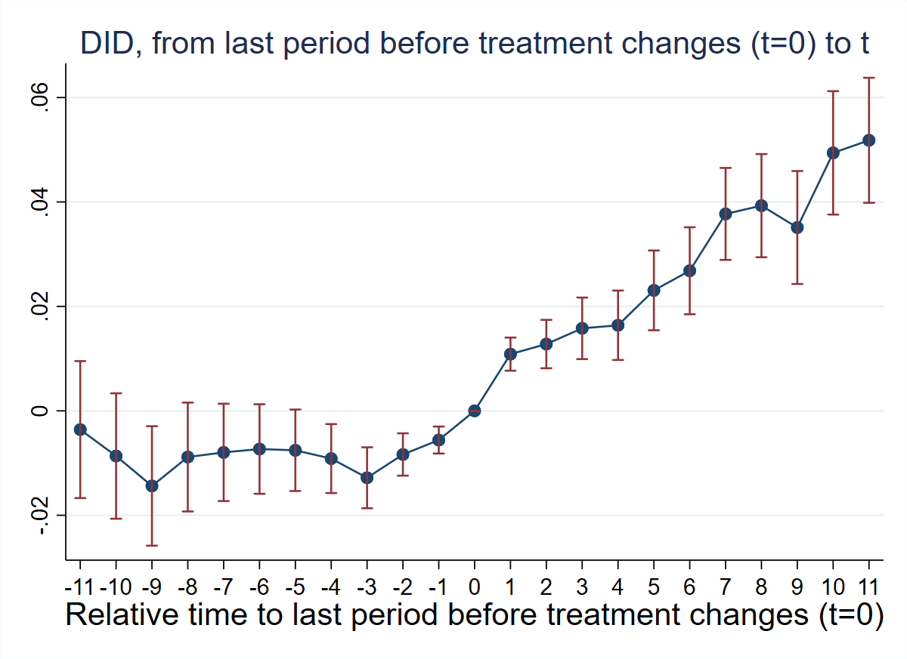
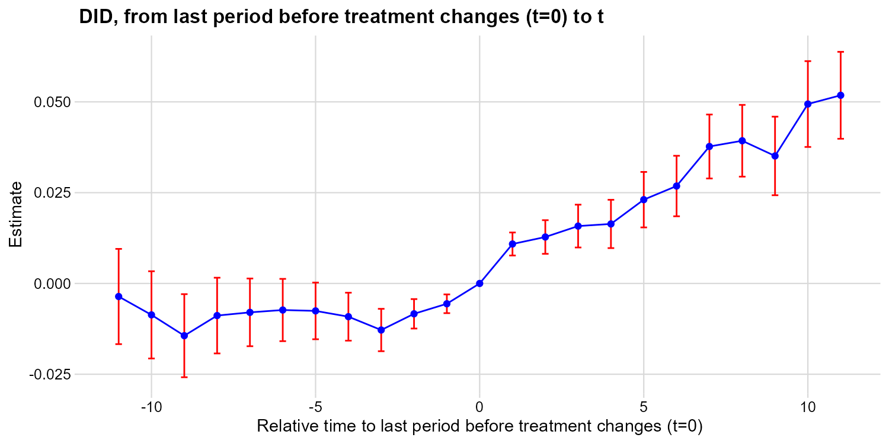
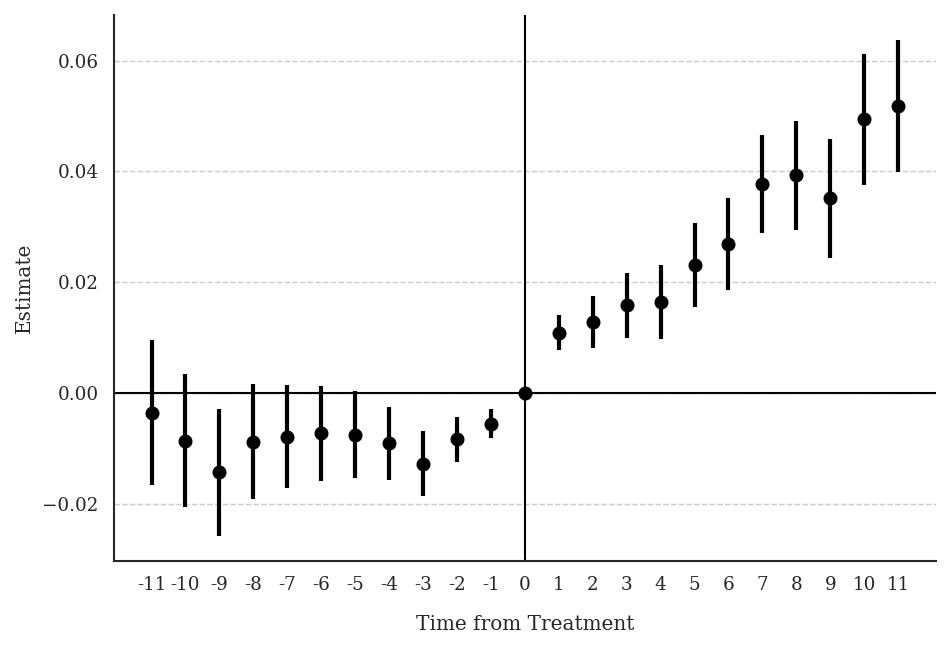
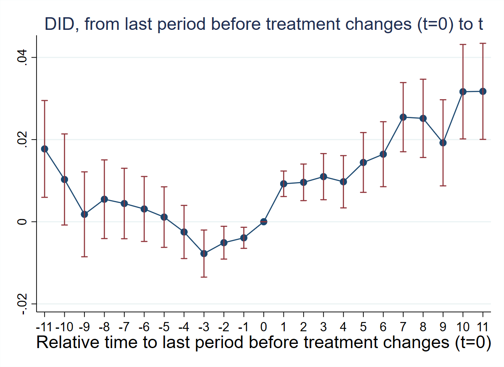
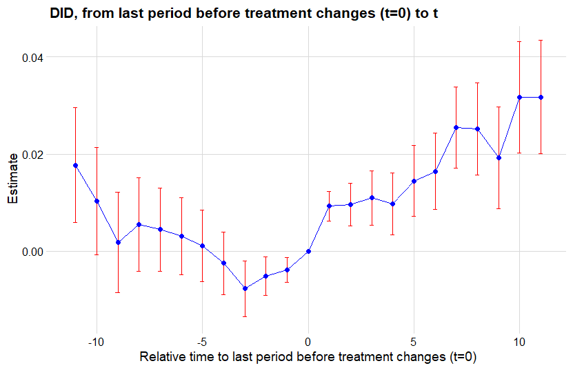
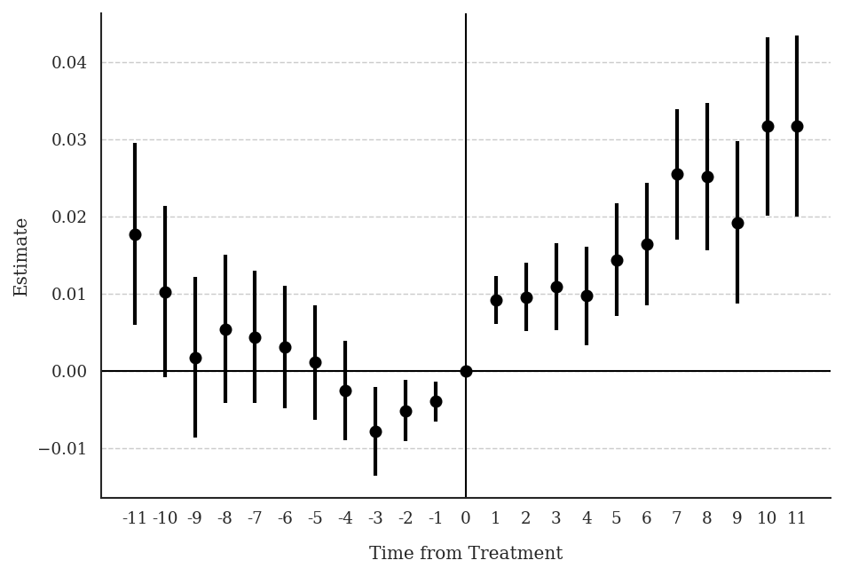

**Research Question:** How do hurricanes affect non-disaster government transfer programs in the United States?

**Data:** County-year panel. Treatment `hurricane` is binary and non-absorbing (counties are treated for at most one year — a "one-shot" design). Outcome: `log_curr_trans_ind_gov_pc` (log non-disaster government transfers per capita).

---

## T1: Verify One-Shot Design

::: {.panel-tabset}

### Stata

```stata
* ssc install did_multiplegt_dyn, replace
copy "https://raw.githubusercontent.com/anzonyquispe/did_book/main/did_applied_book/data/deryugina_2017.dta" "deryugina_2017.dta", replace
use "deryugina_2017.dta", clear
egen total_hurricane = total(hurricane), by(county_fips)
sum total_hurricane
```

```
    Variable |        Obs        Mean    Std. dev.       Min        Max
-------------+---------------------------------------------------------
total_hurr~e |     49,698    .3163709    .4650642          0          1
```

All counties have `total_hurricane` ∈ {0, 1} — confirming the one-shot design.

### R

```r
# install.packages(c("DIDmultiplegtDYN", "polars", "haven", "dplyr"))
library(haven)
library(dplyr)
library(DIDmultiplegtDYN)
library(polars)

load(url("https://raw.githubusercontent.com/anzonyquispe/did_book/main/did_applied_book/data/deryugina_2017.RData"))

df %>%
  group_by(county_fips) %>%
  summarise(total_hurricane = sum(hurricane, na.rm = TRUE)) %>%
  summarise(mean = mean(total_hurricane), sd = sd(total_hurricane),
            min = min(total_hurricane), max = max(total_hurricane))
```

```
# A tibble: 1 × 4
   mean    sd   min   max
  <dbl> <dbl> <dbl> <dbl>
1 0.316 0.465     0     1
```

All counties have `total_hurricane` ∈ {0, 1} — confirming the one-shot design.

### Python

```python
# pip install py-did-multiplegt-dyn pandas pyarrow
import pandas as pd
import polars as pl
from did_multiplegt_dyn import DidMultiplegtDyn

df = pd.read_parquet("https://raw.githubusercontent.com/anzonyquispe/did_book/main/did_applied_book/data/deryugina_2017.parquet")

total = df.groupby("county_fips")["hurricane"].sum().reset_index(name="total_hurricane")
print(total["total_hurricane"].describe())
```

```
count    4518.000000
mean        0.316371
std         0.465064
min         0.000000
max         1.000000
```

All counties have `total_hurricane` ∈ {0, 1} — confirming the one-shot design.

:::

---

## T2: Non-Normalized Event-Study Effects (No Controls)

::: {.panel-tabset}

### Stata

```stata
* ssc install did_multiplegt_dyn, replace
copy "https://raw.githubusercontent.com/anzonyquispe/did_book/main/did_applied_book/data/deryugina_2017.dta" "deryugina_2017.dta", replace
use "deryugina_2017.dta", clear

did_multiplegt_dyn log_curr_trans_ind_gov_pc county_fips year hurricane, effects(11) placebo(11) cluster(county_fips)
```

```
--------------------------------------------------------------------------------
             Estimation of treatment effects: Event-study effects
--------------------------------------------------------------------------------

             |  Estimate         SE      LB CI      UB CI          N  Switchers
-------------+------------------------------------------------------------------
    Effect_1 |  .0108629    .001617   .0076937   .0140321      14240        361
    Effect_2 |  .0127918   .0023651   .0081563   .0174273      13953        361
    Effect_3 |  .0158005   .0030075   .0099059    .021695      13766        361
    Effect_4 |  .0163886    .003393   .0097385   .0230388      13620        361
    Effect_5 |  .0230699   .0038968   .0154322   .0307076      13462        361
    Effect_6 |  .0268285   .0042508   .0184972   .0351598      13253        361
    Effect_7 |  .0377147   .0044926   .0289095     .04652      13038        361
    Effect_8 |  .0392922   .0050394   .0294151   .0491694      12929        361
    Effect_9 |   .035109   .0055185   .0242929   .0459251      12840        361
   Effect_10 |  .0494016    .006029   .0375849   .0612182      12741        361
   Effect_11 |  .0518123   .0061055   .0398457   .0637788      12619        361
--------------------------------------------------------------------------------
Test of joint nullity of the effects : p-value = 0

  Av_tot_eff |  .3190721   .0406001   .2394973   .3986468      31470       3971
Average number of time periods over which a treatment's effect is accumulated = 11

   Placebo_1 | -.0055903   .0013173   -.008172  -.0030085      14154        361
   Placebo_2 | -.0083554   .0020689  -.0124104  -.0043003      13826        361
   Placebo_3 | -.0128183    .002977  -.0186532  -.0069834      13567        361
   Placebo_4 |  -.009143   .0033686  -.0157454  -.0025406      13302        361
   Placebo_5 | -.0075546   .0039816  -.0153585   .0002493      13005        361
   Placebo_6 | -.0073115   .0043748   -.015886    .001263      12682        361
   Placebo_7 | -.0079583   .0047566  -.0172812   .0013645      12431        361
   Placebo_8 |  -.008841   .0053184  -.0192648   .0015829      12214        361
   Placebo_9 | -.0143816   .0058363  -.0258204  -.0029427      11829        361
  Placebo_10 | -.0086498   .0061281  -.0206606   .0033611      10807        299
  Placebo_11 | -.0035924   .0066904  -.0167053   .0095206      10012        282
--------------------------------------------------------------------------------
Test of joint nullity of the placebos : p-value = 1.517e-06
```



### R

```r
# install.packages(c("DIDmultiplegtDYN", "polars", "ggplot2"))
library(DIDmultiplegtDYN)
library(polars)
library(ggplot2)

load(url("https://raw.githubusercontent.com/anzonyquispe/did_book/main/did_applied_book/data/deryugina_2017.RData"))

res_t2 <- did_multiplegt_dyn(
  df        = df,
  outcome   = "log_curr_trans_ind_gov_pc",
  group     = "county_fips",
  time      = "year",
  treatment = "hurricane",
  effects   = 11,
  placebo   = 11,
  cluster   = "county_fips"
)
print(res_t2)
res_t2$plot
```

```
----------------------------------------------------------------------
       Estimation of treatment effects: Event-study effects
----------------------------------------------------------------------
             Estimate SE      LB CI    UB CI    N      Switchers
Effect_1     0.01086  0.00162 0.00769  0.01403  14,240 361
Effect_2     0.01279  0.00237 0.00816  0.01743  13,953 361
Effect_3     0.01580  0.00301 0.00991  0.02170  13,766 361
Effect_4     0.01639  0.00339 0.00974  0.02304  13,620 361
Effect_5     0.02307  0.00390 0.01543  0.03071  13,462 361
Effect_6     0.02683  0.00425 0.01850  0.03516  13,253 361
Effect_7     0.03771  0.00449 0.02891  0.04652  13,038 361
Effect_8     0.03929  0.00504 0.02942  0.04917  12,929 361
Effect_9     0.03511  0.00552 0.02429  0.04593  12,840 361
Effect_10    0.04940  0.00603 0.03758  0.06122  12,741 361
Effect_11    0.05181  0.00611 0.03985  0.06378  12,619 361

Test of joint nullity of the effects  : p-value = 0.0000000

  Av_tot_eff |  0.31907  0.04060  0.23950  0.39865  31,470  3,971
Average number of time periods over which a treatment effect is accumulated: 11

Placebo_1    -0.00559 0.00132 -0.00817 -0.00301 14,154 361
Placebo_2    -0.00836 0.00207 -0.01241 -0.00430 13,826 361
Placebo_3    -0.01282 0.00298 -0.01865 -0.00698 13,567 361
Placebo_4    -0.00914 0.00337 -0.01575 -0.00254 13,302 361
Placebo_5    -0.00755 0.00398 -0.01536  0.00025 13,005 361
Placebo_6    -0.00731 0.00437 -0.01589  0.00126 12,682 361
Placebo_7    -0.00796 0.00476 -0.01728  0.00136 12,431 361
Placebo_8    -0.00884 0.00532 -0.01926  0.00158 12,214 361
Placebo_9    -0.01438 0.00584 -0.02582 -0.00294 11,829 361
Placebo_10   -0.00865 0.00613 -0.02066  0.00336 10,807 299
Placebo_11   -0.00359 0.00669 -0.01671  0.00952 10,012 282

Test of joint nullity of the placebos : p-value = 0.0000015
```



### Python

```python
# pip install py-did-multiplegt-dyn pandas pyarrow
import pandas as pd
import polars as pl
import matplotlib
matplotlib.use('Agg')
import matplotlib.pyplot as plt
from did_multiplegt_dyn import DidMultiplegtDyn

df = pd.read_parquet("https://raw.githubusercontent.com/anzonyquispe/did_book/main/did_applied_book/data/deryugina_2017.parquet")

res_t2 = DidMultiplegtDyn(
    df=pl.from_pandas(df),
    outcome="log_curr_trans_ind_gov_pc", group="county_fips",
    time="year", treatment="hurricane",
    effects=11, placebo=11, cluster="county_fips"
)
res_t2.fit()
res_t2.summary()
res_t2.plot()
plt.savefig("ch09_fig1_hurricane_nocontrols_py.png", dpi=150, bbox_inches="tight")
plt.close()
```

```
================================================================================
             Estimation of treatment effects: Event-study effects
================================================================================
               Block  Estimate       SE     LB CI     UB CI       N  Switchers
            Effect_1  0.010863 0.001617  0.007694  0.014032 14240.0      361.0
            Effect_2  0.012792 0.002365  0.008156  0.017427 13953.0      361.0
            Effect_3  0.015800 0.003007  0.009906  0.021695 13766.0      361.0
            Effect_4  0.016389 0.003393  0.009739  0.023039 13620.0      361.0
            Effect_5  0.023070 0.003897  0.015432  0.030708 13462.0      361.0
            Effect_6  0.026829 0.004251  0.018497  0.035160 13253.0      361.0
            Effect_7  0.037715 0.004493  0.028909  0.046520 13038.0      361.0
            Effect_8  0.039292 0.005039  0.029415  0.049169 12929.0      361.0
            Effect_9  0.035109 0.005519  0.024293  0.045925 12840.0      361.0
           Effect_10  0.049402 0.006029  0.037585  0.061218 12741.0      361.0
           Effect_11  0.051812 0.006105  0.039846  0.063779 12619.0      361.0
Average_Total_Effect  0.319072 0.040600  0.239497  0.398647 31470.0     3971.0
           Placebo_1 -0.005590 0.001317 -0.008172 -0.003008 14154.0      361.0
           Placebo_2 -0.008355 0.002069 -0.012410 -0.004300 13826.0      361.0
           Placebo_3 -0.012818 0.002977 -0.018653 -0.006983 13567.0      361.0
           Placebo_4 -0.009143 0.003369 -0.015745 -0.002541 13302.0      361.0
           Placebo_5 -0.007555 0.003982 -0.015359  0.000249 13005.0      361.0
           Placebo_6 -0.007312 0.004375 -0.015886  0.001263 12682.0      361.0
           Placebo_7 -0.007958 0.004757 -0.017281  0.001365 12431.0      361.0
           Placebo_8 -0.008841 0.005318 -0.019265  0.001583 12214.0      361.0
           Placebo_9 -0.014382 0.005836 -0.025820 -0.002943 11829.0      361.0
          Placebo_10 -0.008650 0.006128 -0.020661  0.003361 10807.0      299.0
          Placebo_11 -0.003592 0.006690 -0.016705  0.009521 10012.0      282.0
================================================================================
Test of joint nullity of the effects: p-value = 0.000000
Test of joint nullity of the placebos: p-value = 0.000002
```



:::

**Interpretation:** Effects are positive and increasing — hurricanes raise non-disaster transfers by ~1% in the short run and ~5% in the long run. The pre-trend test is highly significant (p ≈ 1.5e-06), suggesting a differential trend starting ~4 periods before treatment. The parallel-trends assumption is likely violated without controls.

---

## T3: Non-Normalized Event-Study Effects (With County-Level Controls)

::: {.panel-tabset}

### Stata

```stata
* ssc install did_multiplegt_dyn, replace
copy "https://raw.githubusercontent.com/anzonyquispe/did_book/main/did_applied_book/data/deryugina_2017.dta" "deryugina_2017.dta", replace
use "deryugina_2017.dta", clear

local vars coastal land_area1970 log_pop1969 frac_young1969 frac_old1969 ///
           frac_black1969 log_wage_pc1969 emp_rate1969
local controls
foreach v of local vars {
    gen `v'_year = `v' * year
    local controls `controls' `v'_year
}

did_multiplegt_dyn log_curr_trans_ind_gov_pc county_fips year hurricane, effects(11) placebo(11) cluster(county_fips) controls(`controls')
```

```
--------------------------------------------------------------------------------
             Estimation of treatment effects: Event-study effects
--------------------------------------------------------------------------------

             |  Estimate         SE      LB CI      UB CI          N  Switchers
-------------+------------------------------------------------------------------
    Effect_1 |  .0092419   .0015835   .0061383   .0123456      14077        361
    Effect_2 |  .0095925   .0022712   .0051409   .0140441      13794        361
    Effect_3 |  .0109771   .0028662   .0053594   .0165948      13609        361
    Effect_4 |  .0097365   .0032466   .0033733   .0160998      13464        361
    Effect_5 |  .0144296   .0037154   .0071476   .0217116      13305        361
    Effect_6 |  .0164425   .0040354   .0085333   .0243517      13097        361
    Effect_7 |  .0254598   .0042959   .0170399   .0338797      12884        361
    Effect_8 |  .0251647   .0048611   .0156371   .0346923      12775        361
    Effect_9 |  .0192179   .0053476   .0087368   .0296989      12685        361
   Effect_10 |   .031657   .0058645   .0201628   .0431512      12587        361
   Effect_11 |  .0317402   .0059652   .0200487   .0434317      12465        361
--------------------------------------------------------------------------------
Test of joint nullity of the effects : p-value = 0

  Av_tot_eff |  .2036597    .038535   .1281326   .2791869      31123       3971

   Placebo_1 | -.0039173   .0013091   -.006483  -.0013515      14000        361
   Placebo_2 | -.0051001   .0020352   -.009089  -.0011111      13679        361
   Placebo_3 | -.0077511   .0029252  -.0134844  -.0020179      13430        361
   Placebo_4 | -.0024941    .003301  -.0089639   .0039757      13181        361
   Placebo_5 |  .0011302     .00376  -.0062391   .0084996      12893        361
   Placebo_6 |   .003105   .0040325  -.0047987   .0110086      12577        361
   Placebo_7 |   .004438   .0043775  -.0041417   .0130177      12337        361
   Placebo_8 |  .0054782   .0048862  -.0040986   .0150551      12126        361
   Placebo_9 |  .0018036   .0052736  -.0085325   .0121397      11749        361
  Placebo_10 |  .0102888   .0056563  -.0007973   .0213749      10734        299
  Placebo_11 |  .0177286   .0060115   .0059462    .029511       9948        282
--------------------------------------------------------------------------------
Test of joint nullity of the placebos : p-value = 3.280e-07
```



### R

```r
# install.packages(c("DIDmultiplegtDYN", "polars", "ggplot2"))
library(DIDmultiplegtDYN)
library(polars)
library(ggplot2)

load(url("https://raw.githubusercontent.com/anzonyquispe/did_book/main/did_applied_book/data/deryugina_2017.RData"))

vars <- c("coastal", "land_area1970", "log_pop1969", "frac_young1969",
          "frac_old1969", "frac_black1969", "log_wage_pc1969", "emp_rate1969")
for (v in vars) df[[paste0(v, "_year")]] <- df[[v]] * df$year
controls_list <- paste0(vars, "_year")

res_t3 <- did_multiplegt_dyn(
  df        = df,
  outcome   = "log_curr_trans_ind_gov_pc",
  group     = "county_fips",
  time      = "year",
  treatment = "hurricane",
  effects   = 11,
  placebo   = 11,
  cluster   = "county_fips",
  controls  = controls_list
)
print(res_t3)
res_t3$plot
```

```
----------------------------------------------------------------------
       Estimation of treatment effects: Event-study effects
----------------------------------------------------------------------
             Estimate SE      LB CI    UB CI    N      Switchers
Effect_1     0.00924  0.00158 0.00614  0.01235  14,077 361
Effect_2     0.00959  0.00227 0.00514  0.01404  13,794 361
Effect_3     0.01098  0.00287 0.00536  0.01659  13,609 361
Effect_4     0.00974  0.00325 0.00337  0.01610  13,464 361
Effect_5     0.01443  0.00372 0.00715  0.02171  13,305 361
Effect_6     0.01644  0.00404 0.00853  0.02435  13,097 361
Effect_7     0.02546  0.00430 0.01704  0.03388  12,884 361
Effect_8     0.02516  0.00486 0.01564  0.03469  12,775 361
Effect_9     0.01922  0.00535 0.00874  0.02970  12,685 361
Effect_10    0.03166  0.00586 0.02016  0.04315  12,587 361
Effect_11    0.03174  0.00597 0.02005  0.04343  12,465 361

Test of joint nullity of the effects  : p-value = 0.0000000

  Av_tot_eff |  0.26585  0.04123  0.18504  0.34666  31,123  3,971

Placebo_1    -0.00392 0.00131 -0.00648 -0.00135 14,000 361
Placebo_2    -0.00510 0.00204 -0.00909 -0.00111 13,679 361
Placebo_3    -0.00775 0.00293 -0.01348 -0.00202 13,430 361
Placebo_4    -0.00249 0.00330 -0.00896  0.00398 13,181 361
Placebo_5     0.00113 0.00376 -0.00624  0.00850 12,893 361
Placebo_6     0.00311 0.00403 -0.00480  0.01101 12,577 361
Placebo_7     0.00444 0.00438 -0.00414  0.01302 12,337 361
Placebo_8     0.00548 0.00489 -0.00410  0.01506 12,126 361
Placebo_9     0.00180 0.00527 -0.00853  0.01214 11,749 361
Placebo_10    0.01029 0.00566 -0.00080  0.02137 10,734 299
Placebo_11    0.01773 0.00601  0.00595  0.02951  9,948 282

Test of joint nullity of the placebos : p-value = 0.0000003
```



### Python

```python
# pip install py-did-multiplegt-dyn pandas pyarrow
import pandas as pd
import polars as pl
import matplotlib
matplotlib.use('Agg')
import matplotlib.pyplot as plt
from did_multiplegt_dyn import DidMultiplegtDyn

df = pd.read_parquet("https://raw.githubusercontent.com/anzonyquispe/did_book/main/did_applied_book/data/deryugina_2017.parquet")

vars_list = ["coastal", "land_area1970", "log_pop1969", "frac_young1969",
             "frac_old1969", "frac_black1969", "log_wage_pc1969", "emp_rate1969"]
for v in vars_list:
    df[f"{v}_year"] = df[v] * df["year"]
controls_list = [f"{v}_year" for v in vars_list]

res_t3 = DidMultiplegtDyn(
    df=pl.from_pandas(df),
    outcome="log_curr_trans_ind_gov_pc", group="county_fips",
    time="year", treatment="hurricane",
    effects=11, placebo=11, cluster="county_fips",
    controls=controls_list
)
res_t3.fit()
res_t3.summary()
res_t3.plot()
plt.savefig("ch09_fig2_hurricane_controls_py.png", dpi=150, bbox_inches="tight")
plt.close()
```

```
================================================================================
             Estimation of treatment effects: Event-study effects
================================================================================
               Block  Estimate       SE     LB CI     UB CI       N  Switchers
            Effect_1  0.009242 0.001584  0.006138  0.012346 14077.0      361.0
            Effect_2  0.009593 0.002271  0.005141  0.014044 13794.0      361.0
            Effect_3  0.010977 0.002866  0.005360  0.016595 13609.0      361.0
            Effect_4  0.009737 0.003247  0.003374  0.016100 13464.0      361.0
            Effect_5  0.014430 0.003715  0.007148  0.021712 13305.0      361.0
            Effect_6  0.016443 0.004035  0.008534  0.024352 13097.0      361.0
            Effect_7  0.025460 0.004296  0.017040  0.033880 12884.0      361.0
            Effect_8  0.025165 0.004861  0.015638  0.034693 12775.0      361.0
            Effect_9  0.019219 0.005348  0.008738  0.029699 12685.0      361.0
           Effect_10  0.031658 0.005864  0.020163  0.043152 12587.0      361.0
           Effect_11  0.031741 0.005965  0.020050  0.043433 12465.0      361.0
Average_Total_Effect  0.203664 0.038535  0.128137  0.279191 31123.0     3971.0
           Placebo_1 -0.003917 0.001309 -0.006483 -0.001352 14000.0      361.0
           Placebo_2 -0.005100 0.002035 -0.009089 -0.001111 13679.0      361.0
           Placebo_3 -0.007752 0.002925 -0.013485 -0.002018 13430.0      361.0
           Placebo_4 -0.002494 0.003301 -0.008964  0.003975 13181.0      361.0
           Placebo_5  0.001130 0.003760 -0.006240  0.008499 12893.0      361.0
           Placebo_6  0.003104 0.004033 -0.004799  0.011008 12577.0      361.0
           Placebo_7  0.004437 0.004377 -0.004142  0.013017 12337.0      361.0
           Placebo_8  0.005478 0.004886 -0.004099  0.015054 12126.0      361.0
           Placebo_9  0.001803 0.005274 -0.008533  0.012139 11749.0      361.0
          Placebo_10  0.010288 0.005656 -0.000798  0.021374 10734.0      299.0
          Placebo_11  0.017728 0.006011  0.005946  0.029510  9948.0      282.0
================================================================================
Test of joint nullity of the effects: p-value = 0.000000
Test of joint nullity of the placebos: p-value = 0.000000
```



:::

**Interpretation:** After including controls, effects remain positive and significant (Av_tot_eff ≈ 0.204 vs. 0.319 without controls). Pre-trends improve but the joint test remains significant (p ≈ 3.3e-07), suggesting a persistent differential trend even after conditioning on covariates.
