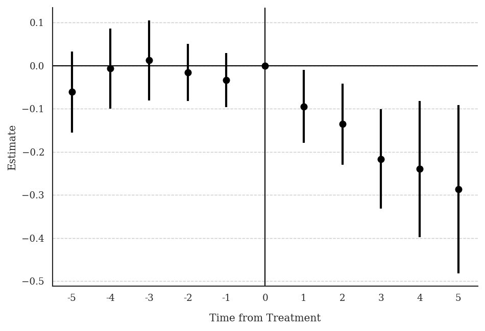
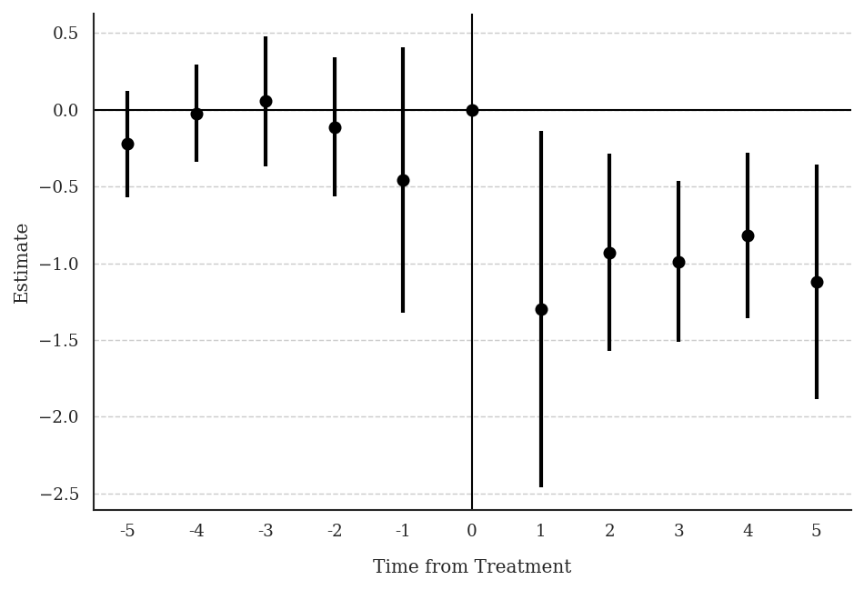

**Research Question:** How does prenatal Medicaid expansion affect the share of low-birth-weight (LBW) infants?

**Data:** State-year panel. Treatment `newsimeli` is the simulated prenatal Medicaid eligibility rate — continuous and absorbing. Outcome: `lbw_detrend81` (% LBW infants, net of state-specific pre-treatment linear trend).

---

## T4: Verify Continuous Treatment in Period 1

::: {.panel-tabset}

### Stata

```stata
* ssc install did_multiplegt_dyn, replace
copy "https://raw.githubusercontent.com/anzonyquispe/did_book/main/did_applied_book/data/east_et_al_2023.dta" "east_et_al_2023.dta", replace
use "east_et_al_2023.dta", clear
tab newsimeli if dob_y_p == 1975
```

```
  newsimeli |      Freq.     Percent        Cum.
------------+-----------------------------------
   .0427696 |          1        2.00        2.00
   .0435282 |          1        2.00        4.00
   .0538973 |          1        2.00        6.00
   .0552416 |          1        2.00        8.00
   .0580446 |          1        2.00       10.00
   .0590862 |          1        2.00       12.00
   .0598038 |          1        2.00       14.00
    .065449 |          1        2.00       16.00
   .0698274 |          1        2.00       18.00
   .0710992 |          1        2.00       20.00
   .0711747 |          1        2.00       22.00
   .0725171 |          1        2.00       24.00
   .0756276 |          1        2.00       26.00
   .0775356 |          1        2.00       28.00
   .0826772 |          1        2.00       30.00
    .083517 |          1        2.00       32.00
   .0871058 |          1        2.00       34.00
   .0888268 |          1        2.00       36.00
   .0929196 |          1        2.00       38.00
   .0931799 |          1        2.00       40.00
   .1006551 |          1        2.00       42.00
   .1007792 |          1        2.00       44.00
   .1015849 |          1        2.00       46.00
   .1038133 |          1        2.00       48.00
   .1041829 |          1        2.00       50.00
   .1087641 |          1        2.00       52.00
   .1092862 |          1        2.00       54.00
   .1114295 |          1        2.00       56.00
   .1138055 |          1        2.00       58.00
   .1214893 |          1        2.00       60.00
   .1217976 |          1        2.00       62.00
   .1221933 |          1        2.00       64.00
   .1243087 |          1        2.00       66.00
   .1318409 |          1        2.00       68.00
   .1325508 |          1        2.00       70.00
   .1402154 |          1        2.00       72.00
   .1486803 |          1        2.00       74.00
   .1520717 |          1        2.00       76.00
    .154815 |          1        2.00       78.00
    .169334 |          1        2.00       80.00
   .1700918 |          1        2.00       82.00
   .1719924 |          1        2.00       84.00
   .1795388 |          1        2.00       86.00
   .1812458 |          1        2.00       88.00
    .185354 |          1        2.00       90.00
   .1957995 |          1        2.00       92.00
    .198558 |          1        2.00       94.00
   .2038389 |          1        2.00       96.00
   .2061362 |          1        2.00       98.00
   .2127634 |          1        2.00      100.00
------------+-----------------------------------
      Total |         50      100.00
```

All 50 states have different values of `newsimeli` in 1975 — confirming continuous treatment in period 1.

### R

```r
# install.packages(c("DIDmultiplegtDYN", "polars", "haven", "dplyr"))
library(haven)
library(dplyr)
library(DIDmultiplegtDYN)
library(polars)

load(url("https://raw.githubusercontent.com/anzonyquispe/did_book/main/did_applied_book/data/east_et_al_2023.RData"))

df %>%
  filter(dob_y_p == 1975) %>%
  count(newsimeli) %>%
  rename("Freq." = n) %>%
  mutate(Percent = 2.0, Cum. = cumsum(Percent)) %>%
  print(n = 50)
```

```
# A tibble: 50 × 4
   newsimeli Freq. Percent  Cum.
       <dbl> <int>   <dbl> <dbl>
 1    0.0428     1       2     2
 2    0.0435     1       2     4
 3    0.0539     1       2     6
 4    0.0552     1       2     8
 5    0.0580     1       2    10
 6    0.0591     1       2    12
 7    0.0598     1       2    14
 8    0.0654     1       2    16
 9    0.0698     1       2    18
10    0.0711     1       2    20
11    0.0712     1       2    22
12    0.0725     1       2    24
13    0.0756     1       2    26
14    0.0775     1       2    28
15    0.0827     1       2    30
16    0.0835     1       2    32
17    0.0871     1       2    34
18    0.0888     1       2    36
19    0.0929     1       2    38
20    0.0932     1       2    40
21    0.101      1       2    42
22    0.101      1       2    44
23    0.102      1       2    46
24    0.104      1       2    48
25    0.104      1       2    50
26    0.109      1       2    52
27    0.109      1       2    54
28    0.111      1       2    56
29    0.114      1       2    58
30    0.121      1       2    60
31    0.122      1       2    62
32    0.122      1       2    64
33    0.124      1       2    66
34    0.132      1       2    68
35    0.133      1       2    70
36    0.140      1       2    72
37    0.149      1       2    74
38    0.152      1       2    76
39    0.155      1       2    78
40    0.169      1       2    80
41    0.170      1       2    82
42    0.172      1       2    84
43    0.180      1       2    86
44    0.181      1       2    88
45    0.185      1       2    90
46    0.196      1       2    92
47    0.199      1       2    94
48    0.204      1       2    96
49    0.206      1       2    98
50    0.213      1       2   100
```

All 50 states have different values — confirming continuous treatment in period 1.

### Python

```python
# pip install did-multiplegt-dyn pandas pyarrow
import pandas as pd
from did_multiplegt_dyn import did_multiplegt_dyn

df = pd.read_parquet("https://raw.githubusercontent.com/anzonyquispe/did_book/main/did_applied_book/data/east_et_al_2023.parquet")

tab = (df.loc[df["dob_y_p"] == 1975, "newsimeli"]
         .value_counts()
         .reset_index()
         .rename(columns={"count": "Freq."})
         .sort_values("newsimeli")
         .reset_index(drop=True))
tab["Percent"] = 2.0
tab["Cum."] = tab["Percent"].cumsum()
print(tab.to_string(index=False))
print(f"\nTotal: {tab['Freq.'].sum()}")
```

```
 newsimeli  Freq.  Percent  Cum.
  0.042770      1      2.0   2.0
  0.043528      1      2.0   4.0
  0.053897      1      2.0   6.0
  0.055242      1      2.0   8.0
  0.058045      1      2.0  10.0
  0.059086      1      2.0  12.0
  0.059804      1      2.0  14.0
  0.065449      1      2.0  16.0
  0.069827      1      2.0  18.0
  0.071099      1      2.0  20.0
  0.071175      1      2.0  22.0
  0.072517      1      2.0  24.0
  0.075628      1      2.0  26.0
  0.077536      1      2.0  28.0
  0.082677      1      2.0  30.0
  0.083517      1      2.0  32.0
  0.087106      1      2.0  34.0
  0.088827      1      2.0  36.0
  0.092920      1      2.0  38.0
  0.093180      1      2.0  40.0
  0.100655      1      2.0  42.0
  0.100779      1      2.0  44.0
  0.101585      1      2.0  46.0
  0.103813      1      2.0  48.0
  0.104183      1      2.0  50.0
  0.108764      1      2.0  52.0
  0.109286      1      2.0  54.0
  0.111429      1      2.0  56.0
  0.113805      1      2.0  58.0
  0.121489      1      2.0  60.0
  0.121798      1      2.0  62.0
  0.122193      1      2.0  64.0
  0.124309      1      2.0  66.0
  0.131841      1      2.0  68.0
  0.132551      1      2.0  70.0
  0.140215      1      2.0  72.0
  0.148680      1      2.0  74.0
  0.152072      1      2.0  76.0
  0.154815      1      2.0  78.0
  0.169334      1      2.0  80.0
  0.170092      1      2.0  82.0
  0.171992      1      2.0  84.0
  0.179539      1      2.0  86.0
  0.181246      1      2.0  88.0
  0.185354      1      2.0  90.0
  0.195800      1      2.0  92.0
  0.198558      1      2.0  94.0
  0.203839      1      2.0  96.0
  0.206136      1      2.0  98.0
  0.212763      1      2.0 100.0

Total: 50
```

All 50 states have different values — confirming continuous treatment in period 1.

:::

---

## T5: Non-Normalized Event-Study Effects

::: {.panel-tabset}

### Stata

```stata
* ssc install did_multiplegt_dyn, replace
copy "https://raw.githubusercontent.com/anzonyquispe/did_book/main/did_applied_book/data/east_et_al_2023.dta" "east_et_al_2023.dta", replace
use "east_et_al_2023.dta", clear

global stcontrols stmarried stblack stother sthsdrop sthsgrad stsomecoll pop0_4 pop5_17 pop18_24 pop25_44 pop45_64 urate incpc maxafdc abortconsent abortmedr

did_multiplegt_dyn lbw_detrend81 plborn dob_y_p newsimeli, effects(5) placebo(5) continuous(1) controls($stcontrols) weight(births) effects_equal("all")
```

```
--------------------------------------------------------------------------------
             Estimation of treatment effects: Event-study effects
--------------------------------------------------------------------------------

             |  Estimate         SE      LB CI      UB CI          N  Switchers
-------------+------------------------------------------------------------------
    Effect_1 | -.0947772   .0431779  -.1794043  -.0101501        234         28
    Effect_2 | -.1357354   .0479484  -.2297126  -.0417581        209         28
    Effect_3 | -.2164912   .0589289  -.3319896  -.1009928        187         28
    Effect_4 | -.2399434   .0807875   -.398284  -.0816028        176         28
    Effect_5 | -.2865485   .0995835  -.4817286  -.0913684        138         21
--------------------------------------------------------------------------------
Test of joint nullity of the effects  : p-value = .01356529
Test of equality of the effects       : p-value = .18570771

  Av_tot_eff | -2.674364   .7711151  -4.185722  -1.163007        405        133
Average number of time periods over which a treatment's effect is accumulated = 2.8379

   Placebo_1 | -.0333622   .0322533  -.0965775    .029853        234         28
   Placebo_2 | -.0162464   .0338256  -.0825434   .0500506        209         28
   Placebo_3 |  .0125248   .0473315  -.0802431   .1052928        187         28
   Placebo_4 | -.0064571   .0475258  -.0996058   .0866917        176         28
   Placebo_5 | -.0608374   .0480836  -.1550795   .0334047        106         18
--------------------------------------------------------------------------------
Test of joint nullity of the placebos : p-value = .72098785
```


### R

```r
# install.packages(c("DIDmultiplegtDYN", "polars"))
library(DIDmultiplegtDYN)
library(polars)

load(url("https://raw.githubusercontent.com/anzonyquispe/did_book/main/did_applied_book/data/east_et_al_2023.RData"))

stcontrols <- c("stmarried", "stblack", "stother", "sthsdrop", "sthsgrad",
                "stsomecoll", "pop0_4", "pop5_17", "pop18_24", "pop25_44",
                "pop45_64", "urate", "incpc", "maxafdc", "abortconsent", "abortmedr")

res_t5 <- did_multiplegt_dyn(
  df            = df,
  outcome       = "lbw_detrend81",
  group         = "plborn",
  time          = "dob_y_p",
  treatment     = "newsimeli",
  effects       = 5,
  placebo       = 5,
  continuous    = 1,
  controls      = stcontrols,
  weight        = "births",
  effects_equal = "all"
)
print(res_t5)
res_t5$plot
```

```
----------------------------------------------------------------------
       Estimation of treatment effects: Event-study effects
----------------------------------------------------------------------
             Estimate SE      LB CI    UB CI    N   Switchers
Effect_1     -0.07830 0.04202 -0.16067  0.00406 234 28
Effect_2     -0.10358 0.04177 -0.18544 -0.02171 209 28
Effect_3     -0.17260 0.05804 -0.28636 -0.05884 187 28
Effect_4     -0.21166 0.07942 -0.36732 -0.05599 176 28
Effect_5     -0.24287 0.09643 -0.43186 -0.05388 138 21

Test of joint nullity of the effects  : p-value = 0.0743
Test of equality of the effects       : p-value = 0.3572

  Av_tot_eff | -2.21745  0.72240  -3.63333  -0.80157  405  133
Average number of time periods over which a treatment effect is accumulated: 2.8379

Placebo_1    -0.02443 0.03121 -0.08560  0.03675 234 28
Placebo_2    -0.00238 0.03145 -0.06402  0.05926 209 28
Placebo_3     0.02319 0.04563 -0.06624  0.11263 187 28
Placebo_4    -0.00233 0.04560 -0.09171  0.08706 176 28
Placebo_5    -0.05702 0.04605 -0.14727  0.03323 106 18

Test of joint nullity of the placebos : p-value = 0.7775
```


### Python

```python
# pip install py-did-multiplegt-dyn pandas pyarrow
import pandas as pd
import polars as pl
import matplotlib
matplotlib.use('Agg')
import matplotlib.pyplot as plt
from did_multiplegt_dyn import DidMultiplegtDyn

df = pd.read_parquet("https://raw.githubusercontent.com/anzonyquispe/did_book/main/did_applied_book/data/east_et_al_2023.parquet")

stcontrols = ["stmarried", "stblack", "stother", "sthsdrop", "sthsgrad",
              "stsomecoll", "pop0_4", "pop5_17", "pop18_24", "pop25_44",
              "pop45_64", "urate", "incpc", "maxafdc", "abortconsent", "abortmedr"]

res_t5 = DidMultiplegtDyn(
    df=pl.from_pandas(df),
    outcome="lbw_detrend81", group="plborn", time="dob_y_p", treatment="newsimeli",
    effects=5, placebo=5, continuous=1, controls=stcontrols,
    weight="births", effects_equal=True
)
res_t5.fit()
res_t5.summary()
res_t5.plot()
plt.savefig("ch09_fig3_medicaid_nonnorm_py.png", dpi=150, bbox_inches="tight")
plt.close()
```

```
----------------------------------------------------------------------
       Estimation of treatment effects: Event-study effects
----------------------------------------------------------------------
             Estimate  SE       LB CI     UB CI    N   Switchers
Effect_1     -0.094777 0.043178 -0.179404 -0.010150 234 28
Effect_2     -0.135735 0.047948 -0.229713 -0.041758 209 28
Effect_3     -0.216491 0.058929 -0.331990 -0.100993 187 28
Effect_4     -0.239943 0.080788 -0.398284 -0.081603 176 28
Effect_5     -0.286549 0.099584 -0.481729 -0.091368 138 21

Test of joint nullity of the effects  : p-value = 0.013565
Test of equality of the effects       : p-value = 0.185708

  Av_tot_eff | -2.674365  0.771115  -4.185722  -1.163007  405  133
Average number of time periods over which a treatment's effect is accumulated = 2.8379

Placebo_1    -0.033362 0.032253 -0.096578  0.029853 234 28
Placebo_2    -0.016246 0.033826 -0.082543  0.050051 209 28
Placebo_3     0.012525 0.047332 -0.080243  0.105293 187 28
Placebo_4    -0.006457 0.047526 -0.099606  0.086692 176 28
Placebo_5    -0.060837 0.048084 -0.155080  0.033405 106 18

Test of joint nullity of the placebos : p-value = 0.720988
```



:::

**Interpretation:** A large increase in prenatal Medicaid eligibility significantly reduces the LBW rate. Effects grow with exposure length (from −0.09 to −0.29 in Stata/Python). Pre-trends are small and jointly insignificant, supporting the parallel-trends assumption.

---

## T6: Normalized Event-Study Effects

::: {.panel-tabset}

### Stata

```stata
* ssc install did_multiplegt_dyn, replace
copy "https://raw.githubusercontent.com/anzonyquispe/did_book/main/did_applied_book/data/east_et_al_2023.dta" "east_et_al_2023.dta", replace
use "east_et_al_2023.dta", clear

global stcontrols stmarried stblack stother sthsdrop sthsgrad stsomecoll pop0_4 pop5_17 pop18_24 pop25_44 pop45_64 urate incpc maxafdc abortconsent abortmedr

did_multiplegt_dyn lbw_detrend81 plborn dob_y_p newsimeli, effects(5) placebo(5) continuous(1) controls($stcontrols) weight(births) normalized normalized_weights effects_equal("all")
```

```
--------------------------------------------------------------------------------
             Estimation of treatment effects: Event-study effects
--------------------------------------------------------------------------------

             |  Estimate         SE      LB CI      UB CI          N  Switchers
-------------+------------------------------------------------------------------
    Effect_1 | -1.298867   .5917281  -2.458633  -.1391013        234         28
    Effect_2 | -.9288246   .3281068  -1.571902  -.2857471        209         28
    Effect_3 | -.9876244   .2688312  -1.514524  -.4607251        187         28
    Effect_4 | -.8192267   .2758287  -1.359841  -.2786122        176         28
    Effect_5 | -1.122649   .3901516  -1.887333  -.3579662        138         21
--------------------------------------------------------------------------------
Test of joint nullity of the effects  : p-value = .01356528
Test of equality of the effects       : p-value = .58100394

             |       ℓ=1        ℓ=2        ℓ=3        ℓ=4        ℓ=5
         k=0 |    1.0000     0.5000     0.3333     0.2500     0.2000
         k=1 |         .     0.5000     0.3333     0.2500     0.2000
         k=2 |         .          .     0.3333     0.2500     0.2000
         k=3 |         .          .          .     0.2500     0.2000
         k=4 |         .          .          .          .     0.2000
       Total |    1.0000     1.0000     1.0000     1.0000     1.0000
```


### R

```r
# install.packages(c("DIDmultiplegtDYN", "polars"))
library(DIDmultiplegtDYN)
library(polars)

load(url("https://raw.githubusercontent.com/anzonyquispe/did_book/main/did_applied_book/data/east_et_al_2023.RData"))

stcontrols <- c("stmarried", "stblack", "stother", "sthsdrop", "sthsgrad",
                "stsomecoll", "pop0_4", "pop5_17", "pop18_24", "pop25_44",
                "pop45_64", "urate", "incpc", "maxafdc", "abortconsent", "abortmedr")

res_t6 <- did_multiplegt_dyn(
  df                 = df,
  outcome            = "lbw_detrend81",
  group              = "plborn",
  time               = "dob_y_p",
  treatment          = "newsimeli",
  effects            = 5,
  placebo            = 5,
  continuous         = 1,
  controls           = stcontrols,
  weight             = "births",
  normalized         = TRUE,
  normalized_weights = TRUE,
  effects_equal      = "all"
)
print(res_t6)
res_t6$plot
```

```
----------------------------------------------------------------------
       Estimation of treatment effects: Event-study effects
----------------------------------------------------------------------
             Estimate SE      LB CI    UB CI    N   Switchers
Effect_1     -1.07310 0.57593 -2.20190  0.05570 234 28
Effect_2     -0.70876 0.28582 -1.26895 -0.14857 209 28
Effect_3     -0.78740 0.26479 -1.30637 -0.26842 187 28
Effect_4     -0.72264 0.27117 -1.25413 -0.19115 176 28
Effect_5     -0.95151 0.37778 -1.69194 -0.21108 138 21

Test of joint nullity of the effects  : p-value = 0.0743
Test of equality of the effects       : p-value = 0.7912

  Av_tot_eff | -2.21745  0.72240  -3.63333  -0.80157  405  133
Average number of time periods over which a treatment effect is accumulated: 2.8379

Placebo_1    -0.33476 0.42774 -1.17311  0.50360 234 28
Placebo_2    -0.01628 0.21522 -0.43810  0.40554 209 28
Placebo_3     0.10581 0.20816 -0.30218  0.51379 187 28
Placebo_4    -0.00794 0.15571 -0.31312  0.29724 176 28
Placebo_5    -0.20873 0.16857 -0.53912  0.12165 106 18

Test of joint nullity of the placebos : p-value = 0.7775

------------------------------------------------------------
             Weights on treatment lags
------------------------------------------------------------
      ℓ=1   ℓ=2   ℓ=3   ℓ=4   ℓ=5
k=0   1.000 0.500 0.333 0.250 0.200
k=1   NA    0.500 0.333 0.250 0.200
k=2   NA    NA    0.333 0.250 0.200
k=3   NA    NA    NA    0.250 0.200
k=4   NA    NA    NA    NA    0.200
Total 1.000 1.000 1.000 1.000 1.000
```


### Python

```python
# pip install py-did-multiplegt-dyn pandas pyarrow
import pandas as pd
import polars as pl
import matplotlib
matplotlib.use('Agg')
import matplotlib.pyplot as plt
from did_multiplegt_dyn import DidMultiplegtDyn

df = pd.read_parquet("https://raw.githubusercontent.com/anzonyquispe/did_book/main/did_applied_book/data/east_et_al_2023.parquet")

stcontrols = ["stmarried", "stblack", "stother", "sthsdrop", "sthsgrad",
              "stsomecoll", "pop0_4", "pop5_17", "pop18_24", "pop25_44",
              "pop45_64", "urate", "incpc", "maxafdc", "abortconsent", "abortmedr"]

res_t6 = DidMultiplegtDyn(
    df=pl.from_pandas(df),
    outcome="lbw_detrend81", group="plborn", time="dob_y_p", treatment="newsimeli",
    effects=5, placebo=5, continuous=1, controls=stcontrols,
    weight="births", normalized=True, normalized_weights=True, effects_equal=True
)
res_t6.fit()
res_t6.summary()
res_t6.plot()
plt.savefig("ch09_fig4_medicaid_norm_py.png", dpi=150, bbox_inches="tight")
plt.close()
```

```
----------------------------------------------------------------------
       Estimation of treatment effects: Event-study effects
----------------------------------------------------------------------
             Estimate  SE       LB CI     UB CI    N   Switchers
Effect_1     -1.298867 0.591728 -2.458633 -0.139101 234 28
Effect_2     -0.928825 0.328107 -1.571902 -0.285747 209 28
Effect_3     -0.987624 0.268831 -1.514524 -0.460725 187 28
Effect_4     -0.819227 0.275829 -1.359841 -0.278612 176 28
Effect_5     -1.122649 0.390152 -1.887333 -0.357966 138 21

Test of joint nullity of the effects  : p-value = 0.013565
Test of equality of the effects       : p-value = 0.581004

  Av_tot_eff | -2.674365  0.771115  -4.185722  -1.163007  405  133
```



:::

**Interpretation:** A 1 percentage point increase in prenatal Medicaid eligibility reduces the LBW rate by ~1 percentage point. One cannot reject equality of effects (p = 0.58 in Stata/Python, p = 0.79 in R).
