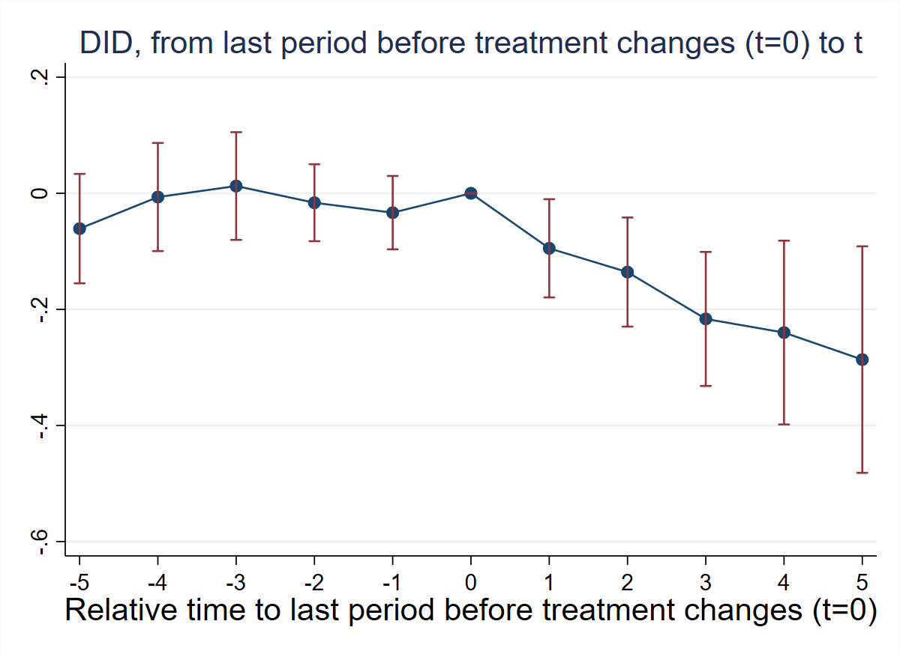
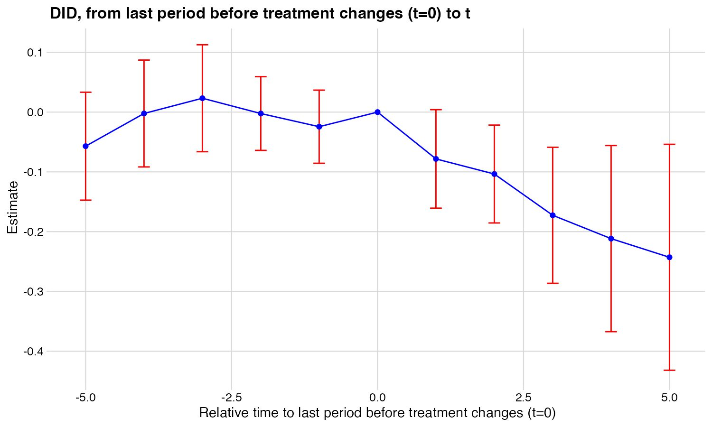
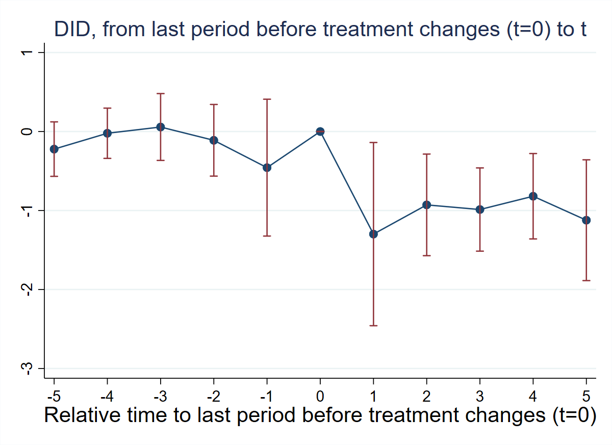
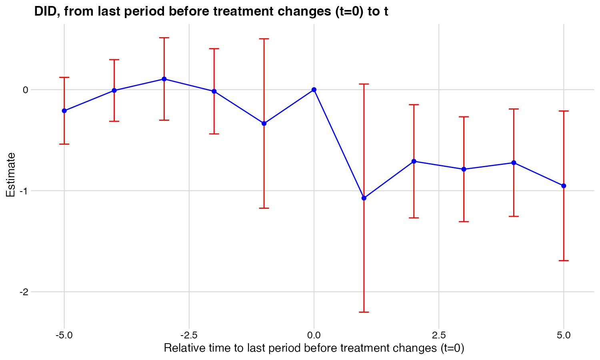

**Research Question:** How does prenatal Medicaid expansion affect the share of low-birth-weight (LBW) infants?

**Data:** State-year panel. Treatment `newsimeli` is the simulated prenatal Medicaid eligibility rate — continuous and absorbing. Outcome: `lbw_detrend81` (% LBW infants, net of state-specific pre-treatment linear trend).

---

## T4: Verify Continuous Treatment in Period 1

::: {.panel-tabset}

### Stata

```stata
* ssc install did_multiplegt_dyn, replace
copy "https://raw.githubusercontent.com/anzonyquispe/did_book/main/did_applied_book/data/east_et_al_2023.dta" "east_et_al_2023.dta", replace
use "east_et_al_2023.dta", clear
tab newsimeli if dob_y_p == 1975
```

```
  newsimeli |      Freq.     Percent        Cum.
------------+-----------------------------------
   .0427696 |          1        2.00        2.00
   .0435282 |          1        2.00        4.00
        ...
   .2127634 |          1        2.00      100.00
------------+-----------------------------------
      Total |         50      100.00
```

All 50 states have different values of `newsimeli` in 1975 — confirming continuous treatment in period 1.

### R

```r
# install.packages(c("DIDmultiplegtDYN", "polars", "haven", "dplyr"))
library(haven)
library(dplyr)
library(DIDmultiplegtDYN)
library(polars)

load(url("https://raw.githubusercontent.com/anzonyquispe/did_book/main/did_applied_book/data/east_et_al_2023.RData"))

df %>% filter(dob_y_p == 1975) %>% count(newsimeli) %>% print(n = 5)
```

```
# A tibble: 50 × 2
   newsimeli     n
       <dbl> <int>
 1    0.0428     1
 2    0.0435     1
 3    0.0501     1
 ...
```

All 50 states have different values — confirming continuous treatment in period 1.

### Python

```python
# pip install did-multiplegt-dyn pandas pyarrow
import pandas as pd
from did_multiplegt_dyn import did_multiplegt_dyn

df = pd.read_parquet("https://raw.githubusercontent.com/anzonyquispe/did_book/main/did_applied_book/data/east_et_al_2023.parquet")

vals = df.loc[df["dob_y_p"] == 1975, "newsimeli"].value_counts()
print(f"Unique values: {len(vals)}, all freq=1: {(vals == 1).all()}")
```

```
Unique values: 50, all freq=1: True
```

All 50 states have different values — confirming continuous treatment in period 1.

:::

---

## T5: Non-Normalized Event-Study Effects

::: {.panel-tabset}

### Stata

```stata
* ssc install did_multiplegt_dyn, replace
copy "https://raw.githubusercontent.com/anzonyquispe/did_book/main/did_applied_book/data/east_et_al_2023.dta" "east_et_al_2023.dta", replace
use "east_et_al_2023.dta", clear

global stcontrols stmarried stblack stother sthsdrop ///
    sthsgrad stsomecoll pop0_4 pop5_17 pop18_24 pop25_44 ///
    pop45_64 urate incpc maxafdc abortconsent abortmedr

did_multiplegt_dyn lbw_detrend81 plborn dob_y_p newsimeli, ///
    effects(5) placebo(5) continuous(1) ///
    controls($stcontrols) weight(births) effects_equal("all")
```

```
--------------------------------------------------------------------------------
             Estimation of treatment effects: Event-study effects
--------------------------------------------------------------------------------

             |  Estimate         SE      LB CI      UB CI          N  Switchers
-------------+------------------------------------------------------------------
    Effect_1 | -.0947772   .0431779  -.1794043  -.0101501        234         28
    Effect_2 | -.1357354   .0479484  -.2297126  -.0417581        209         28
    Effect_3 | -.2164912   .0589289  -.3319896  -.1009928        187         28
    Effect_4 | -.2399434   .0807875   -.398284  -.0816028        176         28
    Effect_5 | -.2865485   .0995835  -.4817286  -.0913684        138         21
--------------------------------------------------------------------------------
Test of joint nullity of the effects  : p-value = .01356529
Test of equality of the effects       : p-value = .18570771

  Av_tot_eff | -2.674364   .7711151  -4.185722  -1.163007        405        133
Average number of time periods over which a treatment's effect is accumulated = 2.8379

   Placebo_1 | -.0333622   .0322533  -.0965775    .029853        234         28
   Placebo_2 | -.0162464   .0338256  -.0825434   .0500506        209         28
   Placebo_3 |  .0125248   .0473315  -.0802431   .1052928        187         28
   Placebo_4 | -.0064571   .0475258  -.0996058   .0866917        176         28
   Placebo_5 | -.0608374   .0480836  -.1550795   .0334047        106         18
--------------------------------------------------------------------------------
Test of joint nullity of the placebos : p-value = .72098785
```



### R

```r
# install.packages(c("DIDmultiplegtDYN", "polars"))
library(DIDmultiplegtDYN)
library(polars)

load(url("https://raw.githubusercontent.com/anzonyquispe/did_book/main/did_applied_book/data/east_et_al_2023.RData"))

stcontrols <- c("stmarried", "stblack", "stother", "sthsdrop", "sthsgrad",
                "stsomecoll", "pop0_4", "pop5_17", "pop18_24", "pop25_44",
                "pop45_64", "urate", "incpc", "maxafdc", "abortconsent", "abortmedr")

res_t5 <- did_multiplegt_dyn(
  df            = df,
  outcome       = "lbw_detrend81",
  group         = "plborn",
  time          = "dob_y_p",
  treatment     = "newsimeli",
  effects       = 5,
  placebo       = 5,
  continuous    = 1,
  controls      = stcontrols,
  weight        = "births",
  effects_equal = "all"
)
print(res_t5)
res_t5$plot
```

```
----------------------------------------------------------------------
       Estimation of treatment effects: Event-study effects
----------------------------------------------------------------------
             Estimate SE      LB CI    UB CI    N   Switchers
Effect_1     -0.07830 0.04202 -0.16067  0.00406 234 28
Effect_2     -0.10358 0.04177 -0.18544 -0.02171 209 28
Effect_3     -0.17260 0.05804 -0.28636 -0.05884 187 28
Effect_4     -0.21166 0.07942 -0.36732 -0.05599 176 28
Effect_5     -0.24287 0.09643 -0.43186 -0.05388 138 21

Test of joint nullity of the effects  : p-value = 0.0743
Test of equality of the effects       : p-value = 0.3572

  Av_tot_eff | -2.21745  0.72240  -3.63333  -0.80157  405  133
Average number of time periods over which a treatment effect is accumulated: 2.8379

Placebo_1    -0.02443 0.03121 -0.08560  0.03675 234 28
Placebo_2    -0.00238 0.03145 -0.06402  0.05926 209 28
Placebo_3     0.02319 0.04563 -0.06624  0.11263 187 28
Placebo_4    -0.00233 0.04560 -0.09171  0.08706 176 28
Placebo_5    -0.05702 0.04605 -0.14727  0.03323 106 18

Test of joint nullity of the placebos : p-value = 0.7775
```



### Python

```python
# pip install did-multiplegt-dyn pandas pyarrow
import pandas as pd
from did_multiplegt_dyn import did_multiplegt_dyn

df = pd.read_parquet("https://raw.githubusercontent.com/anzonyquispe/did_book/main/did_applied_book/data/east_et_al_2023.parquet")

stcontrols = ["stmarried", "stblack", "stother", "sthsdrop", "sthsgrad",
              "stsomecoll", "pop0_4", "pop5_17", "pop18_24", "pop25_44",
              "pop45_64", "urate", "incpc", "maxafdc", "abortconsent", "abortmedr"]

res_t5 = did_multiplegt_dyn(
    df            = df,
    outcome       = "lbw_detrend81",
    group         = "plborn",
    time          = "dob_y_p",
    treatment     = "newsimeli",
    effects       = 5,
    placebo       = 5,
    continuous    = 1,
    controls      = stcontrols,
    weight        = "births",
    effects_equal = "all"
)
print(res_t5)
res_t5.plot
```

```
----------------------------------------------------------------------
       Estimation of treatment effects: Event-study effects
----------------------------------------------------------------------
             Estimate  SE       LB CI     UB CI    N   Switchers
Effect_1     -0.094777 0.043178 -0.179404 -0.010150 234 28
Effect_2     -0.135735 0.047948 -0.229713 -0.041758 209 28
Effect_3     -0.216491 0.058929 -0.331990 -0.100993 187 28
Effect_4     -0.239943 0.080788 -0.398284 -0.081603 176 28
Effect_5     -0.286549 0.099584 -0.481729 -0.091368 138 21

Test of joint nullity of the effects  : p-value = 0.013565
Test of equality of the effects       : p-value = 0.185708

  Av_tot_eff | -2.674365  0.771115  -4.185722  -1.163007  405  133
Average number of time periods over which a treatment's effect is accumulated = 2.8379

Placebo_1    -0.033362 0.032253 -0.096578  0.029853 234 28
Placebo_2    -0.016246 0.033826 -0.082543  0.050051 209 28
Placebo_3     0.012525 0.047332 -0.080243  0.105293 187 28
Placebo_4    -0.006457 0.047526 -0.099606  0.086692 176 28
Placebo_5    -0.060837 0.048084 -0.155080  0.033405 106 18

Test of joint nullity of the placebos : p-value = 0.720988
```

:::

**Interpretation:** A large increase in prenatal Medicaid eligibility significantly reduces the LBW rate. Effects grow with exposure length (from −0.09 to −0.29 in Stata/Python). Pre-trends are small and jointly insignificant, supporting the parallel-trends assumption.

---

## T6: Normalized Event-Study Effects

::: {.panel-tabset}

### Stata

```stata
* ssc install did_multiplegt_dyn, replace
copy "https://raw.githubusercontent.com/anzonyquispe/did_book/main/did_applied_book/data/east_et_al_2023.dta" "east_et_al_2023.dta", replace
use "east_et_al_2023.dta", clear

global stcontrols stmarried stblack stother sthsdrop ///
    sthsgrad stsomecoll pop0_4 pop5_17 pop18_24 pop25_44 ///
    pop45_64 urate incpc maxafdc abortconsent abortmedr

did_multiplegt_dyn lbw_detrend81 plborn dob_y_p newsimeli, ///
    effects(5) placebo(5) continuous(1) ///
    controls($stcontrols) weight(births) normalized normalized_weights ///
    effects_equal("all")
```

```
--------------------------------------------------------------------------------
             Estimation of treatment effects: Event-study effects
--------------------------------------------------------------------------------

             |  Estimate         SE      LB CI      UB CI          N  Switchers
-------------+------------------------------------------------------------------
    Effect_1 | -1.298867   .5917281  -2.458633  -.1391013        234         28
    Effect_2 | -.9288246   .3281068  -1.571902  -.2857471        209         28
    Effect_3 | -.9876244   .2688312  -1.514524  -.4607251        187         28
    Effect_4 | -.8192267   .2758287  -1.359841  -.2786122        176         28
    Effect_5 | -1.122649   .3901516  -1.887333  -.3579662        138         21
--------------------------------------------------------------------------------
Test of joint nullity of the effects  : p-value = .01356528
Test of equality of the effects       : p-value = .58100394

             |       ℓ=1        ℓ=2        ℓ=3        ℓ=4        ℓ=5
         k=0 |    1.0000     0.5000     0.3333     0.2500     0.2000
         k=1 |         .     0.5000     0.3333     0.2500     0.2000
         k=2 |         .          .     0.3333     0.2500     0.2000
         k=3 |         .          .          .     0.2500     0.2000
         k=4 |         .          .          .          .     0.2000
       Total |    1.0000     1.0000     1.0000     1.0000     1.0000
```



### R

```r
# install.packages(c("DIDmultiplegtDYN", "polars"))
library(DIDmultiplegtDYN)
library(polars)

load(url("https://raw.githubusercontent.com/anzonyquispe/did_book/main/did_applied_book/data/east_et_al_2023.RData"))

stcontrols <- c("stmarried", "stblack", "stother", "sthsdrop", "sthsgrad",
                "stsomecoll", "pop0_4", "pop5_17", "pop18_24", "pop25_44",
                "pop45_64", "urate", "incpc", "maxafdc", "abortconsent", "abortmedr")

res_t6 <- did_multiplegt_dyn(
  df                 = df,
  outcome            = "lbw_detrend81",
  group              = "plborn",
  time               = "dob_y_p",
  treatment          = "newsimeli",
  effects            = 5,
  placebo            = 5,
  continuous         = 1,
  controls           = stcontrols,
  weight             = "births",
  normalized         = TRUE,
  normalized_weights = TRUE,
  effects_equal      = "all"
)
print(res_t6)
res_t6$plot
```

```
----------------------------------------------------------------------
       Estimation of treatment effects: Event-study effects
----------------------------------------------------------------------
             Estimate SE      LB CI    UB CI    N   Switchers
Effect_1     -1.07310 0.57593 -2.20190  0.05570 234 28
Effect_2     -0.70876 0.28582 -1.26895 -0.14857 209 28
Effect_3     -0.78740 0.26479 -1.30637 -0.26842 187 28
Effect_4     -0.72264 0.27117 -1.25413 -0.19115 176 28
Effect_5     -0.95151 0.37778 -1.69194 -0.21108 138 21

Test of joint nullity of the effects  : p-value = 0.0743
Test of equality of the effects       : p-value = 0.7912

  Av_tot_eff | -2.21745  0.72240  -3.63333  -0.80157  405  133
Average number of time periods over which a treatment effect is accumulated: 2.8379

Placebo_1    -0.33476 0.42774 -1.17311  0.50360 234 28
Placebo_2    -0.01628 0.21522 -0.43810  0.40554 209 28
Placebo_3     0.10581 0.20816 -0.30218  0.51379 187 28
Placebo_4    -0.00794 0.15571 -0.31312  0.29724 176 28
Placebo_5    -0.20873 0.16857 -0.53912  0.12165 106 18

Test of joint nullity of the placebos : p-value = 0.7775

------------------------------------------------------------
             Weights on treatment lags
------------------------------------------------------------
      ℓ=1   ℓ=2   ℓ=3   ℓ=4   ℓ=5
k=0   1.000 0.500 0.333 0.250 0.200
k=1   NA    0.500 0.333 0.250 0.200
k=2   NA    NA    0.333 0.250 0.200
k=3   NA    NA    NA    0.250 0.200
k=4   NA    NA    NA    NA    0.200
Total 1.000 1.000 1.000 1.000 1.000
```



### Python

```python
# pip install did-multiplegt-dyn pandas pyarrow
import pandas as pd
from did_multiplegt_dyn import did_multiplegt_dyn

df = pd.read_parquet("https://raw.githubusercontent.com/anzonyquispe/did_book/main/did_applied_book/data/east_et_al_2023.parquet")

stcontrols = ["stmarried", "stblack", "stother", "sthsdrop", "sthsgrad",
              "stsomecoll", "pop0_4", "pop5_17", "pop18_24", "pop25_44",
              "pop45_64", "urate", "incpc", "maxafdc", "abortconsent", "abortmedr"]

res_t6 = did_multiplegt_dyn(
    df                 = df,
    outcome            = "lbw_detrend81",
    group              = "plborn",
    time               = "dob_y_p",
    treatment          = "newsimeli",
    effects            = 5,
    placebo            = 5,
    continuous         = 1,
    controls           = stcontrols,
    weight             = "births",
    normalized         = True,
    normalized_weights = True,
    effects_equal      = "all"
)
print(res_t6)
res_t6.plot
```

```
----------------------------------------------------------------------
       Estimation of treatment effects: Event-study effects
----------------------------------------------------------------------
             Estimate  SE       LB CI     UB CI    N   Switchers
Effect_1     -1.298867 0.591728 -2.458633 -0.139101 234 28
Effect_2     -0.928825 0.328107 -1.571902 -0.285747 209 28
Effect_3     -0.987624 0.268831 -1.514524 -0.460725 187 28
Effect_4     -0.819227 0.275829 -1.359841 -0.278612 176 28
Effect_5     -1.122649 0.390152 -1.887333 -0.357966 138 21

Test of joint nullity of the effects  : p-value = 0.013565
Test of equality of the effects       : p-value = 0.581004

  Av_tot_eff | -2.674365  0.771115  -4.185722  -1.163007  405  133
```

:::

**Interpretation:** A 1 percentage point increase in prenatal Medicaid eligibility reduces the LBW rate by ~1 percentage point. One cannot reject equality of effects (p = 0.58 in Stata/Python, p = 0.79 in R).
