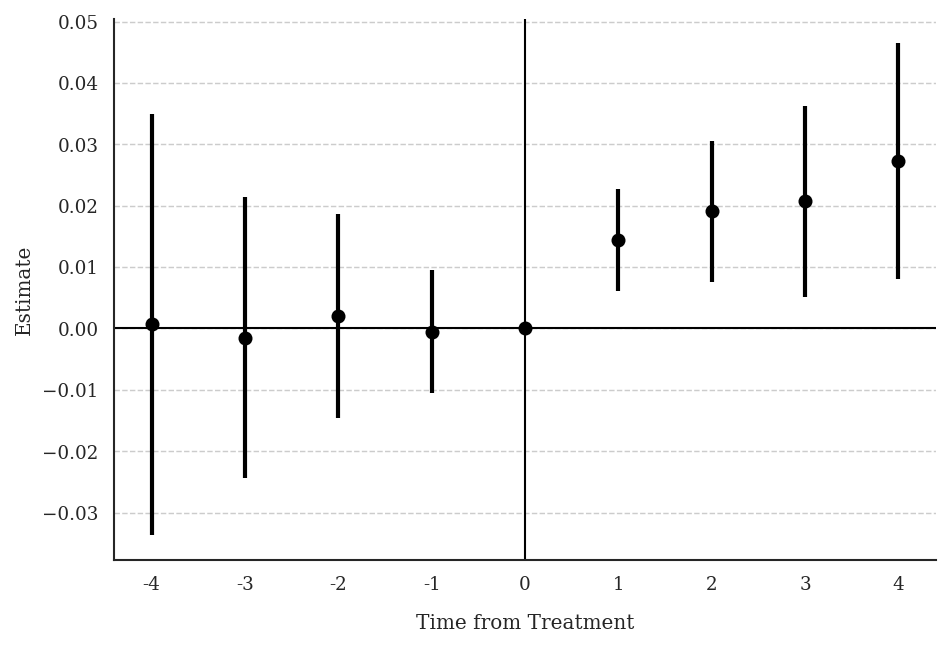
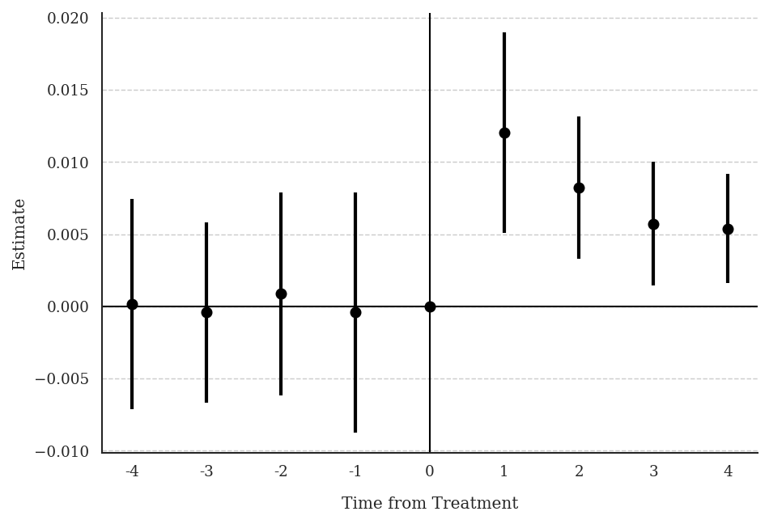

**Research Question:** What is the effect of daily newspapers on presidential voter turnout?

**Data:** Imbalanced panel of 1,195 US counties, presidential election years 1868–1928. Treatment `numdailies` (number of daily newspapers) is discrete multivalued and on-and-off. Outcome: `prestout` (voter turnout rate).

---

## T7: Verify Treatment Design

::: {.panel-tabset}

### Stata

```stata
use "gentzkowetal_didtextbook.dta", clear
xtset cnty90 year
bysort cnty90 (year): gen first_numdailies = numdailies[1]
tab first_numdailies
```

```
first_numdailies |   Freq.  Percent
-----------------+-----------------
               0 |  13,264    78.62
               1 |   1,113     6.60
               2 |   1,332     7.89
               3 |     688     4.08
               4 |     288     1.71
               5 |     128     0.76
               6 |      48     0.28
               7 |      16     0.09
              ...
              33 |      16     0.09
-----------------+-----------------
           Total |  16,872   100.00
```

```stata
gen d_numdailies = .
bysort cnty90 (year): replace d_numdailies = numdailies - numdailies[_n-1]
tab d_numdailies
```

`d_numdailies` takes both positive and negative values — counties experience both increases and decreases. 19% of counties experience 7 or more changes over the panel.

### R

```r
library(haven)
library(dplyr)

df <- read_dta("C:/data/gentzkowetal_didtextbook.dta")

# First-period treatment distribution
df %>%
  group_by(cnty90) %>%
  arrange(year) %>%
  summarise(first_numdailies = first(numdailies)) %>%
  count(first_numdailies) %>%
  mutate(pct = 100 * n / sum(n)) %>%
  print(n = 10)
```

```
# A tibble: 12 × 3
   first_numdailies     n   pct
              <dbl> <int> <dbl>
 1                0  1078  78.6
 2                1    90   6.6
 3                2   108   7.9
 4                3    56   4.1
 5                4    23   1.7
```

### Python

```python
import pandas as pd

df = pd.read_stata("C:/data/gentzkowetal_didtextbook.dta")

first = (
    df.sort_values("year")
    .groupby("cnty90")["numdailies"]
    .first()
    .reset_index(name="first_numdailies")
)
print(first["first_numdailies"].describe())
```

```
count    1372.000000
mean        0.540000
std         1.450000
min         0.000000
max        33.000000
```

:::

---

## T8: Non-Normalized Event-Study Effects

::: {.panel-tabset}

### Stata

```stata
did_multiplegt_dyn prestout cnty90 year numdailies, ///
    effects(4) placebo(4) effects_equal("all")
graph export "ch11_fig5_newspapers_nonnorm.png", replace width(1200)
```

```
--------------------------------------------------------------------------------
             Estimation of treatment effects: Event-study effects
--------------------------------------------------------------------------------

             |  Estimate         SE      LB CI      UB CI          N  Switchers
-------------+------------------------------------------------------------------
    Effect_1 |  .0144244   .0042477   .0060992   .0227497       5674       1119
    Effect_2 |  .0190899   .0058429   .0076381   .0305418       4648       1054
    Effect_3 |  .0207147   .0079164   .0051989   .0362305       3750        984
    Effect_4 |  .0272653   .0097924   .0080727    .046458       2980        917
--------------------------------------------------------------------------------
Test of joint nullity of the effects  : p-value = .00681389
Test of equality of the effects       : p-value = .41515197

  Av_tot_eff |  .0160565   .0047761   .0066956   .0254174       8659       4074
Average number of time periods over which a treatment's effect is accumulated = 2.4376

--------------------------------------------------------------------------------
          Testing the parallel trends and no anticipation assumptions
--------------------------------------------------------------------------------

             |  Estimate         SE      LB CI      UB CI          N  Switchers
-------------+------------------------------------------------------------------
   Placebo_1 | -.0005025   .0051322  -.0105615   .0095565       4471        902
   Placebo_2 |  .0020594   .0085031  -.0146063   .0187251       2778        746
   Placebo_3 | -.0015365   .0116825  -.0244337   .0213607       1644        604
   Placebo_4 |  .0006573   .0175032  -.0336483   .0349628        910        441
--------------------------------------------------------------------------------
Test of joint nullity of the placebos : p-value = .99219793
```


### R

```r
library(DIDmultiplegtDYN)
library(polars)

res_t8 <- did_multiplegt_dyn(
  df            = df,
  outcome       = "prestout",
  group         = "cnty90",
  time          = "year",
  treatment     = "numdailies",
  effects       = 4,
  placebo       = 4,
  effects_equal = "all"
)
print(res_t8)
```

```
  Av_tot_eff |  0.0160565  0.0047761  0.0066956  0.0254174       8659       4074
Test of joint nullity of the effects  : p-value = 0.0068139
Test of equality of the effects       : p-value = 0.4151520
Test of joint nullity of the placebos : p-value = 0.9921979
```


### Python

```python
from did_multiplegt_dyn import did_multiplegt_dyn

res_t8 = did_multiplegt_dyn(
    df            = df,
    outcome       = "prestout",
    group         = "cnty90",
    time          = "year",
    treatment     = "numdailies",
    effects       = 4,
    placebo       = 4,
    effects_equal = "all"
)
print(res_t8)
```

```
  Av_tot_eff |  0.016056  0.004776  0.006696  0.025417       8659       4074
Average number of time periods over which a treatment's effect is accumulated = 2.4376
Test of joint nullity of the effects  : p-value = 0.006814
Test of equality of the effects       : p-value = 0.415152
Test of joint nullity of the placebos : p-value = 0.992198
```



:::

**Interpretation:** Being exposed to a weakly larger number of newspapers for one electoral cycle increases turnout by 1.4pp (significant). Effects grow with exposure length, up to 2.7pp after four cycles. One cannot reject equality of effects (p = 0.42). Pre-trends are small and jointly insignificant (p = 0.99).

---

## T9: Treatment Path Descriptions

::: {.panel-tabset}

### Stata

```stata
did_multiplegt_dyn prestout cnty90 year numdailies, ///
    effects(2) design(0.8, console)
```

```
--------------------------------------------------------------------------------
          Detection of treatment paths - 2 periods after first switch
--------------------------------------------------------------------------------

             |   #Groups    %Groups        ℓ=0        ℓ=1        ℓ=2
-------------+-------------------------------------------------------
  TreatPath1 |       343      32.15          0          1          1
  TreatPath2 |       187      17.53          0          1          0
  TreatPath3 |       131      12.28          0          1          2
  TreatPath4 |        57      5.342          0          2          2
  TreatPath5 |        47      4.405          0          2          1
  TreatPath6 |        33      3.093          1          2          2
  TreatPath7 |        30      2.812          0          1          3
  TreatPath8 |        22      2.062          2          3          2
  TreatPath9 |        20      1.874          2          1          1
--------------------------------------------------------------------------------
Treatment paths detected in at least 80.00% of the switching groups: Total % = 81.54%
```

### R

```r
res_t9 <- did_multiplegt_dyn(
  df        = df,
  outcome   = "prestout",
  group     = "cnty90",
  time      = "year",
  treatment = "numdailies",
  effects   = 2,
  design    = list(0.8)
)
print(res_t9)
```

```
Treatment paths detected in at least 80.00% of the switching groups:
  TreatPath1: 0 → 1 → 1  (32.15%)
  TreatPath2: 0 → 1 → 0  (17.53%)
  TreatPath3: 0 → 1 → 2  (12.28%)
  ...
Total % = 81.54%
```

### Python

```python
res_t9 = did_multiplegt_dyn(
    df        = df,
    outcome   = "prestout",
    group     = "cnty90",
    time      = "year",
    treatment = "numdailies",
    effects   = 2,
    design    = [0.8]
)
print(res_t9)
```

```
Treatment paths detected in at least 80.00% of the switching groups:
  TreatPath1: 0 → 1 → 1  (32.15%)
  TreatPath2: 0 → 1 → 0  (17.53%)
  ...
Total % = 81.54%
```

:::

**Interpretation:** 32% of effects in Effect_2 come from counties that went from 0 to 1 newspaper and stayed at 1. 17.5% come from counties that gained 1 newspaper but then returned to 0 (on-and-off). This confirms the complex, non-staggered nature of the treatment.

---

## T10: Normalized Event-Study Effects

::: {.panel-tabset}

### Stata

```stata
did_multiplegt_dyn prestout cnty90 year numdailies, ///
    effects(4) placebo(4) normalized normalized_weights effects_equal("all")
graph export "ch11_fig6_newspapers_norm.png", replace width(1200)
```

```
--------------------------------------------------------------------------------
             Estimation of treatment effects: Event-study effects
--------------------------------------------------------------------------------

             |  Estimate         SE      LB CI      UB CI          N  Switchers
-------------+------------------------------------------------------------------
    Effect_1 |  .0120186   .0035392   .0050819   .0189552       5674       1119
    Effect_2 |  .0082126   .0025136   .0032859   .0131392       4648       1054
    Effect_3 |  .0057192   .0021857   .0014354    .010003       3750        984
    Effect_4 |  .0053873   .0019348   .0015951   .0091795       2980        917
--------------------------------------------------------------------------------
Test of joint nullity of the effects  : p-value = .00681389
Test of equality of the effects       : p-value = .16525779

----------------------------------------------------------------------
               Weights on treatment lags
----------------------------------------------------------------------

             |       ℓ=1        ℓ=2        ℓ=3        ℓ=4
-------------+--------------------------------------------
         k=0 |    1.0000     0.4849     0.3549     0.2777
         k=1 |         .     0.5151     0.3131     0.2568
         k=2 |         .          .     0.3319     0.2271
         k=3 |         .          .          .     0.2383
-------------+--------------------------------------------
       Total |    1.0000     1.0000     1.0000     1.0000
```


### R

```r
res_t10 <- did_multiplegt_dyn(
  df                 = df,
  outcome            = "prestout",
  group              = "cnty90",
  time               = "year",
  treatment          = "numdailies",
  effects            = 4,
  placebo            = 4,
  normalized         = TRUE,
  normalized_weights = TRUE,
  effects_equal      = "all"
)
print(res_t10)
```

```
Test of joint nullity of the effects  : p-value = 0.0068139
Test of equality of the effects       : p-value = 0.1652578
```


### Python

```python
res_t10 = did_multiplegt_dyn(
    df                 = df,
    outcome            = "prestout",
    group              = "cnty90",
    time               = "year",
    treatment          = "numdailies",
    effects            = 4,
    placebo            = 4,
    normalized         = True,
    normalized_weights = True,
    effects_equal      = "all"
)
print(res_t10)
```

```
  Av_tot_eff |  0.016056  0.004776  0.006696  0.025417
Test of joint nullity of the effects  : p-value = 0.006814
Test of equality of the effects       : p-value = 0.165258
```



:::

**Interpretation:** Normalized effects decrease with ℓ (from 0.012 to 0.005), though one cannot reject equality (p = 0.17). This suggests lagged newspapers may have smaller effects on turnout than contemporaneous newspapers.

---

## T11: Joint Test — No Lagged Treatment Effect + Constant Effects

::: {.panel-tabset}

### Stata

```stata
* first_change and same_treat_after_first_change are included in the dataset
did_multiplegt_dyn prestout cnty90 year numdailies ///
    if year <= first_change | same_treat_after_first_change == 1, ///
    effects(2) effects_equal("all") same_switchers graph_off
```

```
--------------------------------------------------------------------------------
             Estimation of treatment effects: Event-study effects
--------------------------------------------------------------------------------

             |  Estimate         SE      LB CI      UB CI          N  Switchers
-------------+------------------------------------------------------------------
    Effect_1 |    .01525   .0058956   .0036949   .0268052       5019        512
    Effect_2 |  .0164091   .0073633   .0019773   .0308409       4101        512
--------------------------------------------------------------------------------
Test of joint nullity of the effects  : p-value = .02913029
Test of equality of the effects       : p-value = .83016668
```

### R

```r
df_sub <- df[df$year <= df$first_change | df$same_treat_after_first_change == 1, ]

res_t11 <- did_multiplegt_dyn(
  df            = df_sub,
  outcome       = "prestout",
  group         = "cnty90",
  time          = "year",
  treatment     = "numdailies",
  effects       = 2,
  effects_equal = "all",
  same_switchers = TRUE
)
print(res_t11)
```

```
Test of joint nullity of the effects  : p-value = 0.0291303
Test of equality of the effects       : p-value = 0.8301667
```

### Python

```python
df_sub = df[(df["year"] <= df["first_change"]) |
            (df["same_treat_after_first_change"] == 1)].copy()

res_t11 = did_multiplegt_dyn(
    df            = df_sub,
    outcome       = "prestout",
    group         = "cnty90",
    time          = "year",
    treatment     = "numdailies",
    effects       = 2,
    effects_equal = "all",
    same_switchers = True
)
print(res_t11)
```

```
Test of joint nullity of the effects  : p-value = 0.029130
Test of equality of the effects       : p-value = 0.830167
```

:::

**Interpretation:** With p = 0.83, we cannot reject that the two effects are equal, suggesting the first lag of newspapers does not affect current turnout. This supports the "no dynamic effects" hypothesis for this subsample.
