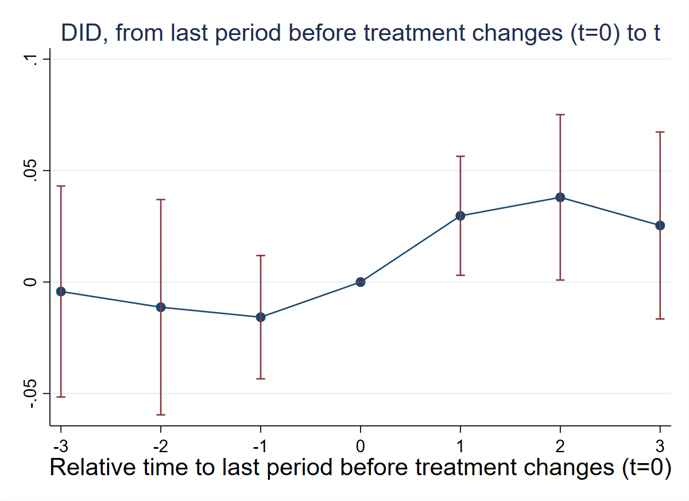
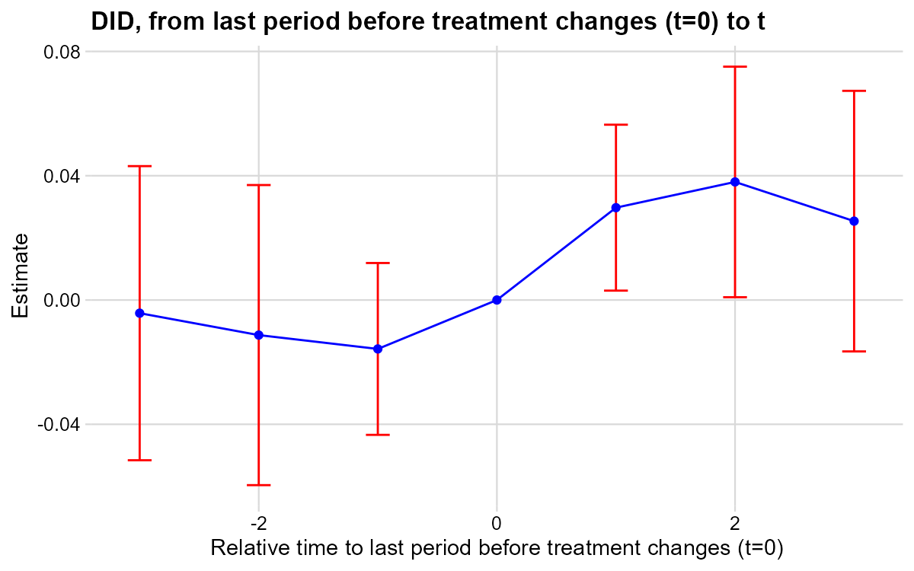
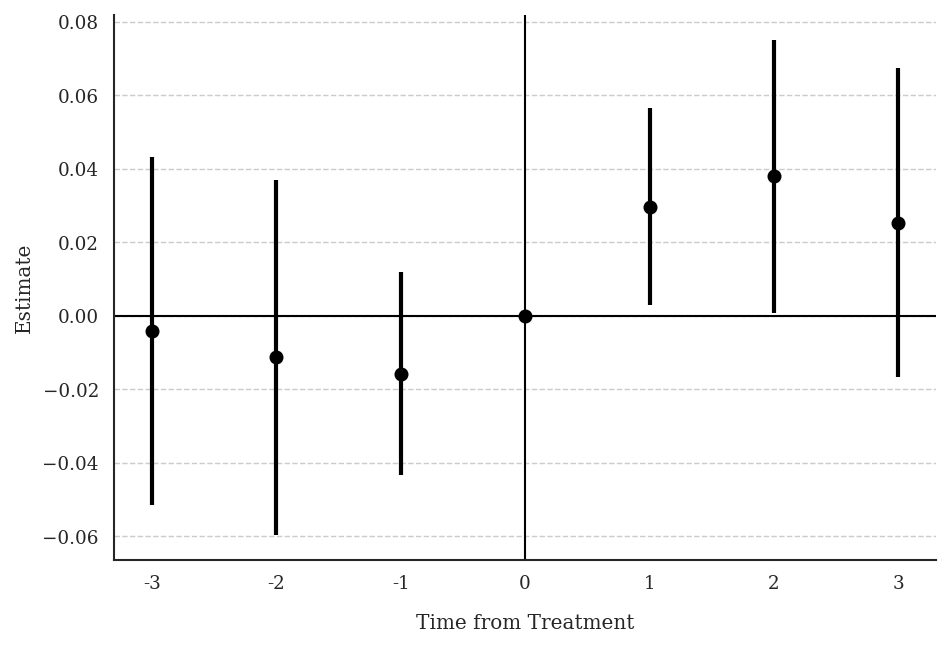
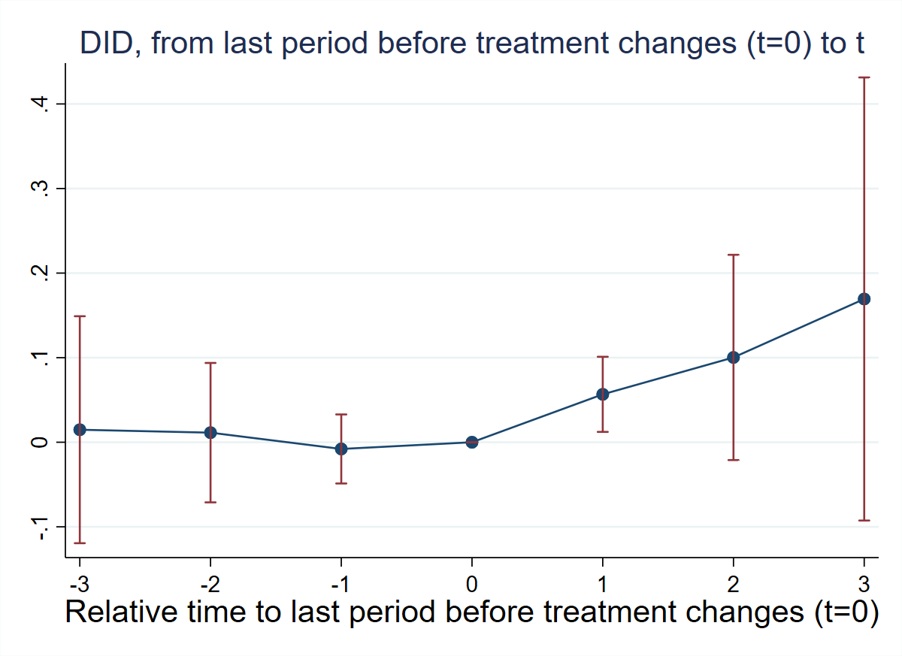
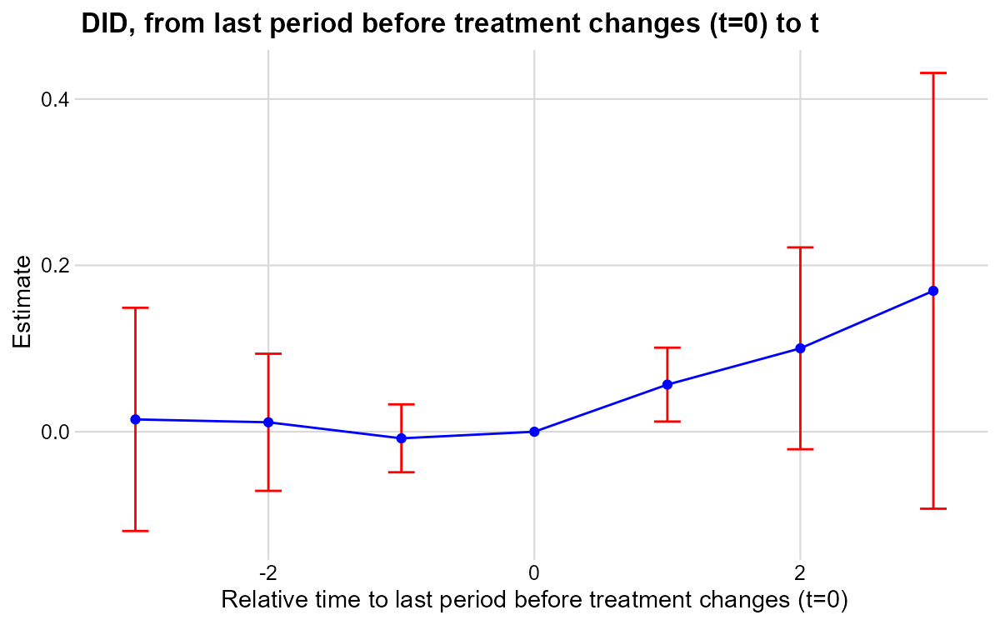
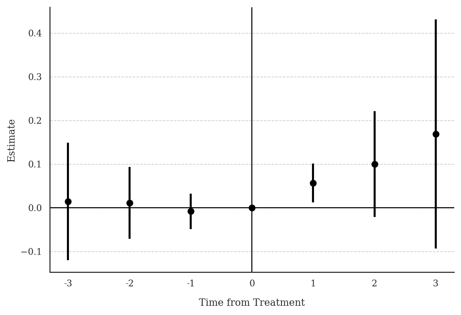

**Research Question:** How do medical and recreational marijuana laws differentially affect marijuana use among adults and adolescents?

**Data:** State-year panel 2002–2019. Two binary absorbing treatments: `mm` (medical legalization) and `rm` (recreational legalization), where medical always precedes recreational. Outcome: `ln_mj_use_365` (log of marijuana use in the past 365 days).

---

## T12: Summary Statistics and Design Verification

::: {.panel-tabset}

### Stata

```stata
* ssc install did_multiplegt_dyn, replace
copy "https://raw.githubusercontent.com/anzonyquispe/did_book/main/did_applied_book/data/hollingsworth_et_al_2022.dta" "hollingsworth_et_al_2022.dta", replace
use "hollingsworth_et_al_2022.dta", clear

sum ln_mj_use_365 mm rm

xtset state year
tab mm
tab rm
tab d_mm
tab d_rm
tab mm_rm_timing
```

```
    Variable |        Obs        Mean    Std. dev.       Min        Max
-------------+---------------------------------------------------------
ln_mj_us~365 |        765    2.433264     .259119    1.77137    3.30977
          mm |        765    .3045752    .4605284          0          1
          rm |        765    .0235294    .1516768          0          1

         mm |      Freq.     Percent        Cum.
------------+-----------------------------------
          0 |        532       69.54       69.54
          1 |        233       30.46      100.00
------------+-----------------------------------
      Total |        765      100.00

         rm |      Freq.     Percent        Cum.
------------+-----------------------------------
          0 |        747       97.65       97.65
          1 |         18        2.35      100.00
------------+-----------------------------------
      Total |        765      100.00

       d_mm |      Freq.     Percent        Cum.
------------+-----------------------------------
          0 |        693       97.06       97.06
          1 |         21        2.94      100.00
------------+-----------------------------------
      Total |        714      100.00

       d_rm |      Freq.     Percent        Cum.
------------+-----------------------------------
          0 |        707       99.02       99.02
          1 |          7        0.98      100.00
------------+-----------------------------------
      Total |        714      100.00

mm_rm_timin |
          g |      Freq.     Percent        Cum.
------------+-----------------------------------
          0 |        550       71.90       71.90
          1 |        215       28.10      100.00
------------+-----------------------------------
      Total |        765      100.00
```

Both treatments take values 0 or 1 — binary and absorbing. `mm_rm_timing` is always ≥ 0 — medical always precedes recreational.

### R

```r
# install.packages(c("DIDmultiplegtDYN", "polars", "haven", "dplyr"))
library(haven)
library(dplyr)
library(DIDmultiplegtDYN)
library(polars)

load(url("https://raw.githubusercontent.com/anzonyquispe/did_book/main/did_applied_book/data/hollingsworth_et_al_2022.RData"))

df %>% select(ln_mj_use_365, mm, rm) %>% summary()
table(df$mm)
table(df$rm)
table(df$mm - df$rm)
```

```
 ln_mj_use_365         mm               rm         
 Min.   :1.771   Min.   :0.0000   Min.   :0.00000  
 1st Qu.:2.250   1st Qu.:0.0000   1st Qu.:0.00000  
 Median :2.395   Median :0.0000   Median :0.00000  
 Mean   :2.433   Mean   :0.3046   Mean   :0.02353  
 3rd Qu.:2.585   3rd Qu.:1.0000   3rd Qu.:0.00000  
 Max.   :3.310   Max.   :1.0000   Max.   :1.00000  

  0   1 
532 233 

  0   1 
747  18 

  0   1 
550 215 
```

Both treatments are binary and absorbing. `mm - rm` is always ≥ 0 — medical always precedes recreational.

### Python

```python
# pip install py-did-multiplegt-dyn pandas pyarrow
import pandas as pd
from did_multiplegt_dyn import DidMultiplegtDyn

df = pd.read_parquet("https://raw.githubusercontent.com/anzonyquispe/did_book/main/did_applied_book/data/hollingsworth_et_al_2022.parquet")

print(df[["ln_mj_use_365", "mm", "rm"]].describe())
print(df["mm"].value_counts().sort_index())
print(df["rm"].value_counts().sort_index())
print((df["mm"] - df["rm"]).value_counts().sort_index())
```

```
       ln_mj_use_365          mm          rm
count     765.000000  765.000000  765.000000
mean        2.433264    0.304575    0.023529
std         0.259119    0.460528    0.151677
min         1.771370    0.000000    0.000000
25%         2.250365    0.000000    0.000000
50%         2.395064    0.000000    0.000000
75%         2.584752    1.000000    0.000000
max         3.309770    1.000000    1.000000

mm
0    532
1    233

rm
0    747
1     18

0    550
1    215
```

Both treatments are binary and absorbing. `mm - rm` is always ≥ 0 — medical always precedes recreational.

:::

---

## T13: Effects of Medical Marijuana Laws

::: {.panel-tabset}

### Stata

```stata
* ssc install did_multiplegt_dyn, replace
copy "https://raw.githubusercontent.com/anzonyquispe/did_book/main/did_applied_book/data/hollingsworth_et_al_2022.dta" "hollingsworth_et_al_2022.dta", replace
use "hollingsworth_et_al_2022.dta", clear

did_multiplegt_dyn ln_mj_use_365 state year mm if rm==0, effects(3) placebo(3) cluster(state)
```

```
--------------------------------------------------------------------------------
             Estimation of treatment effects: Event-study effects
--------------------------------------------------------------------------------

             |  Estimate         SE      LB CI      UB CI          N  Switchers
-------------+------------------------------------------------------------------
    Effect_1 |  .0297197   .0136225     .00302   .0564194        361         21
    Effect_2 |  .0380018   .0189295   .0009006   .0751029        324         16
    Effect_3 |   .025386   .0213948   -.016547    .067319        307         16
--------------------------------------------------------------------------------
Test of joint nullity of the effects : p-value = .15497711

  Av_tot_eff |  .0309117   .0144444   .0026012   .0592221        499         53
Average number of time periods over which a treatment's effect is accumulated = 1.9056604

   Placebo_1 | -.0157475   .0141094  -.0434015   .0119065        361         21
   Placebo_2 | -.0112911    .024639  -.0595826   .0370004        281         14
   Placebo_3 | -.0042399   .0241491  -.0515713   .0430916        265         14
--------------------------------------------------------------------------------
Test of joint nullity of the placebos : p-value = .71060368
```



### R

```r
# install.packages(c("DIDmultiplegtDYN", "polars", "ggplot2"))
library(DIDmultiplegtDYN)
library(polars)
library(ggplot2)

load(url("https://raw.githubusercontent.com/anzonyquispe/did_book/main/did_applied_book/data/hollingsworth_et_al_2022.RData"))

res_t13 <- did_multiplegt_dyn(df[df$rm==0,], "ln_mj_use_365", "state", "year", "mm",
  effects=3, placebo=3, cluster="state")
print(res_t13)
res_t13$plot
```

```
----------------------------------------------------------------------
       Estimation of treatment effects: Event-study effects
----------------------------------------------------------------------
             Estimate SE      LB CI    UB CI   N   Switchers
Effect_1     0.02972  0.01362 0.00302  0.05642 361 21
Effect_2     0.03800  0.01893 0.00090  0.07510 324 16
Effect_3     0.02539  0.02139 -0.01655 0.06732 307 16

Test of joint nullity of the effects : p-value = 0.1550

  Av_tot_eff |  0.03091  0.01444  0.00260  0.05922  499  53
Average number of time periods over which a treatment effect is accumulated: 1.9057

Placebo_1    -0.01575 0.01411 -0.04340 0.01191 361 21
Placebo_2    -0.01129 0.02464 -0.05958 0.03700 281 14
Placebo_3    -0.00424 0.02415 -0.05157 0.04309 265 14

Test of joint nullity of the placebos : p-value = 0.7106
```



### Python

```python
# pip install py-did-multiplegt-dyn polars matplotlib
import polars as pl
import matplotlib
matplotlib.use('Agg')
import matplotlib.pyplot as plt
from did_multiplegt_dyn import DidMultiplegtDyn

df = pl.read_parquet("https://raw.githubusercontent.com/anzonyquispe/did_book/main/did_applied_book/data/hollingsworth_et_al_2022.parquet")

res_t13 = DidMultiplegtDyn(
    df=df.filter(pl.col("rm")==0),
    outcome="ln_mj_use_365", group="state", time="year", treatment="mm",
    effects=3, placebo=3, cluster="state"
)
res_t13.fit()
res_t13.summary()
res_t13.plot()
plt.savefig("ch09_fig7_marijuana_medical_py.png", dpi=150, bbox_inches="tight")
plt.close()
```

```
================================================================================
             Estimation of treatment effects: Event-study effects
================================================================================
               Block  Estimate       SE     LB CI    UB CI     N  Switchers
            Effect_1  0.029720 0.013623  0.003020 0.056419 361.0      21.0
            Effect_2  0.038002 0.018930  0.000901 0.075103 324.0      16.0
            Effect_3  0.025386 0.021395 -0.016547 0.067319 307.0      16.0
Average_Total_Effect  0.030912 0.014444  0.002601 0.059222 499.0      53.0
           Placebo_1 -0.015747 0.014109 -0.043401 0.011907 361.0      21.0
           Placebo_2 -0.011291 0.024639 -0.059583 0.037000 281.0      14.0
           Placebo_3 -0.004240 0.024149 -0.051571 0.043092 265.0      14.0
================================================================================
Test of joint nullity of the effects: p-value = 0.154977
Test of joint nullity of the placebos: p-value = 0.710604
```



:::

**Interpretation:** Medical marijuana laws increase marijuana use by ~3%, though effects are marginally significant (p = 0.155). Pre-trends are small and jointly insignificant (p = 0.71), supporting parallel trends.

---

## T14: Effects of Recreational Marijuana Laws

::: {.panel-tabset}

### Stata

```stata
* ssc install did_multiplegt_dyn, replace
copy "https://raw.githubusercontent.com/anzonyquispe/did_book/main/did_applied_book/data/hollingsworth_et_al_2022.dta" "hollingsworth_et_al_2022.dta", replace
use "hollingsworth_et_al_2022.dta", clear

egen fg1 = min(cond(mm == 1, year, .)), by(state)
did_multiplegt_dyn ln_mj_use_365 state year rm if mm==1, effects(3) placebo(3) trends_nonparam(fg1) cluster(state)
```

```
--------------------------------------------------------------------------------
             Estimation of treatment effects: Event-study effects
--------------------------------------------------------------------------------

             |  Estimate         SE      LB CI      UB CI          N  Switchers
-------------+------------------------------------------------------------------
    Effect_1 |  .0566549   .0226574   .0122473   .1010626         23          7
    Effect_2 |   .100263    .061912  -.0210824   .2216083         16          5
    Effect_3 |  .1693897   .1336577  -.0925745    .431354          8          2
--------------------------------------------------------------------------------
Test of joint nullity of the effects : p-value = .06567349

  Av_tot_eff |  .0883342   .0407436   .0084782   .1681901         44         14
Average number of time periods over which a treatment's effect is accumulated = 1.6428571

   Placebo_1 | -.0079344   .0208247  -.0487501   .0328813         23          7
   Placebo_2 |  .0113437   .0420547  -.0710819   .0937694         16          5
   Placebo_3 |  .0148201   .0684662  -.1193712   .1490114          8          2
--------------------------------------------------------------------------------
Test of joint nullity of the placebos : p-value = .93253844
```



### R

```r
# install.packages(c("DIDmultiplegtDYN", "polars", "ggplot2"))
library(DIDmultiplegtDYN)
library(polars)
library(ggplot2)

load(url("https://raw.githubusercontent.com/anzonyquispe/did_book/main/did_applied_book/data/hollingsworth_et_al_2022.RData"))

df$fg1 <- ave(ifelse(df$mm==1, df$year, NA), df$state, FUN=function(x) min(x, na.rm=TRUE))

res_t14 <- did_multiplegt_dyn(df[df$mm==1,], "ln_mj_use_365", "state", "year", "rm",
  effects=3, placebo=3, trends_nonparam="fg1", cluster="state")
print(res_t14)
res_t14$plot
```

```
----------------------------------------------------------------------
       Estimation of treatment effects: Event-study effects
----------------------------------------------------------------------
             Estimate SE      LB CI    UB CI   N  Switchers
Effect_1     0.05665  0.02266 0.01225  0.10106 23 7
Effect_2     0.10026  0.06191 -0.02108 0.22161 16 5
Effect_3     0.16939  0.13366 -0.09257 0.43135  8 2

Test of joint nullity of the effects : p-value = 0.0657

  Av_tot_eff |  0.08833  0.04074  0.00848  0.16819  44  14
Average number of time periods over which a treatment effect is accumulated: 1.6429

Placebo_1    -0.00793 0.02082 -0.04875 0.03288 23 7
Placebo_2     0.01134 0.04205 -0.07108 0.09377 16 5
Placebo_3     0.01482 0.06847 -0.11937 0.14901  8 2

Test of joint nullity of the placebos : p-value = 0.9325
```



### Python

```python
# pip install py-did-multiplegt-dyn polars matplotlib
import polars as pl
import matplotlib
matplotlib.use('Agg')
import matplotlib.pyplot as plt
from did_multiplegt_dyn import DidMultiplegtDyn

df = pl.read_parquet("https://raw.githubusercontent.com/anzonyquispe/did_book/main/did_applied_book/data/hollingsworth_et_al_2022.parquet")

df = df.with_columns(
    pl.when(pl.col("mm")==1).then(pl.col("year")).otherwise(None)
    .min().over("state").alias("fg1")
)

res_t14 = DidMultiplegtDyn(
    df=df.filter(pl.col("mm")==1),
    outcome="ln_mj_use_365", group="state", time="year", treatment="rm",
    effects=3, placebo=3, trends_nonparam=["fg1"], cluster="state"
)
res_t14.fit()
res_t14.summary()
res_t14.plot()
plt.savefig("ch09_fig8_marijuana_recreational_py.png", dpi=150, bbox_inches="tight")
plt.close()
```

```
================================================================================
             Estimation of treatment effects: Event-study effects
================================================================================
               Block  Estimate       SE     LB CI    UB CI    N  Switchers
            Effect_1  0.056655 0.022657  0.012247 0.101063 23.0       7.0
            Effect_2  0.100263 0.061912 -0.021082 0.221608 16.0       5.0
            Effect_3  0.169390 0.133658 -0.092575 0.431354  8.0       2.0
Average_Total_Effect  0.088334 0.040744  0.008478 0.168190 44.0      14.0
           Placebo_1 -0.007934 0.020825 -0.048750 0.032881 23.0       7.0
           Placebo_2  0.011344 0.042055 -0.071082 0.093769 16.0       5.0
           Placebo_3  0.014820 0.068466 -0.119371 0.149011  8.0       2.0
================================================================================
Test of joint nullity of the effects: p-value = 0.065673
Test of joint nullity of the placebos: p-value = 0.932538
```



:::

**Interpretation:** Recreational marijuana laws increase marijuana use by ~6% in the short run and ~17% in the long run, though effects are marginally significant (p = 0.066). Pre-trends are flat and jointly insignificant (p = 0.93).
