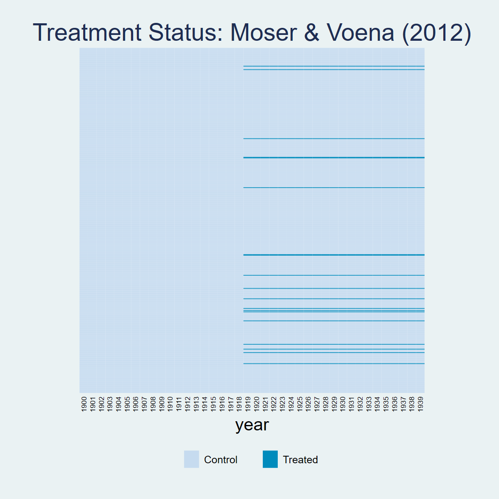
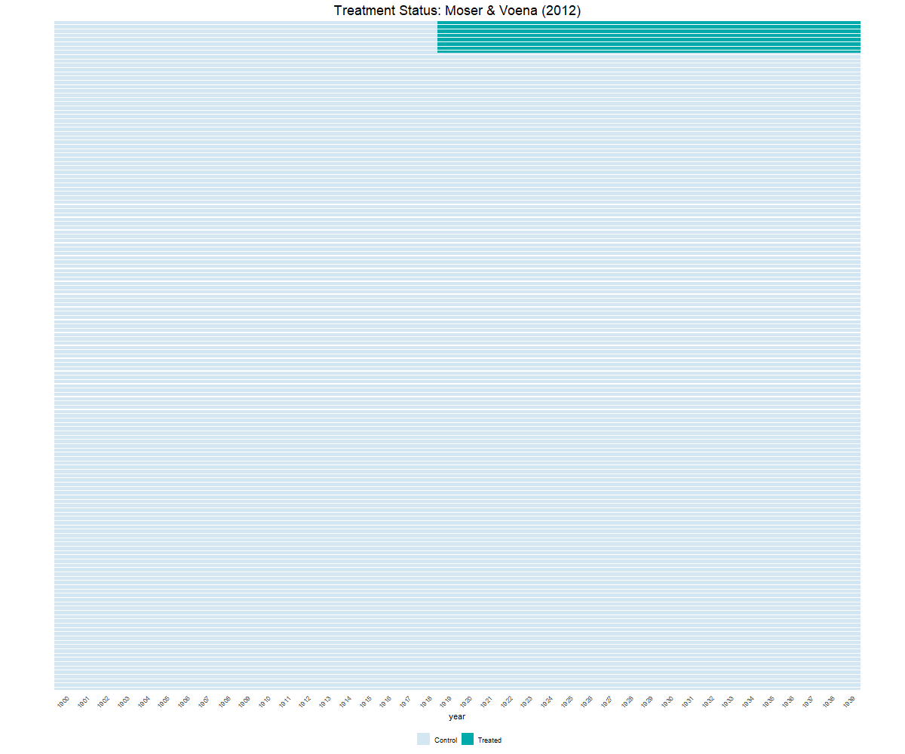
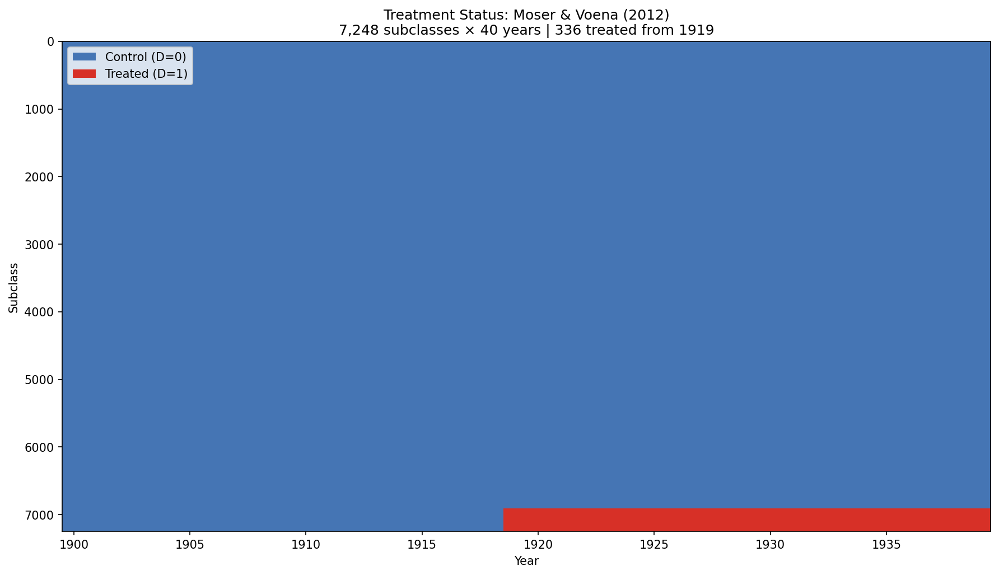
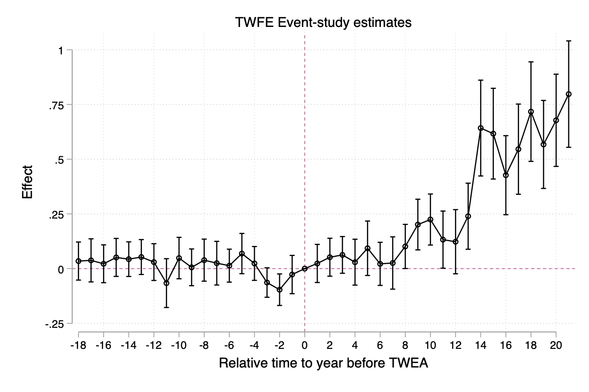
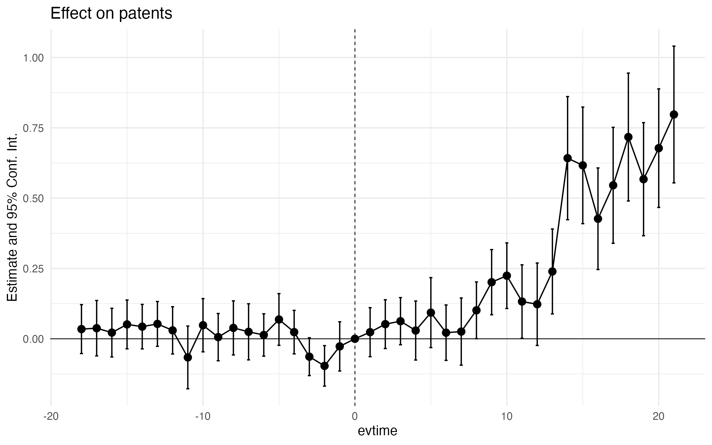
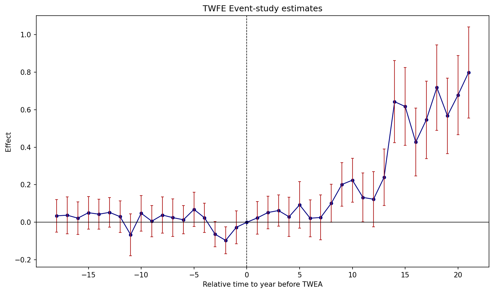
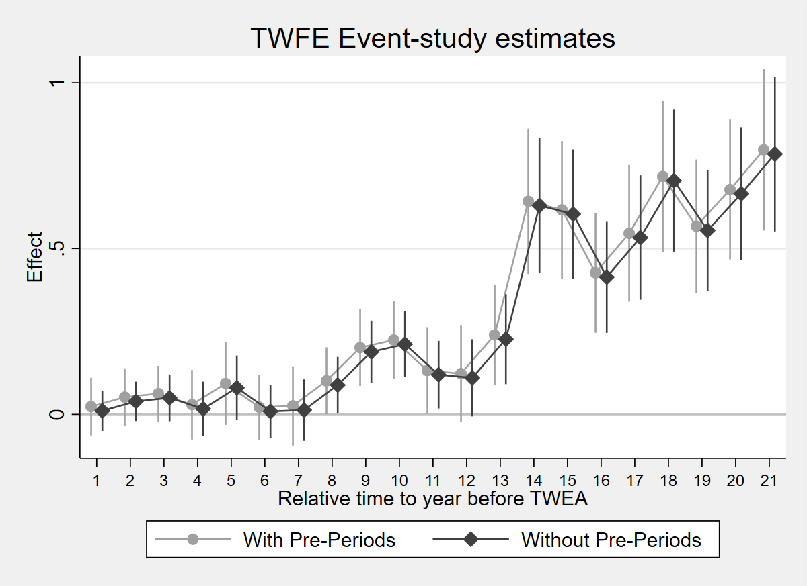
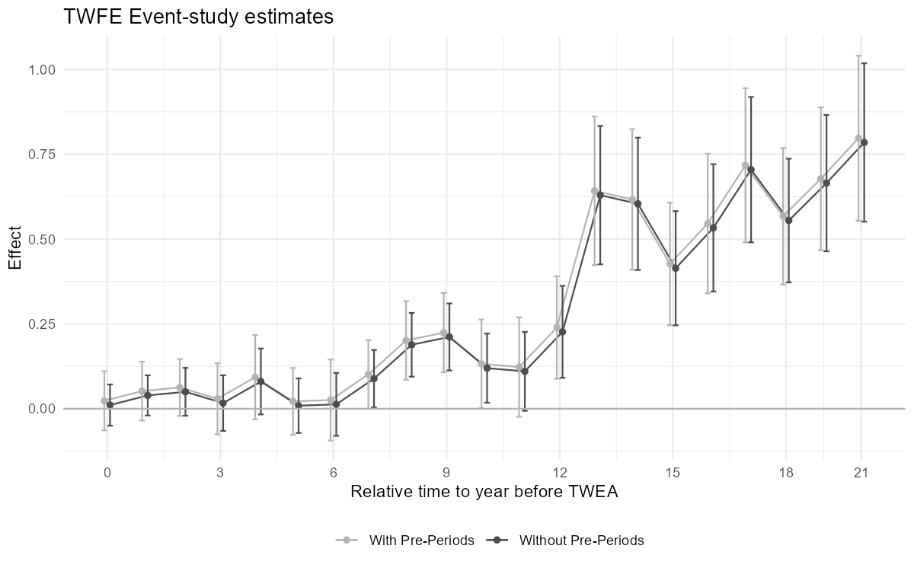
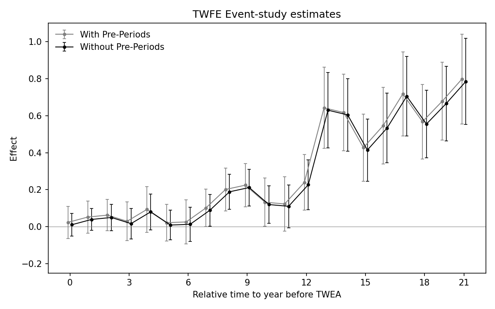

## Overview

Dataset: **Moser & Voena (2012)** — `moser_voena_didtextbook.dta, moser_voena_didtextbook.RData, moser_voena_didtextbook.parquet`

The Trading with the Enemy Act (TWEA) allowed US firms to use German-owned patents. Treatment ($D_{g,t}$) equals 1 for the 336 subclasses that received German patents, starting in 1919. The dataset contains 289,920 observations (7,248 subclasses × 40 years).

---

## Panel View

::: {.panel-tabset}

### Stata

```stata
* ssc install panelview, replace
copy "https://raw.githubusercontent.com/anzonyquispe/did_book/main/cc_xd_didtextbook_2025_9_30/Data%20sets/Moser%20and%20Voena%202012/moser_voena_didtextbook.dta" "moser_voena_didtextbook.dta", replace
use "moser_voena_didtextbook.dta", clear
panelview patents twea, i(subclass) t(year) type(treat) title("Treatment Status: Moser & Voena (2012)") ylabel(none) ytitle("")
graph export "figures/ch03_panelview_stata.png", replace width(1200)
```



### R

```r
library(panelView)
load(url("https://raw.githubusercontent.com/anzonyquispe/did_book/main/cc_xd_didtextbook_2025_9_30/Data%20sets/Moser%20and%20Voena%202012/moser_voena_didtextbook.RData"))
png("figures/ch03_panelview_R.png", width = 1000, height = 600)
panelview(patents ~ twea, data = df, index = c("subclass", "year"), type = "treat",
          main = "Moser & Voena (2012)", ylab = "")
dev.off()
```



### Python

```python
import pandas as pd
import matplotlib.pyplot as plt
import matplotlib.colors as mcolors
from matplotlib.patches import Patch

df = pd.read_parquet("https://raw.githubusercontent.com/anzonyquispe/did_book/main/cc_xd_didtextbook_2025_9_30/Data%20sets/Moser%20and%20Voena%202012/moser_voena_didtextbook.parquet")
pv = df.pivot_table(index="subclass", columns="year", values="twea", aggfunc="first")
pv_sorted = pv.loc[pv.mean(axis=1).sort_values(ascending=False).index]
cmap = mcolors.ListedColormap(["#D4E6F1", "#00AAAA"])
fig, ax = plt.subplots(figsize=(12, 10))
ax.imshow(pv_sorted.values, aspect="auto", cmap=cmap, interpolation="nearest", vmin=0, vmax=1)
for i in range(0, len(pv_sorted), 10):
    ax.axhline(y=i - 0.5, color="white", linewidth=0.15)
ax.set_xticks(range(0, len(pv_sorted.columns), 1))
ax.set_xticklabels([int(c) for c in pv_sorted.columns], rotation=45, ha="right", fontsize=8)
ax.set_yticks([])
ax.set_xlabel("year")
ax.set_title("Treatment Status: Moser & Voena (2012)", fontsize=16)
ax.legend(handles=[Patch(facecolor="#D4E6F1", edgecolor="gray", label="Control"),
                   Patch(facecolor="#00AAAA", edgecolor="gray", label="Treated")],
          loc="lower center", bbox_to_anchor=(0.5, -0.12), ncol=2)
plt.tight_layout()
plt.savefig("figures/ch03_panelview_Python.png", dpi=150, bbox_inches="tight")
plt.show()
```



:::

---

## CQ#1: Static TWFE Regression

> Using the `moser_voena_didtextbook` dataset, run the TWFE regression of the number of patents in subclass $g$ and year $t$ on subclass and year FEs and the `twea` treatment, clustering standard errors at the subclass level.

::: {.panel-tabset}

### Stata

```stata
* ssc install reghdfe, replace
copy "https://raw.githubusercontent.com/anzonyquispe/did_book/main/cc_xd_didtextbook_2025_9_30/Data%20sets/Moser%20and%20Voena%202012/moser_voena_didtextbook.dta" "moser_voena_didtextbook.dta", replace
use "moser_voena_didtextbook.dta", clear

* Ejemplo 1: xtreg
xtreg patents twea i.year, fe i(subclass) robust cluster(subclass)

* Ejemplo 2: reghdfe
reghdfe patents twea, absorb(subclass year) cluster(subclass)
```

```
Both commands yield the same coefficient:
                           (Std. err. adjusted for 7,248 clusters in subclass)
------------------------------------------------------------------------------
             |               Robust
     patents | Coefficient  std. err.      t    P>|t|     [95% conf. interval]
-------------+----------------------------------------------------------------
        twea |   .2882615   .0388871     7.41   0.000     .2120315    .3644915
------------------------------------------------------------------------------
```

### R

```r
library(fixest); library(haven)
options(digits=7)
load(url("https://raw.githubusercontent.com/anzonyquispe/did_book/main/cc_xd_didtextbook_2025_9_30/Data%20sets/Moser%20and%20Voena%202012/moser_voena_didtextbook.RData"))

# Ejemplo 1
summary(feols(patents ~ twea + i(year) | subclass, data = df, cluster = ~subclass))

# Ejemplo 2
summary(feols(patents ~ twea | subclass + year, data = df, cluster = ~subclass))
```

```
Ejemplo 1 (feols with i(year)):
     Estimate Std. Error  t value   Pr(>|t|)
twea 0.288262   0.038887  7.412783 1.3770e-13 ***

Ejemplo 2 (feols with subclass + year):
     Estimate Std. Error t value  Pr(>|t|)
twea 0.288262   0.038887 7.41278 1.377e-13 ***
```

### Python

```python
import pandas as pd
import pyfixest as pf

df = pd.read_parquet("https://raw.githubusercontent.com/anzonyquispe/did_book/main/cc_xd_didtextbook_2025_9_30/Data%20sets/Moser%20and%20Voena%202012/moser_voena_didtextbook.parquet")

# Ejemplo 1
m1 = pf.feols('patents ~ twea + i(year) | subclass', data=df, vcov={'CRV1': 'subclass'})
c1 = m1.coef(); s1 = m1.se(); t1 = m1.tstat(); p1 = m1.pvalue()
for name in c1.index:
    print(f"{name:>20s} | {c1[name]:>12.7f}  {s1[name]:>10.7f}  {t1[name]:>8.2f}   {p1[name]:>8.4f}")

# Ejemplo 2
m2 = pf.feols('patents ~ twea | subclass + year', data=df, vcov={'CRV1': 'subclass'})
c2 = m2.coef(); s2 = m2.se(); t2 = m2.tstat(); p2 = m2.pvalue()
print("\n--- Ejemplo 2 ---")
for name in c2.index:
    print(f"{name:>20s} | {c2[name]:>12.7f}  {s2[name]:>10.7f}  {t2[name]:>8.2f}   {p2[name]:>8.4f}")
```

```
Ejemplo 1:
                twea |    0.2882615   0.0388871      7.41     0.0000
     C(year)[T.1901] |    0.0059327   0.0077529      0.77     0.4442
     ...

Ejemplo 2:
                twea |    0.2882615   0.0388871      7.41     0.0000
```

:::

**Result:** The coefficient on `twea` is **0.28826** ($t = 7.41$, $p < 0.001$) across all three languages. Compulsory licensing has a positive and significant effect on US innovation.

---

## CQ#2: Equivalence between Static TWFE and DID

> Verify that $\hat{\beta}_{fe}$ equals the coefficient on `twea` in a regression on the treatment group indicator, the post indicator, and `twea`.

::: {.panel-tabset}

### Stata

```stata
copy "https://raw.githubusercontent.com/anzonyquispe/did_book/main/cc_xd_didtextbook_2025_9_30/Data%20sets/Moser%20and%20Voena%202012/moser_voena_didtextbook.dta" "moser_voena_didtextbook.dta", replace
use "moser_voena_didtextbook.dta", clear
reg patents treatmentgroup post twea, cluster(subclass)
```

```
                             (Std. err. adjusted for 7,248 clusters in subclass)
--------------------------------------------------------------------------------
               |               Robust
       patents | Coefficient  std. err.      t    P>|t|     [95% conf. interval]
---------------+----------------------------------------------------------------
treatmentgroup |  -.1780874   .0338152    -5.27   0.000    -.2443751   -.1117996
          post |   .2996666   .0090614    33.07   0.000     .2819036    .3174296
          twea |   .2882615   .0388846     7.41   0.000     .2120364    .3644867
         _cons |   .3143656   .0098186    32.02   0.000     .2951183    .3336129
--------------------------------------------------------------------------------
```

### R

```r
library(haven); library(fixest)
load(url("https://raw.githubusercontent.com/anzonyquispe/did_book/main/cc_xd_didtextbook_2025_9_30/Data%20sets/Moser%20and%20Voena%202012/moser_voena_didtextbook.RData"))
model2 <- feols(patents ~ treatmentgroup + post + twea,
                data = df, cluster = ~subclass)
summary(model2)
```

```
OLS estimation, Dep. Var.: patents
Observations: 289,920
Standard-errors: Clustered (subclass)
                Estimate Std. Error  t value   Pr(>|t|)
(Intercept)     0.314366   0.009819 32.01738  < 2.2e-16 ***
treatmentgroup -0.178087   0.033815 -5.26648 1.4306e-07 ***
post            0.299667   0.009061 33.07069  < 2.2e-16 ***
twea            0.288262   0.038885  7.41326 1.3721e-13 ***
```

### Python

```python
import pandas as pd
import pyfixest as pf

df = pd.read_parquet("https://raw.githubusercontent.com/anzonyquispe/did_book/main/cc_xd_didtextbook_2025_9_30/Data%20sets/Moser%20and%20Voena%202012/moser_voena_didtextbook.parquet")
m2 = pf.feols("patents ~ treatmentgroup + post + twea",
              data=df, vcov={"CRV1": "subclass"})
print(m2.summary())
```

```
| Coefficient    |   Estimate |   Std. Error |   t value |   Pr(>|t|) |    2.5% |   97.5% |
|:---------------|------------|--------------|-----------|------------|---------|---------|
| Intercept      |    0.31437 |      0.00982 |  32.01738 |      0.000 |  0.2951 |   0.334 |
| treatmentgroup |   -0.17809 |      0.03382 |  -5.26648 |      0.000 | -0.2444 |  -0.112 |
| post           |    0.29967 |      0.00906 |  33.07069 |      0.000 |  0.2819 |   0.317 |
| twea           |    0.28826 |      0.03889 |   7.41326 |      0.000 |  0.2120 |   0.365 |
```

:::

**Result:** The coefficient on `twea` is **identical** (0.28826) in both specifications across all three languages.

---

## CQ#3: Testing Randomized Treatment

> Regress patents on the treatment group indicator, restricting the sample to years before 1919.

::: {.panel-tabset}

### Stata

```stata
copy "https://raw.githubusercontent.com/anzonyquispe/did_book/main/cc_xd_didtextbook_2025_9_30/Data%20sets/Moser%20and%20Voena%202012/moser_voena_didtextbook.dta" "moser_voena_didtextbook.dta", replace
use "moser_voena_didtextbook.dta", clear
reg patents treatmentgroup if year<=1918, cluster(subclass)
```

```
                             (Std. err. adjusted for 7,248 clusters in subclass)
--------------------------------------------------------------------------------
               |               Robust
       patents | Coefficient  std. err.      t    P>|t|     [95% conf. interval]
---------------+----------------------------------------------------------------
treatmentgroup |  -.1780874   .0338152    -5.27   0.000     -.244375   -.1117997
         _cons |   .3143656   .0098186    32.02   0.000     .2951183    .3336128
--------------------------------------------------------------------------------
```

### R

```r
library(haven); library(fixest); library(dplyr)
load(url("https://raw.githubusercontent.com/anzonyquispe/did_book/main/cc_xd_didtextbook_2025_9_30/Data%20sets/Moser%20and%20Voena%202012/moser_voena_didtextbook.RData"))
model3 <- feols(patents ~ treatmentgroup,
                data = df %>% filter(year <= 1918), cluster = ~subclass)
summary(model3)
```

```
OLS estimation, Dep. Var.: patents
Observations: 137,712
Standard-errors: Clustered (subclass)
                Estimate Std. Error  t value   Pr(>|t|)
(Intercept)     0.314366   0.009819 32.01743  < 2.2e-16 ***
treatmentgroup -0.178087   0.033815 -5.26649 1.4306e-07 ***
```

### Python

```python
import pandas as pd
import pyfixest as pf

df = pd.read_parquet("https://raw.githubusercontent.com/anzonyquispe/did_book/main/cc_xd_didtextbook_2025_9_30/Data%20sets/Moser%20and%20Voena%202012/moser_voena_didtextbook.parquet")
df_pre = df[df["year"] <= 1918].copy()
m3 = pf.feols("patents ~ treatmentgroup",
              data=df_pre, vcov={"CRV1": "subclass"})
print(m3.summary())
```

```
| Coefficient    |   Estimate |   Std. Error |   t value |   Pr(>|t|) |    2.5% |   97.5% |
|:---------------|------------|--------------|-----------|------------|---------|---------|
| Intercept      |    0.31437 |      0.00982 |  32.01743 |      0.000 |  0.2951 |   0.334 |
| treatmentgroup |   -0.17809 |      0.03382 |  -5.26649 |      0.000 | -0.2444 |  -0.112 |
```

:::

**Result:** The coefficient is **−0.17809** ($t = -5.27$, $p < 0.001$). Treatment is **not** randomly assigned — treated subclasses had fewer patents before the TWEA.

---

## CQ#4–7: Event-Study TWFE Regression

> Estimate the event-study TWFE regression. Test whether pre-trend coefficients are jointly significant. Verify that $\hat{\beta}_1^{fe}$ equals the DID from equation (3.7).

Now estimate the event-study TWFE regression:

::: {.panel-tabset}

### Stata

```stata
copy "https://raw.githubusercontent.com/anzonyquispe/did_book/main/cc_xd_didtextbook_2025_9_30/Data%20sets/Moser%20and%20Voena%202012/moser_voena_didtextbook.dta" "moser_voena_didtextbook.dta", replace
use "moser_voena_didtextbook.dta", clear
forvalues l = 1/18 {
    gen reltimeminus`l' = treatmentgroup * (year == 1918 - `l')
}
forvalues l = 1/21 {
    gen reltimeplus`l' = treatmentgroup * (year == 1918 + `l')
}
reg patents i.year treatmentgroup reltimeminus* reltimeplus*, cluster(subclass)

* F-test on pre-trends
test reltimeminus1 reltimeminus2 reltimeminus3 reltimeminus4 reltimeminus5 reltimeminus6 reltimeminus7 reltimeminus8 reltimeminus9 reltimeminus10 reltimeminus11 reltimeminus12 reltimeminus13 reltimeminus14 reltimeminus15 reltimeminus16 reltimeminus17 reltimeminus18
```

```
       F( 18,  7247) =    3.79
            Prob > F =    0.0000
```

```stata
* Verify equation (3.7) for l=1 (continues from above)
quietly summarize patents if year==1919 & treatmentgroup==1
scalar m1 = r(mean)
quietly summarize patents if year==1918 & treatmentgroup==1
scalar m2 = r(mean)
quietly summarize patents if year==1919 & treatmentgroup==0
scalar m3 = r(mean)
quietly summarize patents if year==1918 & treatmentgroup==0
scalar m4 = r(mean)
display "DID manual = " m1-m2-(m3-m4)
```

```
DID manual (eq 3.7, l=1) = .02352017
```

### R

```r
library(haven); library(fixest); library(car)
load(url("https://raw.githubusercontent.com/anzonyquispe/did_book/main/cc_xd_didtextbook_2025_9_30/Data%20sets/Moser%20and%20Voena%202012/moser_voena_didtextbook.RData"))
for (l in 1:18) df[[paste0("reltimeminus", l)]] <- as.numeric(df$treatmentgroup == 1 & df$year == 1918 - l)
for (l in 1:21) df[[paste0("reltimeplus", l)]] <- as.numeric(df$treatmentgroup == 1 & df$year == 1918 + l)

event_formula <- as.formula(paste(
  "patents ~ i(year) + treatmentgroup +",
  paste(paste0("reltimeminus", 1:18), collapse = " + "), "+",
  paste(paste0("reltimeplus", 1:21), collapse = " + ")))
model4 <- feols(event_formula, data = df, cluster = ~subclass)

# F-test on pre-trends
library(car)
linearHypothesis(model4, paste0("reltimeminus", 1:18))

# DID manual
m1 <- mean(df$patents[df$year == 1919 & df$treatmentgroup == 1])
m2 <- mean(df$patents[df$year == 1918 & df$treatmentgroup == 1])
m3 <- mean(df$patents[df$year == 1919 & df$treatmentgroup == 0])
m4 <- mean(df$patents[df$year == 1918 & df$treatmentgroup == 0])
cat("DID manual:", m1 - m2 - (m3 - m4))
```

```
Chisq = 68.25, p-value = 8.915e-08

DID manual (eq 3.7, l=1): 0.02352017
reltimeplus1 coef:         0.02352017
```

### Python

```python
import pandas as pd
import pyfixest as pf
import numpy as np
from scipy import stats

df = pd.read_parquet("https://raw.githubusercontent.com/anzonyquispe/did_book/main/cc_xd_didtextbook_2025_9_30/Data%20sets/Moser%20and%20Voena%202012/moser_voena_didtextbook.parquet")
for l in range(1, 19):
    df[f"reltimeminus{l}"] = (df["treatmentgroup"] * (df["year"] == 1918 - l)).astype(float)
for l in range(1, 22):
    df[f"reltimeplus{l}"] = (df["treatmentgroup"] * (df["year"] == 1918 + l)).astype(float)

minus_vars = [f"reltimeminus{i}" for i in range(1, 19)]
plus_vars  = [f"reltimeplus{i}"  for i in range(1, 22)]
all_reltime = minus_vars + plus_vars

fml_es = "patents ~ " + " + ".join(all_reltime) + " + treatmentgroup | year"
m4 = pf.feols(fml_es, data=df, vcov={"CRV1": "subclass"})

# F-test on pre-trends
c = m4.coef()
v_mat = pd.DataFrame(m4._vcov, index=c.index, columns=c.index)
pre_names = [x for x in minus_vars if x in c.index]
beta_pre = c[pre_names].values
V_pre = v_mat.loc[pre_names, pre_names].values
F_stat = beta_pre @ np.linalg.inv(V_pre) @ beta_pre / len(pre_names)
p_val = 1 - stats.f.cdf(F_stat, len(pre_names), df["subclass"].nunique() - 1)
print(f"F-test: F({len(pre_names)}, {df['subclass'].nunique()-1}) = {F_stat:.4f}, p = {p_val:.4f}")

# DID manual
m1v = df.loc[(df["year"]==1919) & (df["treatmentgroup"]==1), "patents"].mean()
m2v = df.loc[(df["year"]==1918) & (df["treatmentgroup"]==1), "patents"].mean()
m3v = df.loc[(df["year"]==1919) & (df["treatmentgroup"]==0), "patents"].mean()
m4v = df.loc[(df["year"]==1918) & (df["treatmentgroup"]==0), "patents"].mean()
print(f"DID manual (eq 3.7, l=1): {m1v - m2v - (m3v - m4v):.8f}")
print(f"reltimeplus1 coef:        {m4.coef()['reltimeplus1']:.8f}")
```

```
F-test: F(18, 7247) = 3.7917, p = 0.0000

DID manual (eq 3.7, l=1): 0.02352017
reltimeplus1 coef:        0.02352017
```

:::

**Result:** Pre-trends are jointly significant ($F = 3.79$, $p < 0.001$). The manual DID (**0.02352**) matches `reltimeplus1` exactly.

### Figure 3.2: TWFE Event-Study Plot

::: {.panel-tabset}

### Stata

```stata
copy "https://raw.githubusercontent.com/anzonyquispe/did_book/main/cc_xd_didtextbook_2025_9_30/Data%20sets/Moser%20and%20Voena%202012/moser_voena_didtextbook.dta" "moser_voena_didtextbook.dta", replace
use "moser_voena_didtextbook.dta", clear
reg patents i.year treatmentgroup reltimeminus* reltimeplus*, cluster(subclass)
coefplot, keep(reltimeminus* reltimeplus*) vertical yline(0) xline(18.5, lpattern(dash)) xtitle("Relative time to year before TWEA") ytitle("Effect") title("TWFE Event-study estimates") ciopts(recast(rcap) color(cranberry))
graph export "figures/ch03_fig32_es_twfe.png", replace width(1200)
```



### R

```r
library(fixest); library(haven)
options(digits=7)
load(url("https://raw.githubusercontent.com/anzonyquispe/did_book/main/cc_xd_didtextbook_2025_9_30/Data%20sets/Moser%20and%20Voena%202012/moser_voena_didtextbook.RData"))
reltimeminus_vars <- paste0("reltimeminus", 1:18)
reltimeplus_vars <- paste0("reltimeplus", 1:21)
formula_str <- paste("patents ~", paste(reltimeminus_vars, collapse = " + "), "+",
    paste(reltimeplus_vars, collapse = " + "), "+ treatmentgroup | year")
model4 <- feols(as.formula(formula_str), data = df, cluster = ~subclass)
rt <- c(-(18:1), 0, 1:21)
coefs <- c(rev(coef(model4)[paste0("reltimeminus", 18:1)]), 0,
           coef(model4)[paste0("reltimeplus", 1:21)])
ses <- c(rev(se(model4)[paste0("reltimeminus", 18:1)]), 0,
         se(model4)[paste0("reltimeplus", 1:21)])
png("figures/ch03_fig32_es_twfe_R.png", width = 1000, height = 600)
plot(rt, coefs, type = "b", pch = 19, col = "navy", cex = 0.6,
     xlab = "Relative time to year before TWEA", ylab = "Effect",
     main = "TWFE Event-study estimates", ylim = range(coefs - 1.96*ses, coefs + 1.96*ses))
arrows(rt, coefs - 1.96*ses, rt, coefs + 1.96*ses,
       length = 0.03, angle = 90, code = 3, col = "firebrick")
abline(h = 0, col = "black", lwd = 0.8)
abline(v = 0, col = "black", lty = 2)
dev.off()
```



### Python

```python
import pandas as pd
import pyfixest as pf
import matplotlib.pyplot as plt
import numpy as np

df = pd.read_parquet("https://raw.githubusercontent.com/anzonyquispe/did_book/main/cc_xd_didtextbook_2025_9_30/Data%20sets/Moser%20and%20Voena%202012/moser_voena_didtextbook.parquet")
minus_vars = [f"reltimeminus{i}" for i in range(1, 19)]
plus_vars = [f"reltimeplus{i}" for i in range(1, 22)]
fml = "patents ~ " + " + ".join(minus_vars + plus_vars) + " + treatmentgroup | year"
m4 = pf.feols(fml, data=df, vcov={'CRV1': 'subclass'})
rt = list(range(-18, 0)) + [0] + list(range(1, 22))
c4 = [m4.coef()[f"reltimeminus{i}"] for i in range(18, 0, -1)] + [0] + \
     [m4.coef()[f"reltimeplus{i}"] for i in range(1, 22)]
s4 = [m4.se()[f"reltimeminus{i}"] for i in range(18, 0, -1)] + [0] + \
     [m4.se()[f"reltimeplus{i}"] for i in range(1, 22)]
c4, s4 = np.array(c4), np.array(s4)
fig, ax = plt.subplots(figsize=(10, 6))
ax.plot(rt, c4, 'o-', color='navy', markersize=4, linewidth=1.2)
ax.errorbar(rt, c4, yerr=1.96*s4, fmt='none', ecolor='firebrick', capsize=2, linewidth=1)
ax.axhline(0, color='black', linewidth=0.8)
ax.axvline(0, color='black', linestyle='--', linewidth=0.8)
ax.set_xlabel("Relative time to year before TWEA")
ax.set_ylabel("Effect")
ax.set_title("TWFE Event-study estimates")
plt.tight_layout()
plt.savefig("figures/ch03_fig32_es_twfe_Python.png", dpi=150, bbox_inches="tight")
```



:::

*Figure 3.2: Effects of compulsory licensing on US innovation, according to an ES-TWFER. Standard errors clustered at the patent subclass level. 95% confidence intervals shown in red.*

---

## CQ#9: Event-Study without Pre-Trends

> Re-estimate the event-study using only post-treatment dummies. This is numerically equivalent to Borusyak, Jaravel, and Spiess (2024).

::: {.panel-tabset}

### Stata

```stata
copy "https://raw.githubusercontent.com/anzonyquispe/did_book/main/cc_xd_didtextbook_2025_9_30/Data%20sets/Moser%20and%20Voena%202012/moser_voena_didtextbook.dta" "moser_voena_didtextbook.dta", replace
use "moser_voena_didtextbook.dta", clear
forvalues l = 1/21 {
    gen reltimeplus`l' = treatmentgroup * (year == 1918 + `l')
}
reg patents i.yearpost treatmentgroup reltimeplus*, cluster(subclass)
```

```
                             (Std. err. adjusted for 7,248 clusters in subclass)
--------------------------------------------------------------------------------
               |               Robust
       patents | Coefficient  std. err.      t    P>|t|     [95% conf. interval]
---------------+----------------------------------------------------------------
treatmentgroup |  -.1780874   .0338176    -5.27   0.000    -.2443797   -.1117951
  reltimeplus1 |   .0108007   .0309763     0.35   0.727     -.049922    .0715233
  reltimeplus2 |   .0393018   .0302047     1.30   0.193    -.0199081    .0985118
  reltimeplus3 |   .0498425   .0359726     1.39   0.166    -.0206743    .1203593
  reltimeplus4 |   .0166497   .0418098     0.40   0.690    -.0653098    .0986092
  reltimeplus5 |   .0803071    .049547     1.62   0.105    -.0168195    .1774337
  reltimeplus6 |   .0089819    .041055     0.22   0.827    -.0714978    .0894616
  reltimeplus7 |   .0129501   .0472633     0.27   0.784    -.0796997       .1056
  reltimeplus8 |   .0885536   .0432021     2.05   0.040     .0038648    .1732424
  reltimeplus9 |   .1885454   .0479442     3.93   0.000     .0945607      .28253
 reltimeplus10 |   .2115488    .050361     4.20   0.000     .1128266     .310271
 reltimeplus11 |   .1196796   .0520212     2.30   0.021      .017703    .2216563
 reltimeplus12 |   .1101517   .0593023     1.86   0.063    -.0060982    .2264015
 reltimeplus13 |   .2266778   .0691283     3.28   0.001     .0911663    .3621893
 reltimeplus14 |   .6294969   .1040565     6.05   0.000     .4255158     .833478
 reltimeplus15 |   .6038686   .0994844     6.07   0.000     .4088502     .798887
 reltimeplus16 |   .4141158   .0858483     4.82   0.000     .2458282    .5824034
 reltimeplus17 |   .5330394   .0957086     5.57   0.000     .3454227    .7206561
 reltimeplus18 |   .7046044    .109204     6.45   0.000     .4905328     .918676
 reltimeplus19 |   .5546581   .0930222     5.96   0.000     .3723075    .7370087
 reltimeplus20 |   .6650045   .1024705     6.49   0.000     .4641324    .8658766
 reltimeplus21 |   .7847135   .1190138     6.59   0.000     .5514119    1.018015
         _cons |   .3143656   .0098193    32.02   0.000     .2951169    .3336142
--------------------------------------------------------------------------------
```

### R

```r
library(haven); library(fixest)
load(url("https://raw.githubusercontent.com/anzonyquispe/did_book/main/cc_xd_didtextbook_2025_9_30/Data%20sets/Moser%20and%20Voena%202012/moser_voena_didtextbook.RData"))
for (l in 1:21) df[[paste0("reltimeplus", l)]] <- as.numeric(df$treatmentgroup == 1 & df$year == 1918 + l)

post_formula <- as.formula(paste(
  "patents ~ i(yearpost) + treatmentgroup +",
  paste(paste0("reltimeplus", 1:21), collapse = " + ")))
model5 <- feols(post_formula, data = df, cluster = ~subclass)
summary(model5)
```

```
                Estimate Std. Error  t value   Pr(>|t|)
treatmentgroup -0.178087   0.033818 -5.266118 1.4334e-07 ***
reltimeplus1    0.010801   0.030976  0.348674 7.2734e-01
reltimeplus2    0.039302   0.030205  1.301183 1.9324e-01
reltimeplus3    0.049843   0.035973  1.385634 1.6590e-01
reltimeplus4    0.016650   0.041810  0.398234 6.9050e-01
reltimeplus5    0.080307   0.049547  1.620753 1.0514e-01
reltimeplus6    0.008982   0.041055  0.218776 8.2685e-01
reltimeplus7    0.012950   0.047263  0.274032 7.8404e-01
reltimeplus8    0.088554   0.043202  2.049798 4.0405e-02 *
reltimeplus9    0.188545   0.047944  3.932590 8.4570e-05 ***
reltimeplus10   0.211549   0.050361  4.201191 2.6755e-05 ***
reltimeplus11   0.119680   0.052021  2.300631 2.1441e-02 *
reltimeplus12   0.110152   0.059302  1.857479 6.3256e-02
reltimeplus13   0.226678   0.069128  3.278641 1.0478e-03 **
reltimeplus14   0.629497   0.104057  6.050261 1.5073e-09 ***
reltimeplus15   0.603869   0.099484  6.069422 1.3510e-09 ***
reltimeplus16   0.414116   0.085848  4.823560 1.4305e-06 ***
reltimeplus17   0.533039   0.095709  5.568517 2.6464e-08 ***
reltimeplus18   0.704604   0.109204  6.452210 1.1588e-10 ***
reltimeplus19   0.554658   0.093022  5.963752 2.5802e-09 ***
reltimeplus20   0.665005   0.102471  6.490150 9.2071e-11 ***
reltimeplus21   0.784714   0.119014  6.593469 4.5985e-11 ***
---
RMSE: 1.33696   Adj. R2: 0.025481
```

### Python

```python
import pandas as pd
import pyfixest as pf

df = pd.read_parquet("https://raw.githubusercontent.com/anzonyquispe/did_book/main/cc_xd_didtextbook_2025_9_30/Data%20sets/Moser%20and%20Voena%202012/moser_voena_didtextbook.parquet")
for l in range(1, 22):
    df[f"reltimeplus{l}"] = (df["treatmentgroup"] * (df["year"] == 1918 + l)).astype(float)

plus_vars = [f"reltimeplus{i}" for i in range(1, 22)]
fml5 = "patents ~ " + " + ".join(plus_vars) + " + treatmentgroup | yearpost"
m5 = pf.feols(fml5, data=df, vcov={"CRV1": "subclass"})
print(m5.summary())
```

```
| Coefficient    |   Estimate |   Std. Error |   t value |   Pr(>|t|) |    2.5% |   97.5% |
|:---------------|------------|--------------|-----------|------------|---------|---------|
| reltimeplus1   |    0.01080 |      0.03098 |   0.34867 |    0.72734 | -0.0499 |   0.072 |
| reltimeplus2   |    0.03930 |      0.03020 |   1.30118 |    0.19324 | -0.0199 |   0.099 |
| reltimeplus3   |    0.04984 |      0.03597 |   1.38563 |    0.16590 | -0.0207 |   0.120 |
| reltimeplus4   |    0.01665 |      0.04181 |   0.39823 |    0.69050 | -0.0653 |   0.099 |
| reltimeplus5   |    0.08031 |      0.04955 |   1.62075 |    0.10514 | -0.0168 |   0.177 |
| reltimeplus6   |    0.00898 |      0.04106 |   0.21878 |    0.82685 | -0.0715 |   0.089 |
| reltimeplus7   |    0.01295 |      0.04726 |   0.27403 |    0.78404 | -0.0797 |   0.106 |
| reltimeplus8   |    0.08855 |      0.04320 |   2.04980 |    0.04041 |  0.0039 |   0.173 |
| reltimeplus9   |    0.18855 |      0.04794 |   3.93259 |    0.00008 |  0.0946 |   0.283 |
| reltimeplus10  |    0.21155 |      0.05036 |   4.20119 |    0.00003 |  0.1128 |   0.310 |
| reltimeplus11  |    0.11968 |      0.05202 |   2.30063 |    0.02144 |  0.0177 |   0.222 |
| reltimeplus12  |    0.11015 |      0.05930 |   1.85748 |    0.06326 | -0.0061 |   0.226 |
| reltimeplus13  |    0.22668 |      0.06913 |   3.27864 |    0.00105 |  0.0912 |   0.362 |
| reltimeplus14  |    0.62950 |      0.10406 |   6.05026 |    0.00000 |  0.4255 |   0.833 |
| reltimeplus15  |    0.60387 |      0.09948 |   6.06942 |    0.00000 |  0.4089 |   0.799 |
| reltimeplus16  |    0.41412 |      0.08585 |   4.82356 |    0.00000 |  0.2458 |   0.582 |
| reltimeplus17  |    0.53304 |      0.09571 |   5.56852 |    0.00000 |  0.3454 |   0.721 |
| reltimeplus18  |    0.70460 |      0.10920 |   6.45221 |    0.00000 |  0.4905 |   0.919 |
| reltimeplus19  |    0.55466 |      0.09302 |   5.96375 |    0.00000 |  0.3723 |   0.737 |
| reltimeplus20  |    0.66500 |      0.10247 |   6.49015 |    0.00000 |  0.4641 |   0.866 |
| reltimeplus21  |    0.78471 |      0.11901 |   6.59347 |    0.00000 |  0.5514 |   1.018 |
| treatmentgroup |   -0.17809 |      0.03382 |  -5.26612 |    0.00000 | -0.2444 |  -0.112 |
---
RMSE: 1.337 R2: 0.026 R2 Within: 0.001
```

:::

### Figure 3.5: Comparison of two ES-TWFER estimators

::: {.panel-tabset}

### Stata

```stata
copy "https://raw.githubusercontent.com/anzonyquispe/did_book/main/cc_xd_didtextbook_2025_9_30/Data%20sets/Moser%20and%20Voena%202012/moser_voena_didtextbook.dta" "moser_voena_didtextbook.dta", replace
use "moser_voena_didtextbook.dta", clear

reg patents i.year treatmentgroup reltimeminus* reltimeplus*, cluster(subclass)
estimates store m1

reg patents i.yearpost treatmentgroup reltimeplus*, cluster(subclass)
estimates store m2

coefplot (m1, label("With Pre-Periods") mcolor(gs10) ciopts(lcolor(gs10)) connect(l) lcolor(gs10) msymbol(O) msize(small)) (m2, label("Without Pre-Periods") mcolor(gs4) ciopts(lcolor(gs4)) connect(l) lcolor(gs4) msymbol(O) msize(small)), keep(reltimeplus*) vertical yline(0, lcolor(gs12) lpattern(solid)) title("TWFE Event-study estimates") xtitle("Relative time to year before TWEA") ytitle("Effect") legend(rows(1) position(6)) scheme(s2mono) rename(reltimeplus1="0" reltimeplus4="3" reltimeplus7="6" reltimeplus10="9" reltimeplus13="12" reltimeplus16="15" reltimeplus19="18" reltimeplus21="21" reltimeplus2=" " reltimeplus3=" " reltimeplus5=" " reltimeplus6=" " reltimeplus8=" " reltimeplus9=" " reltimeplus11=" " reltimeplus12=" " reltimeplus14=" " reltimeplus15=" " reltimeplus17=" " reltimeplus18=" " reltimeplus20=" ")
graph export "figures/ch03_fig35_comparison.png", replace width(1200)
```



### R

```r
library(fixest); library(dplyr); library(ggplot2)
load(url("https://raw.githubusercontent.com/anzonyquispe/did_book/main/cc_xd_didtextbook_2025_9_30/Data%20sets/Moser%20and%20Voena%202012/moser_voena_didtextbook.RData"))

reltimeminus_vars <- paste0("reltimeminus", 1:18)
reltimeplus_vars <- paste0("reltimeplus", 1:21)

fml1 <- as.formula(paste("patents ~ i(year) + treatmentgroup +", paste(c(reltimeminus_vars, reltimeplus_vars), collapse = " + ")))
m1 <- feols(fml1, data = df, cluster = ~subclass)

fml2 <- as.formula(paste("patents ~ i(yearpost) + treatmentgroup +", paste(reltimeplus_vars, collapse = " + ")))
m2 <- feols(fml2, data = df, cluster = ~subclass)

coef1 <- data.frame(x = 1:21, est = coef(m1)[reltimeplus_vars], se = se(m1)[reltimeplus_vars], model = "With Pre-Periods")
coef2 <- data.frame(x = 1:21, est = coef(m2)[reltimeplus_vars], se = se(m2)[reltimeplus_vars], model = "Without Pre-Periods")
plotdf <- rbind(coef1, coef2)
plotdf$lo <- plotdf$est - 1.96 * plotdf$se
plotdf$hi <- plotdf$est + 1.96 * plotdf$se

ggplot(plotdf, aes(x = x, y = est, color = model)) +
  geom_line(position = position_dodge(0.3)) +
  geom_point(position = position_dodge(0.3), size = 1.5) +
  geom_errorbar(aes(ymin = lo, ymax = hi), width = 0.3, position = position_dodge(0.3)) +
  geom_hline(yintercept = 0, linetype = "solid", color = "grey70") +
  scale_color_manual(values = c("With Pre-Periods" = "grey70", "Without Pre-Periods" = "grey30")) +
  scale_x_continuous(breaks = c(1, 4, 7, 10, 13, 16, 19, 21), labels = c("0", "3", "6", "9", "12", "15", "18", "21")) +
  labs(x = "Relative time to year before TWEA", y = "Effect", title = "TWFE Event-study estimates", color = "") +
  theme_minimal() + theme(legend.position = "bottom")
ggsave("figures/ch03_fig35_comparison_R.png", width = 8, height = 5, dpi = 150)
```



### Python

```python
import pandas as pd
import numpy as np
import pyfixest as pf
import matplotlib.pyplot as plt

df = pd.read_parquet("https://raw.githubusercontent.com/anzonyquispe/did_book/main/cc_xd_didtextbook_2025_9_30/Data%20sets/Moser%20and%20Voena%202012/moser_voena_didtextbook.parquet")

minus_vars = [f"reltimeminus{i}" for i in range(1, 19)]
plus_vars = [f"reltimeplus{i}" for i in range(1, 22)]

fml1 = "patents ~ " + " + ".join(minus_vars + plus_vars) + " + C(year) + treatmentgroup"
m1 = pf.feols(fml1, data=df, vcov={"CRV1": "subclass"})

fml2 = "patents ~ " + " + ".join(plus_vars) + " + C(yearpost) + treatmentgroup"
m2 = pf.feols(fml2, data=df, vcov={"CRV1": "subclass"})

x = np.arange(1, 22)
c1 = np.array([m1.coef()[v] for v in plus_vars])
s1 = np.array([m1.se()[v] for v in plus_vars])
c2 = np.array([m2.coef()[v] for v in plus_vars])
s2 = np.array([m2.se()[v] for v in plus_vars])

fig, ax = plt.subplots(figsize=(8, 5))
ax.errorbar(x - 0.1, c1, yerr=1.96*s1, fmt='-o', color='grey', markersize=3, linewidth=1, capsize=2, capthick=0.8, elinewidth=0.8, label='With Pre-Periods')
ax.errorbar(x + 0.1, c2, yerr=1.96*s2, fmt='-o', color='black', markersize=3, linewidth=1, capsize=2, capthick=0.8, elinewidth=0.8, label='Without Pre-Periods')
ax.axhline(y=0, color='grey', linestyle='-', linewidth=0.5)
ax.set_xticks([1, 4, 7, 10, 13, 16, 19, 21])
ax.set_xticklabels(["0", "3", "6", "9", "12", "15", "18", "21"])
ax.set_xlabel("Relative time to year before TWEA")
ax.set_ylabel("Effect")
ax.set_title("TWFE Event-study estimates")
ax.legend(loc='upper left', frameon=False)
ax.set_ylim(-0.25, 1.1)
plt.tight_layout()
plt.savefig("figures/ch03_fig35_comparison_Python.png", dpi=150)
plt.show()
```



:::

*Figure 3.5: Effects of compulsory licensing on US innovation: comparison of two ES-TWFER estimators. The coefficients shown in grey come from the usual ES-TWFER with FEs for pre-treatment periods. The coefficients shown in black come from the imputation ES-TWFER without FEs for pre-treatment periods. Standard errors are clustered at the patent subclass level. 95% confidence intervals shown.*

---

## CQ#8: Linear Pre-Trends We Could Fail to Detect

> Use the pretrends package (Roth, 2022) to compute the linear differential trends one has 50% chances of detecting based on the first 6 pre-trend estimators.

::: {.panel-tabset}

### Stata

```stata
* ssc install pretrends, replace
copy "https://raw.githubusercontent.com/anzonyquispe/did_book/main/cc_xd_didtextbook_2025_9_30/Data%20sets/Moser%20and%20Voena%202012/moser_voena_didtextbook.dta" "moser_voena_didtextbook.dta", replace
use "moser_voena_didtextbook.dta", clear
forvalues l = 1/18 {
    gen reltimeminus`l' = treatmentgroup * (year == 1918 - `l')
}
forvalues l = 1/21 {
    gen reltimeplus`l' = treatmentgroup * (year == 1918 + `l')
}
reghdfe patents reltimeminus* reltimeplus*, absorb(treatmentgroup year) cluster(subclass)
pretrends power 0.5, numpre(6)
```

```
Slope for 50% power =  .0098235
```

### R

```r
library(haven); library(fixest); library(pretrends)
load(url("https://raw.githubusercontent.com/anzonyquispe/did_book/main/cc_xd_didtextbook_2025_9_30/Data%20sets/Moser%20and%20Voena%202012/moser_voena_didtextbook.RData"))
for (l in 1:18) df[[paste0("reltimeminus", l)]] <- as.numeric(df$treatmentgroup == 1 & df$year == 1918 - l)
for (l in 1:21) df[[paste0("reltimeplus", l)]] <- as.numeric(df$treatmentgroup == 1 & df$year == 1918 + l)

model6 <- feols(as.formula(paste(
  "patents ~", paste(paste0("reltimeminus", 1:18), collapse = " + "), "+",
  paste(paste0("reltimeplus", 1:21), collapse = " + "), "| treatmentgroup + year")),
  data = df, cluster = ~subclass)

# Extract coefficients and vcov for first 6 pre-periods
pretrend_coefs_6 <- paste0("reltimeminus", 1:6)
beta <- coef(model6)[pretrend_coefs_6]
sigma <- vcov(model6)[pretrend_coefs_6, pretrend_coefs_6]
slope50 <- slope_for_power(sigma = sigma, targetPower = 0.5,
                           tVec = -6:-1, referencePeriod = 0)
cat("Slope for 50% power:", slope50)
```

```
Slope for 50% power (numpre=6): 0.009796021
```

### Python

```python
import pandas as pd
import pyfixest as pf
from pretrends import slope_for_power

df = pd.read_parquet("https://raw.githubusercontent.com/anzonyquispe/did_book/main/cc_xd_didtextbook_2025_9_30/Data%20sets/Moser%20and%20Voena%202012/moser_voena_didtextbook.parquet")
for l in range(1, 19):
    df[f"reltimeminus{l}"] = (df["treatmentgroup"] * (df["year"] == 1918 - l)).astype(float)
for l in range(1, 22):
    df[f"reltimeplus{l}"] = (df["treatmentgroup"] * (df["year"] == 1918 + l)).astype(float)

minus_vars = [f"reltimeminus{i}" for i in range(1, 19)]
plus_vars = [f"reltimeplus{i}" for i in range(1, 22)]

# Full model (matches Stata: reghdfe patents reltimeminus* reltimeplus*)
fml6 = "patents ~ " + " + ".join(minus_vars + plus_vars) + " | treatmentgroup + year"
m6 = pf.feols(fml6, data=df, vcov={"CRV1": "subclass"})

# Extract vcov for 6 closest pre-periods
pre6 = [f"reltimeminus{i}" for i in range(1, 7)]
vcov6 = pd.DataFrame(m6._vcov, index=m6.coef().index,
                      columns=m6.coef().index).loc[pre6, pre6].values

slope50 = slope_for_power(vcov6, target_power=0.5,
                           t_vec=[-6, -5, -4, -3, -2, -1])
print(f"Slope for 50% power (numpre=6): {slope50:.7f}")
```

```
Slope for 50% power (numpre=6): 0.0098252
```

:::

**Note:** All three platforms give essentially identical results: Stata ≈ 0.0098235, R ≈ 0.009796, Python ≈ 0.0098252. The Python `pretrends` package (based on Roth 2022) uses the exact multivariate normal CDF, matching Stata and R.

---

## CQ#10: Variance of Treatment Effects

> Compare the variance of `diffpatentswrt1918` in treatment and control groups in 1932.

::: {.panel-tabset}

### Stata

```stata
copy "https://raw.githubusercontent.com/anzonyquispe/did_book/main/cc_xd_didtextbook_2025_9_30/Data%20sets/Moser%20and%20Voena%202012/moser_voena_didtextbook.dta" "moser_voena_didtextbook.dta", replace
use "moser_voena_didtextbook.dta", clear
sdtest diffpatentswrt1918 if year==1932, by(treatmentgroup)

scalar sd_effects = r(sd_2) - r(sd_1)
reg diffpatentswrt1918 treatmentgroup if year==1932
display "Bottom and top decile of effects: [" _b[treatmentgroup] - 1.28*sd_effects ", " _b[treatmentgroup] + 1.28*sd_effects "]
```

```

Variance ratio test
------------------------------------------------------------------------------
   Group |     Obs        Mean    Std. err.   Std. dev.   [95% conf. interval]
---------+--------------------------------------------------------------------
       0 |   6,912    .3577836    .0213236    1.772807    .3159828    .3995843
       1 |     336           1    .1097584    2.011905    .7840975    1.215903
---------+--------------------------------------------------------------------
Combined |   7,248    .3875552    .0210201    1.789547    .3463497    .4287606
------------------------------------------------------------------------------

    ratio = sd(0) / sd(1)                        f =   0.7764
  Pr(F < f) = 0.0004     2*Pr(F < f) = 0.0008

sd_2 - sd_1 = .23909779
beta = .64221644
Bottom and top decile of effects: [.33617126, .94826161]
```

### R

```r
library(haven)
library(dplyr)

load(url("https://raw.githubusercontent.com/anzonyquispe/did_book/main/cc_xd_didtextbook_2025_9_30/Data%20sets/Moser%20and%20Voena%202012/moser_voena_didtextbook.RData"))

df_1932 <- df %>% filter(year == 1932)

var_test <- var.test(diffpatentswrt1918 ~ treatmentgroup, data = df_1932)
print(var_test)

sd_stats <- df_1932 %>%
  group_by(treatmentgroup) %>%
  summarise(sd = sd(diffpatentswrt1918, na.rm = TRUE))

sd_effects <- sd_stats$sd[2] - sd_stats$sd[1]

effect_reg <- lm(diffpatentswrt1918 ~ treatmentgroup, data = df_1932)

beta_reg <- coef(effect_reg)["treatmentgroup"]

cat(
  "Bottom and top decile of effects: [",
  beta_reg - 1.28 * sd_effects,
  ",",
  beta_reg + 1.28 * sd_effects,
  "]\n"
)
```

```
F = 0.77644, p-value = 0.0008145
SD control: 1.772807
SD treated: 2.011905
sd_2 - sd_1 = 0.2390978
beta = 0.6422164
Bottom and top decile of effects: [ 0.3361713 , 0.9482616 ]
```

### Python

```python
import pandas as pd
import pyfixest as pf
from scipy import stats
df = pd.read_parquet(
    "https://raw.githubusercontent.com/anzonyquispe/did_book/main/cc_xd_didtextbook_2025_9_30/Data%20sets/Moser%20and%20Voena%202012/moser_voena_didtextbook.parquet"
)
df_1932 = df[df["year"] == 1932]
g0 = df_1932.loc[
    df_1932["treatmentgroup"] == 0,
    "diffpatentswrt1918"
].dropna()

g1 = df_1932.loc[
    df_1932["treatmentgroup"] == 1,
    "diffpatentswrt1918"
].dropna()

sd0 = g0.std(ddof=1)
sd1 = g1.std(ddof=1)

sd_effects = sd1 - sd0

F_var = sd0**2 / sd1**2

p_two = 2 * min(
    stats.f.cdf(F_var, len(g0) - 1, len(g1) - 1),
    1 - stats.f.cdf(F_var, len(g0) - 1, len(g1) - 1)
)

m7 = pf.feols(
    "diffpatentswrt1918 ~ treatmentgroup",
    data=df_1932
)

beta = m7.coef()["treatmentgroup"]

print(f"F = {F_var:.4f}, p = {p_two:.4f}")
print(f"sd_2 - sd_1 = {sd_effects:.6f}")
print(f"beta = {beta:.6f}")

print(
    f"Bottom and top decile of effects: "
    f"[{beta - 1.28 * sd_effects:.6f}, "
    f"{beta + 1.28 * sd_effects:.6f}]"
)
```

```
F = 0.7765, p = 0.0008

sd_2 - sd_1 = 0.238982

beta = 0.642216

Bottom and top decile of effects: [0.336320, 0.948113]
```

:::

**Result:** The treated group has a larger variance ($\hat{\sigma}_1 = 2.01 > \hat{\sigma}_0 = 1.77$). The implied SD of treatment effects is $\approx 0.239$, and the bottom and top deciles of subclass-specific effects are respectively equal to 0.336 and 0.948.

