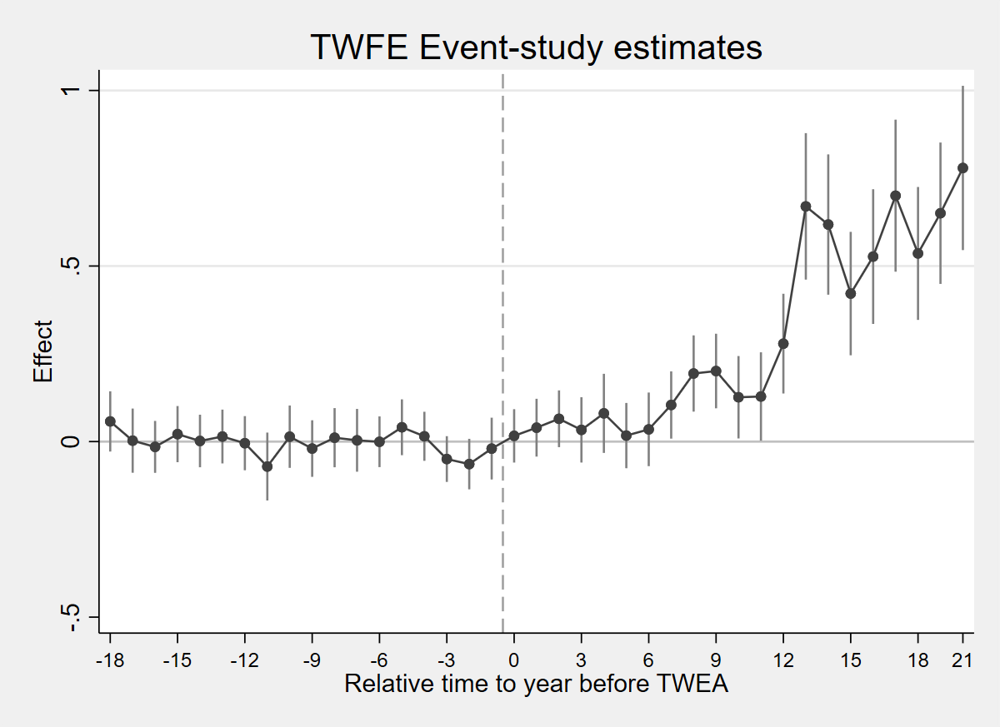
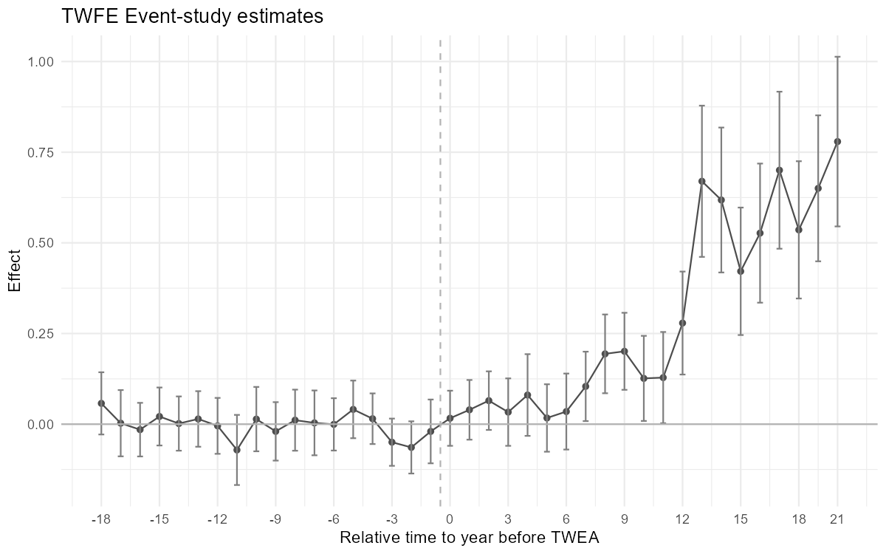
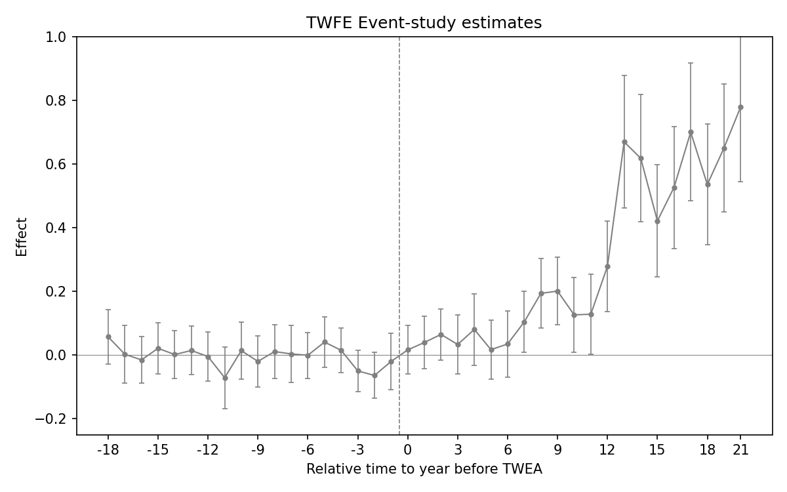
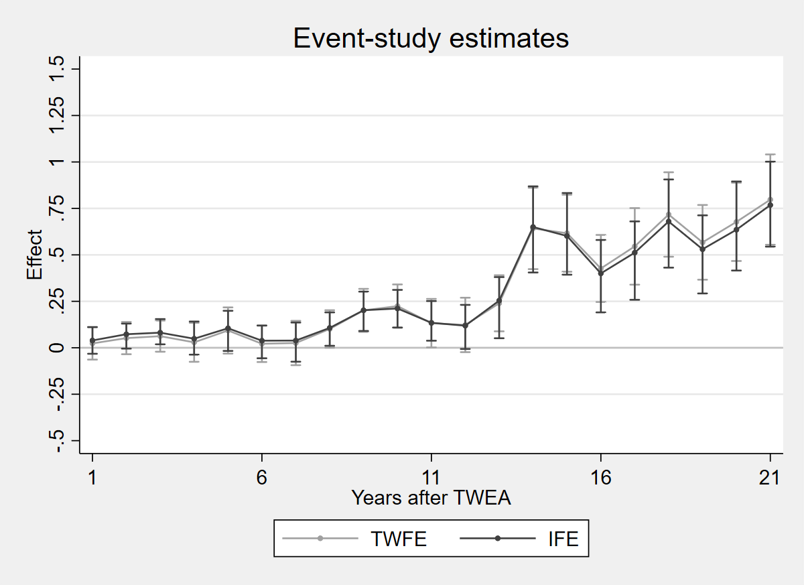
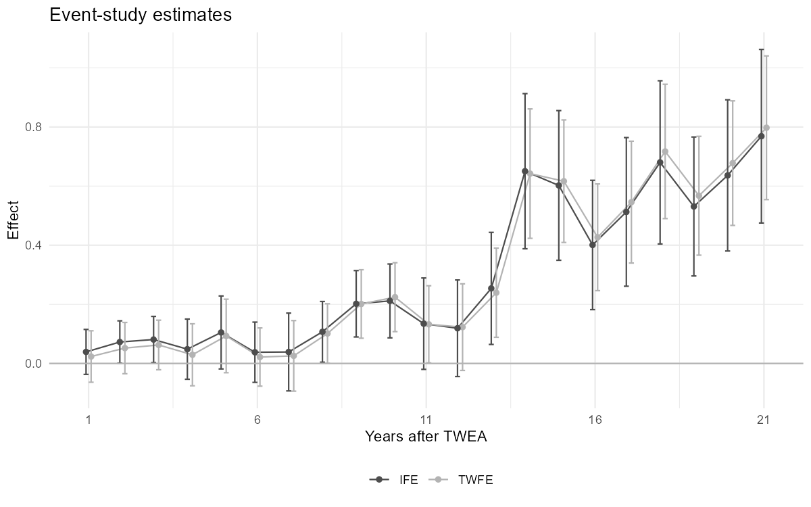
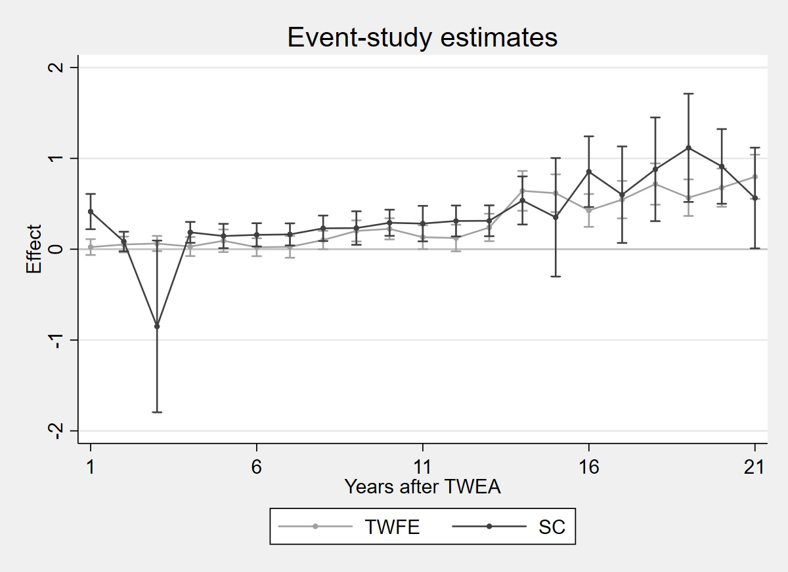
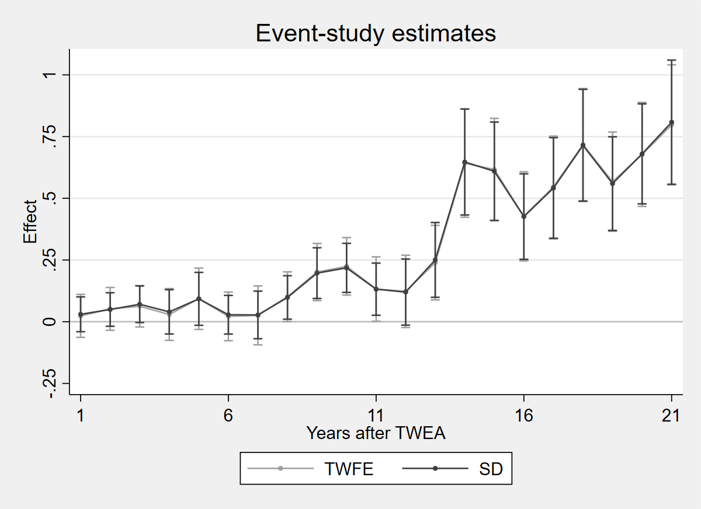
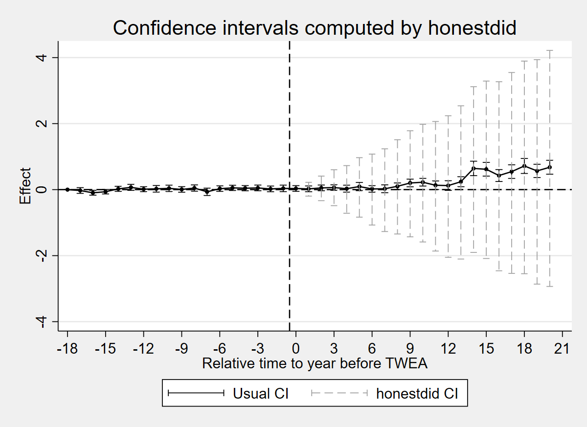
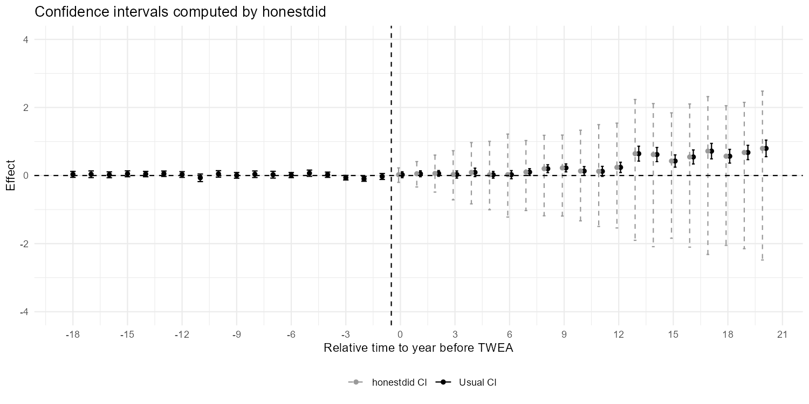

## Overview

Dataset: **Moser & Voena (2012)** — `moser_voena_didtextbook.dta, moser_voena_didtextbook.RData, moser_voena_didtextbook.parquet`

This chapter explores alternatives to the parallel trends assumption. We consider: (1) TWFE with control variables, (2) Interactive Fixed Effects, (3) Synthetic Control, (4) Synthetic DID, and (5) sensitivity analysis using HonestDiD.

---

## CQ#11: TWFE with Controls (controlling for patents in 1900)

> Estimate the event-study TWFE regression controlling for `year#patents1900` interactions. Are the estimated event-study effects with controls very different from those without controls?

::: {.panel-tabset}

### Stata

```stata
* ssc install reghdfe, replace
copy "https://raw.githubusercontent.com/anzonyquispe/did_book/main/cc_xd_didtextbook_2025_9_30/Data%20sets/Moser%20and%20Voena%202012/moser_voena_didtextbook.dta" "moser_voena_didtextbook.dta", replace
use "moser_voena_didtextbook.dta", clear
reghdfe patents reltimeminus* reltimeplus*, absorb(year#patents1900 treatmentgroup) cluster(subclass)
```

```
(dropped 120 singleton observations)
HDFE Linear regression                            Number of obs   =    289,800
Absorbing 2 HDFE groups                           F(  39,   7244) =       5.67
Statistics robust to heteroskedasticity           Prob > F        =     0.0000
                                                  R-squared       =     0.2017
                                                  Adj R-squared   =     0.2005
                                                  Within R-sq.    =     0.0018
Number of clusters (subclass) =      7,245        Root MSE        =     1.2046

                             (Std. err. adjusted for 7,245 clusters in subclass)
--------------------------------------------------------------------------------
               |               Robust
       patents | Coefficient  std. err.      t    P>|t|     [95% conf. interval]
---------------+----------------------------------------------------------------
 reltimeminus1 |  -.0199956   .0448816    -0.45   0.656    -.1079766    .0679854
 reltimeminus2 |  -.0641054   .0367139    -1.75   0.081    -.1360753    .0078645
 reltimeminus3 |  -.0497285   .0332297    -1.50   0.135    -.1148684    .0154115
 reltimeminus4 |   .0150341   .0356259     0.42   0.673    -.0548031    .0848712
 reltimeminus5 |   .0407338   .0405428     1.00   0.315    -.0387419    .1202095
 reltimeminus6 |  -.0005561   .0368071    -0.02   0.988    -.0727086    .0715965
 reltimeminus7 |   .0035782   .0456115     0.08   0.937    -.0858336    .0929901
 reltimeminus8 |   .0110298    .042976     0.26   0.797    -.0732157    .0952752
 reltimeminus9 |  -.0198643   .0411051    -0.48   0.629    -.1004423    .0607136
reltimeminus10 |    .013951   .0452813     0.31   0.758    -.0748135    .1027155
reltimeminus11 |  -.0710991    .049324    -1.44   0.149    -.1677885    .0255903
reltimeminus12 |  -.0046761   .0393384    -0.12   0.905    -.0817909    .0724386
reltimeminus13 |   .0143954   .0390986     0.37   0.713    -.0622493    .0910401
reltimeminus14 |   .0017015   .0381674     0.04   0.964    -.0731177    .0765207
reltimeminus15 |   .0211697   .0407824     0.52   0.604    -.0587756     .101115
reltimeminus16 |  -.0151022   .0377199    -0.40   0.689    -.0890442    .0588399
reltimeminus17 |   .0026673    .046629     0.06   0.954     -.088739    .0940737
reltimeminus18 |   .0573644   .0437614     1.31   0.190    -.0284207    .1431494
  reltimeplus1 |   .0163077   .0387799     0.42   0.674    -.0597122    .0923277
  reltimeplus2 |   .0395616   .0419817     0.94   0.346    -.0427348     .121858
  reltimeplus3 |   .0649224   .0412167     1.58   0.115    -.0158743    .1457191
  reltimeplus4 |   .0332733   .0474389     0.70   0.483    -.0597208    .1262674
  reltimeplus5 |   .0804001   .0574766     1.40   0.162    -.0322708     .193071
  reltimeplus6 |   .0170507   .0474503     0.36   0.719    -.0759657    .1100671
  reltimeplus7 |   .0348215   .0534565     0.65   0.515    -.0699689    .1396119
  reltimeplus8 |   .1041923   .0488441     2.13   0.033     .0084436     .199941
  reltimeplus9 |   .1939013   .0554245     3.50   0.000     .0852531    .3025495
 reltimeplus10 |   .2009451   .0541914     3.71   0.000     .0947141    .3071762
 reltimeplus11 |   .1262371   .0598691     2.11   0.035     .0088762    .2435981
 reltimeplus12 |    .128423   .0641903     2.00   0.045     .0025912    .2542548
 reltimeplus13 |   .2788762    .072442     3.85   0.000     .1368687    .4208836
 reltimeplus14 |   .6698552   .1064112     6.29   0.000     .4612582    .8784522
 reltimeplus15 |   .6181703   .1019476     6.06   0.000     .4183233    .8180173
 reltimeplus16 |   .4215474   .0896653     4.70   0.000     .2457773    .5973176
 reltimeplus17 |   .5268535    .097861     5.38   0.000     .3350174    .7186896
 reltimeplus18 |   .7003532   .1104681     6.34   0.000     .4838035    .9169028
 reltimeplus19 |    .535842   .0965702     5.55   0.000     .3465363    .7251477
 reltimeplus20 |    .650356   .1026827     6.33   0.000      .449068    .8516441
 reltimeplus21 |    .779268   .1193597     6.53   0.000     .5452882    1.013248
         _cons |   .4615322   .0085679    53.87   0.000     .4447366    .4783278
--------------------------------------------------------------------------------
```

### R

```r
library(fixest); library(haven); library(car); library(dplyr)
load(url("https://raw.githubusercontent.com/anzonyquispe/did_book/main/cc_xd_didtextbook_2025_9_30/Data%20sets/Moser%20and%20Voena%202012/moser_voena_didtextbook.RData"))

formula_str <- paste("patents ~",
    paste(paste0("reltimeminus", 1:18), collapse = " + "), "+",
    paste(paste0("reltimeplus", 1:21), collapse = " + "),
    "| year^patents1900 + treatmentgroup")
model_controls <- feols(as.formula(formula_str),
    data = df, cluster = ~subclass)
summary(model_controls)

# F-test on pre-trends
linearHypothesis(model_controls, paste0("reltimeminus", 1:18))

# Correlation test
corr_test <- feols(patents1900 ~ treatmentgroup,
    data = df %>% filter(year == 1900))
summary(corr_test)
```

```
NOTE: 120/0 fixed-effect singletons were removed (120 observations).
OLS estimation, Dep. Var.: patents
Observations: 289,800
Fixed-effects: year^patents1900: 400,  treatmentgroup: 2
Standard-errors: Clustered (subclass)
                Estimate Std. Error   t value   Pr(>|t|)
reltimeminus1  -0.019996   0.044882 -0.445518 6.5596e-01
reltimeminus2  -0.064105   0.036714 -1.746081 8.0839e-02
reltimeminus3  -0.049728   0.033230 -1.496505 1.3457e-01
reltimeminus4   0.015034   0.035626  0.421998 6.7304e-01
reltimeminus5   0.040734   0.040543  1.004711 3.1507e-01
reltimeminus6  -0.000556   0.036807 -0.015108 9.8795e-01
reltimeminus7   0.003578   0.045612  0.078450 9.3747e-01
reltimeminus8   0.011030   0.042976  0.256650 7.9746e-01
reltimeminus9  -0.019864   0.041105 -0.483258 6.2893e-01
reltimeminus10  0.013951   0.045281  0.308096 7.5802e-01
reltimeminus11 -0.071099   0.049324 -1.441471 1.4950e-01
reltimeminus12 -0.004676   0.039338 -0.118870 9.0538e-01
reltimeminus13  0.014395   0.039099  0.368182 7.1275e-01
reltimeminus14  0.001702   0.038167  0.044580 9.6444e-01
reltimeminus15  0.021170   0.040782  0.519089 6.0371e-01
reltimeminus16 -0.015102   0.037720 -0.400376 6.8889e-01
reltimeminus17  0.002667   0.046629  0.057203 9.5438e-01
reltimeminus18  0.057364   0.043761  1.310844 1.8995e-01
reltimeplus1    0.016308   0.038780  0.420520 6.7412e-01
reltimeplus2    0.039562   0.041982  0.942354 3.4604e-01
reltimeplus3    0.064922   0.041217  1.575150 1.1527e-01
reltimeplus4    0.033273   0.047439  0.701392 4.8308e-01
reltimeplus5    0.080400   0.057477  1.398831 1.6191e-01
reltimeplus6    0.017051   0.047450  0.359338 7.1935e-01
reltimeplus7    0.034821   0.053457  0.651398 5.1481e-01
reltimeplus8    0.104192   0.048844  2.133160 3.2945e-02 *
reltimeplus9    0.193901   0.055425  3.498476 4.7074e-04 ***
reltimeplus10   0.200945   0.054191  3.708061 2.1041e-04 ***
reltimeplus11   0.126237   0.059869  2.108551 3.5018e-02 *
reltimeplus12   0.128423   0.064190  2.000659 4.5466e-02 *
reltimeplus13   0.278876   0.072442  3.849646 1.1931e-04 ***
reltimeplus14   0.669855   0.106411  6.294968 3.2540e-10 ***
reltimeplus15   0.618170   0.101948  6.063608 1.3979e-09 ***
reltimeplus16   0.421547   0.089665  4.701344 2.6323e-06 ***
reltimeplus17   0.526854   0.097861  5.383692 7.5262e-08 ***
reltimeplus18   0.700353   0.110468  6.339869 2.4376e-10 ***
reltimeplus19   0.535842   0.096570  5.548733 2.9791e-08 ***
reltimeplus20   0.650356   0.102683  6.333646 2.5375e-10 ***
reltimeplus21   0.779268   0.119360  6.528737 7.0807e-11 ***
---
RMSE: 1.20373     Adj. R2: 0.200463
                Within R2: 0.001805

F-test: Chisq = 91.312550, p = 8.386428e-12

Correlation: treatmentgroup = -0.156312 (t = -3.61, p = 0.0003)
```

### Python

```python
import pandas as pd
import pyfixest as pf
import numpy as np
from scipy import stats

df = pd.read_parquet("https://raw.githubusercontent.com/anzonyquispe/did_book/main/cc_xd_didtextbook_2025_9_30/Data%20sets/Moser%20and%20Voena%202012/moser_voena_didtextbook.parquet")

minus_vars = [f"reltimeminus{i}" for i in range(1, 19)]
plus_vars = [f"reltimeplus{i}" for i in range(1, 22)]

df["year_x_pat1900"] = df["year"].astype(str) + "_" + \
                        df["patents1900"].astype(str)
fml = "patents ~ " + " + ".join(minus_vars + plus_vars) + \
      " | year_x_pat1900 + treatmentgroup"
m = pf.feols(fml, data=df, vcov={"CRV1": "subclass"})
print(m.summary())

# F-test on pre-trends
c = m.coef()
v_mat = pd.DataFrame(m._vcov, index=c.index, columns=c.index)
pre_names = [x for x in minus_vars if x in c.index]
beta_pre = c[pre_names].values
V_pre = v_mat.loc[pre_names, pre_names].values
F_stat = beta_pre @ np.linalg.inv(V_pre) @ beta_pre / len(pre_names)
p_val = 1 - stats.f.cdf(F_stat, len(pre_names),
                          df["subclass"].nunique() - 1)
print(f"F-test: F({len(pre_names)}, {df['subclass'].nunique()-1})"
      f" = {F_stat:.6f}, p = {p_val:.6e}")

# Correlation test
corr = pf.feols("patents1900 ~ treatmentgroup",
    data=df[df["year"] == 1900])
print(corr.summary())
```

```
(120 singleton fixed effects removed)
HDFE Linear regression
Dep. var.: patents
Observations: 289800
----------------------------------------------------------------------------
                 |  Coefficient    Std. err.          t      P>|t|
-----------------+-----------------------------------------------
   reltimeminus1 |    -0.019996     0.044882      -0.45     0.6560
   reltimeminus2 |    -0.064105     0.036714      -1.75     0.0808
   reltimeminus3 |    -0.049728     0.033230      -1.50     0.1346
   reltimeminus4 |     0.015034     0.035626       0.42     0.6730
   reltimeminus5 |     0.040734     0.040543       1.00     0.3151
   reltimeminus6 |    -0.000556     0.036807      -0.02     0.9879
   reltimeminus7 |     0.003578     0.045612       0.08     0.9375
   reltimeminus8 |     0.011030     0.042976       0.26     0.7975
   reltimeminus9 |    -0.019864     0.041105      -0.48     0.6289
  reltimeminus10 |     0.013951     0.045281       0.31     0.7580
  reltimeminus11 |    -0.071099     0.049324      -1.44     0.1495
  reltimeminus12 |    -0.004676     0.039338      -0.12     0.9054
  reltimeminus13 |     0.014395     0.039099       0.37     0.7127
  reltimeminus14 |     0.001702     0.038167       0.04     0.9644
  reltimeminus15 |     0.021170     0.040782       0.52     0.6037
  reltimeminus16 |    -0.015102     0.037720      -0.40     0.6889
  reltimeminus17 |     0.002667     0.046629       0.06     0.9544
  reltimeminus18 |     0.057364     0.043761       1.31     0.1900
    reltimeplus1 |     0.016308     0.038780       0.42     0.6741
    reltimeplus2 |     0.039562     0.041982       0.94     0.3460
    reltimeplus3 |     0.064922     0.041217       1.58     0.1153
    reltimeplus4 |     0.033273     0.047439       0.70     0.4831
    reltimeplus5 |     0.080400     0.057477       1.40     0.1619
    reltimeplus6 |     0.017051     0.047450       0.36     0.7194
    reltimeplus7 |     0.034821     0.053457       0.65     0.5148
    reltimeplus8 |     0.104192     0.048844       2.13     0.0329
    reltimeplus9 |     0.193901     0.055425       3.50     0.0005
   reltimeplus10 |     0.200945     0.054191       3.71     0.0002
   reltimeplus11 |     0.126237     0.059869       2.11     0.0350
   reltimeplus12 |     0.128423     0.064190       2.00     0.0455
   reltimeplus13 |     0.278876     0.072442       3.85     0.0001
   reltimeplus14 |     0.669855     0.106411       6.29     0.0000
   reltimeplus15 |     0.618170     0.101948       6.06     0.0000
   reltimeplus16 |     0.421547     0.089665       4.70     0.0000
   reltimeplus17 |     0.526854     0.097861       5.38     0.0000
   reltimeplus18 |     0.700353     0.110468       6.34     0.0000
   reltimeplus19 |     0.535842     0.096570       5.55     0.0000
   reltimeplus20 |     0.650356     0.102683       6.33     0.0000
   reltimeplus21 |     0.779268     0.119360       6.53     0.0000
----------------------------------------------------------------------------

F-test on pre-trends: F(18, 7247) = 5.072919
                      Prob > F = 1.019140e-11

Correlation test: patents1900 ~ treatmentgroup (year==1900)
------------------------------------------------------------
                 |  Coefficient    Std. err.          t
-----------------+------------------------------------
       Intercept |     0.221788     0.009315      23.81
  treatmentgroup |    -0.156312     0.043262      -3.61
------------------------------------------------------------
```

:::

**Result:** The pre-trend and event-study estimates are similar to those without controls.

### Figure 4.2: ES-TWFER with controls

::: {.panel-tabset}

### Stata

```stata
copy "https://raw.githubusercontent.com/anzonyquispe/did_book/main/cc_xd_didtextbook_2025_9_30/Data%20sets/Moser%20and%20Voena%202012/moser_voena_didtextbook.dta" "moser_voena_didtextbook.dta", replace
use "moser_voena_didtextbook.dta", clear
reghdfe patents reltimeminus* reltimeplus*, absorb(year#patents1900 treatmentgroup) cluster(subclass)
estimates store m_ctrl

coefplot m_ctrl, keep(reltimeminus* reltimeplus*) order(reltimeminus18 reltimeminus17 reltimeminus16 reltimeminus15 reltimeminus14 reltimeminus13 reltimeminus12 reltimeminus11 reltimeminus10 reltimeminus9 reltimeminus8 reltimeminus7 reltimeminus6 reltimeminus5 reltimeminus4 reltimeminus3 reltimeminus2 reltimeminus1 reltimeplus1 reltimeplus2 reltimeplus3 reltimeplus4 reltimeplus5 reltimeplus6 reltimeplus7 reltimeplus8 reltimeplus9 reltimeplus10 reltimeplus11 reltimeplus12 reltimeplus13 reltimeplus14 reltimeplus15 reltimeplus16 reltimeplus17 reltimeplus18 reltimeplus19 reltimeplus20 reltimeplus21) vertical yline(0, lcolor(gs12)) xline(18.5, lcolor(gs10) lpattern(dash)) title("TWFE Event-study estimates") xtitle("Relative time to year before TWEA") ytitle("Effect") scheme(s2mono) mcolor(gs4) ciopts(lcolor(gs8)) connect(l) lcolor(gs4) msymbol(O) msize(small) xlabel(1 "-18" 4 "-15" 7 "-12" 10 "-9" 13 "-6" 16 "-3" 19 "0" 22 "3" 25 "6" 28 "9" 31 "12" 34 "15" 37 "18" 39 "21", labsize(small))
graph export "figures/ch04_fig42_twfe_controls.png", replace width(1200)
```



### R

```r
library(fixest); library(ggplot2)
load(url("https://raw.githubusercontent.com/anzonyquispe/did_book/main/cc_xd_didtextbook_2025_9_30/Data%20sets/Moser%20and%20Voena%202012/moser_voena_didtextbook.RData"))

m_ctrl <- feols(patents ~ reltimeminus1 + reltimeminus2 + reltimeminus3 + reltimeminus4 + reltimeminus5 + reltimeminus6 + reltimeminus7 + reltimeminus8 + reltimeminus9 + reltimeminus10 + reltimeminus11 + reltimeminus12 + reltimeminus13 + reltimeminus14 + reltimeminus15 + reltimeminus16 + reltimeminus17 + reltimeminus18 + reltimeplus1 + reltimeplus2 + reltimeplus3 + reltimeplus4 + reltimeplus5 + reltimeplus6 + reltimeplus7 + reltimeplus8 + reltimeplus9 + reltimeplus10 + reltimeplus11 + reltimeplus12 + reltimeplus13 + reltimeplus14 + reltimeplus15 + reltimeplus16 + reltimeplus17 + reltimeplus18 + reltimeplus19 + reltimeplus20 + reltimeplus21 | year^patents1900 + treatmentgroup, data = df, cluster = ~subclass)

minus_vars <- paste0("reltimeminus", 18:1)
plus_vars <- paste0("reltimeplus", 1:21)
all_vars <- c(minus_vars, plus_vars)
ci <- data.frame(x = -18:20, est = coef(m_ctrl)[all_vars], se = se(m_ctrl)[all_vars])
ci$lo <- ci$est - 1.96 * ci$se
ci$hi <- ci$est + 1.96 * ci$se

ggplot(ci, aes(x = x, y = est)) +
  geom_line(color = "grey30") + geom_point(color = "grey30", size = 1.5) +
  geom_errorbar(aes(ymin = lo, ymax = hi), width = 0.3, color = "grey50") +
  geom_hline(yintercept = 0, color = "grey70") +
  geom_vline(xintercept = -0.5, linetype = "dashed", color = "grey70") +
  scale_x_continuous(breaks = seq(-18, 21, 3)) +
  labs(x = "Relative time to year before TWEA", y = "Effect", title = "TWFE Event-study estimates") +
  theme_minimal()
ggsave("figures/ch04_fig42_twfe_controls_R.png", width = 8, height = 5, dpi = 150)
```



### Python

```python
import pandas as pd, numpy as np, pyfixest as pf, matplotlib.pyplot as plt

df = pd.read_parquet("https://raw.githubusercontent.com/anzonyquispe/did_book/main/cc_xd_didtextbook_2025_9_30/Data%20sets/Moser%20and%20Voena%202012/moser_voena_didtextbook.parquet")
minus_vars = [f"reltimeminus{i}" for i in range(1, 19)]
plus_vars = [f"reltimeplus{i}" for i in range(1, 22)]
fml = "patents ~ " + " + ".join(minus_vars + plus_vars) + " | year^patents1900 + treatmentgroup"
m = pf.feols(fml, data=df, vcov={"CRV1": "subclass"})

all_vars = [f"reltimeminus{i}" for i in range(18, 0, -1)] + plus_vars
x = np.arange(-18, 21)
c = np.array([m.coef()[v] for v in all_vars])
s = np.array([m.se()[v] for v in all_vars])

fig, ax = plt.subplots(figsize=(8, 5))
ax.errorbar(x, c, yerr=1.96*s, fmt='-o', color='grey', markersize=3, capsize=2, linewidth=1, elinewidth=0.8)
ax.axhline(y=0, color='grey', linewidth=0.5)
ax.axvline(x=-0.5, color='grey', linestyle='--', linewidth=0.8)
ax.set_xticks(range(-18, 22, 3))
ax.set_xlabel("Relative time to year before TWEA")
ax.set_ylabel("Effect")
ax.set_title("TWFE Event-study estimates")
plt.tight_layout()
plt.savefig("figures/ch04_fig42_twfe_controls_Python.png", dpi=150)
plt.show()
```



:::

*Figure 4.2: Effects of compulsory licensing on US innovation, according to an ES-TWFER with controls. Standard errors are clustered at the patent subclass level. 95% confidence intervals shown.*

---

## CQ#12: DID with Nonparametric Trends (`did_multiplegt_dyn`)

> Use the `did_multiplegt_dyn` command to perform the same estimation with `trends_nonparam(patents1900)`. Are results very different from those you obtained with the TWFE ES regression with controls?

::: {.panel-tabset}

### Stata

```stata
* ssc install did_multiplegt_dyn, replace
copy "https://raw.githubusercontent.com/anzonyquispe/did_book/main/cc_xd_didtextbook_2025_9_30/Data%20sets/Moser%20and%20Voena%202012/moser_voena_didtextbook.dta" "moser_voena_didtextbook.dta", replace
use "moser_voena_didtextbook.dta", clear
did_multiplegt_dyn patents subclass year twea, effects(21) placebo(18) trends_nonparam(patents1900)
```

```
--------------------------------------------------------------------------------
             Estimation of treatment effects: Event-study effects
--------------------------------------------------------------------------------

             |  Estimate         SE      LB CI      UB CI          N  Switchers
-------------+------------------------------------------------------------------
    Effect_1 |  .0123774     .04079  -.0675695   .0923242       6992        336
    Effect_2 |    .03685   .0429563  -.0473428   .1210428       6992        336
    Effect_3 |  .0617362   .0424486  -.0214616    .144934       6992        336
    Effect_4 |  .0265509   .0510521  -.0735094   .1266112       6992        336
    Effect_5 |  .0733544   .0612449  -.0466835   .1933922       6992        336
    Effect_6 |  .0122893   .0489294  -.0836105   .1081892       6992        336
    Effect_7 |  .0279862   .0558801  -.0815369   .1375093       6992        336
    Effect_8 |  .1010481   .0496669   .0037028   .1983933       6992        336
    Effect_9 |  .1877217   .0571643   .0756817   .2997617       6992        336
   Effect_10 |  .1938123   .0579096   .0803116   .3073131       6992        336
   Effect_11 |  .1164829   .0638489  -.0086585   .2416244       6992        336
   Effect_12 |  .1182967   .0683539  -.0156746   .2522679       6992        336
   Effect_13 |  .2709911   .0741055    .125747   .4162351       6992        336
   Effect_14 |  .6614688   .1082719   .4492597   .8736779       6992        336
   Effect_15 |  .6108274   .1033414   .4082819   .8133728       6992        336
   Effect_16 |   .415785   .0904341   .2385374   .5930326       6992        336
   Effect_17 |  .5180924   .1004725   .3211699   .7150149       6992        336
   Effect_18 |   .689296   .1134788   .4668817   .9117102       6992        336
   Effect_19 |   .524998   .1001209   .3287646   .7212314       6992        336
   Effect_20 |  .6430043      .1028   .4415201   .8444885       6992        336
   Effect_21 |  .7738304    .120365   .5379193   1.009742       6992        336
--------------------------------------------------------------------------------
Test of joint nullity of the effects : p-value = 7.327e-15

--------------------------------------------------------------------------------
               Average cumulative (total) effect per treatment unit
--------------------------------------------------------------------------------

             |  Estimate         SE      LB CI      UB CI          N  Switch x Periods
-------------+--------------------------------------------------------------------------
  Av_tot_eff |  .2893714   .0489889   .1933549   .3853879     146832       7056
--------------------------------------------------------------------------------

--------------------------------------------------------------------------------
          Testing the parallel trends and no anticipation assumptions
--------------------------------------------------------------------------------

             |  Estimate         SE      LB CI      UB CI          N  Switchers
-------------+------------------------------------------------------------------
   Placebo_1 | -.0210605   .0457692  -.1107665   .0686455       6992        336
   Placebo_2 | -.0642981   .0374583  -.1377151   .0091189       6992        336
   Placebo_3 | -.0515437   .0342756  -.1187227   .0156353       6992        336
   Placebo_4 |  .0174201   .0362663  -.0536606   .0885007       6992        336
   Placebo_5 |  .0358319    .043043  -.0485308   .1201947       6992        336
   Placebo_6 | -.0030407   .0380414  -.0776004   .0715191       6992        336
   Placebo_7 | -.0056155    .051001  -.1055756   .0943446       6992        336
   Placebo_8 |  .0061129   .0454662  -.0829993    .095225       6992        336
   Placebo_9 | -.0215649    .042263   -.104399   .0612691       6992        336
  Placebo_10 |   .007594   .0483178  -.0871072   .1022952       6992        336
  Placebo_11 | -.0818832   .0588654  -.1972572   .0334907       6992        336
  Placebo_12 | -.0095863   .0420207  -.0919453   .0727728       6992        336
  Placebo_13 |  .0123832   .0406417  -.0672731   .0920396       6992        336
  Placebo_14 | -.0013973   .0400975  -.0799871   .0771924       6992        336
  Placebo_15 |  .0186997   .0417909   -.063209   .1006084       6992        336
  Placebo_16 | -.0183403   .0398628  -.0964699   .0597894       6992        336
  Placebo_17 | -.0058081    .052783  -.1092609   .0976447       6992        336
  Placebo_18 |  .0500484   .0489266  -.0458459   .1459427       6992        336
--------------------------------------------------------------------------------
Test of joint nullity of the placebos : p-value = 1.685e-12
```

### R

```r
library(haven); library(DIDmultiplegtDYN); library(polars)
load(url("https://raw.githubusercontent.com/anzonyquispe/did_book/main/cc_xd_didtextbook_2025_9_30/Data%20sets/Moser%20and%20Voena%202012/moser_voena_didtextbook.RData"))
result_dyn <- did_multiplegt_dyn(
    df = as.data.frame(df),
    outcome = "patents",
    group = "subclass",
    time = "year",
    treatment = "twea",
    effects = 21,
    placebo = 18,
    trends_nonparam = "patents1900",
    graph_off = TRUE
)
print(result_dyn)
```

```
----------------------------------------------------------------------
       Estimation of treatment effects: Event-study effects
----------------------------------------------------------------------
             Estimate SE      LB CI    UB CI   N     Switchers
Effect_1     0.0123774 0.0407900 -0.0675695 0.0923242 6,992 336
Effect_2     0.0368500 0.0429563 -0.0473428 0.1210428 6,992 336
Effect_3     0.0617362 0.0424486 -0.0214616 0.1449340 6,992 336
Effect_4     0.0265509 0.0510521 -0.0735094 0.1266112 6,992 336
Effect_5     0.0733544 0.0612449 -0.0466835 0.1933922 6,992 336
Effect_6     0.0122893 0.0489294 -0.0836105 0.1081892 6,992 336
Effect_7     0.0279862 0.0558801 -0.0815369 0.1375093 6,992 336
Effect_8     0.1010481 0.0496669  0.0037028 0.1983933 6,992 336
Effect_9     0.1877217 0.0571643  0.0756817 0.2997617 6,992 336
Effect_10    0.1938123 0.0579096  0.0803116 0.3073131 6,992 336
Effect_11    0.1164829 0.0638489 -0.0086585 0.2416244 6,992 336
Effect_12    0.1182967 0.0683539 -0.0156746 0.2522679 6,992 336
Effect_13    0.2709911 0.0741055  0.1257470 0.4162351 6,992 336
Effect_14    0.6614688 0.1082719  0.4492597 0.8736779 6,992 336
Effect_15    0.6108274 0.1033414  0.4082819 0.8133728 6,992 336
Effect_16    0.4157850 0.0904341  0.2385374 0.5930326 6,992 336
Effect_17    0.5180924 0.1004725  0.3211699 0.7150149 6,992 336
Effect_18    0.6892960 0.1134788  0.4668817 0.9117102 6,992 336
Effect_19    0.5249980 0.1001209  0.3287646 0.7212314 6,992 336
Effect_20    0.6430043 0.1028000  0.4415201 0.8444885 6,992 336
Effect_21    0.7738304 0.1203650  0.5379193 1.0097420 6,992 336

Test of joint nullity of the effects : p-value = 0.0000
----------------------------------------------------------------------
    Average cumulative (total) effect per treatment unit
----------------------------------------------------------------------
 Estimate        SE     LB CI     UB CI         N Switchers
  0.2893714   0.0489889   0.1933549   0.3853879   146,832     7,056
Average number of time periods over which effect is accumulated: 11.0000

----------------------------------------------------------------------
     Testing the parallel trends and no anticipation assumptions
----------------------------------------------------------------------
             Estimate SE      LB CI    UB CI   N     Switchers
Placebo_1   -0.0210605 0.0457692 -0.1107665 0.0686455 6,992 336
Placebo_2   -0.0642981 0.0374583 -0.1377151 0.0091189 6,992 336
Placebo_3   -0.0515437 0.0342756 -0.1187227 0.0156353 6,992 336
Placebo_4    0.0174201 0.0362663 -0.0536606 0.0885007 6,992 336
Placebo_5    0.0358319 0.0430430 -0.0485308 0.1201947 6,992 336
Placebo_6   -0.0030407 0.0380414 -0.0776004 0.0715191 6,992 336
Placebo_7   -0.0056155 0.0510010 -0.1055756 0.0943446 6,992 336
Placebo_8    0.0061129 0.0454662 -0.0829993 0.0952250 6,992 336
Placebo_9   -0.0215649 0.0422630 -0.1043990 0.0612691 6,992 336
Placebo_10   0.0075940 0.0483178 -0.0871072 0.1022952 6,992 336
Placebo_11  -0.0818832 0.0588654 -0.1972572 0.0334907 6,992 336
Placebo_12  -0.0095863 0.0420207 -0.0919453 0.0727728 6,992 336
Placebo_13   0.0123832 0.0406417 -0.0672731 0.0920396 6,992 336
Placebo_14  -0.0013973 0.0400975 -0.0799871 0.0771924 6,992 336
Placebo_15   0.0186997 0.0417909 -0.0632090 0.1006084 6,992 336
Placebo_16  -0.0183403 0.0398628 -0.0964699 0.0597894 6,992 336
Placebo_17  -0.0058081 0.0527830 -0.1092609 0.0976447 6,992 336
Placebo_18   0.0500484 0.0489266 -0.0458459 0.1459427 6,992 336

Test of joint nullity of the placebos : p-value = 0.0000
```

### Python

```python
import polars as pl
import pandas as pd
from did_multiplegt_dyn import DidMultiplegtDyn

df = pd.read_parquet("https://raw.githubusercontent.com/anzonyquispe/did_book/main/cc_xd_didtextbook_2025_9_30/Data%20sets/Moser%20and%20Voena%202012/moser_voena_didtextbook.parquet")
model = DidMultiplegtDyn(
    df=pl.from_pandas(df),
    outcome='patents',
    group='subclass',
    time='year',
    treatment='twea',
    effects=21,
    placebo=18,
    trends_nonparam=['patents1900']
)
model.fit()
model.summary()
```

```
               Block  Estimate       SE     LB CI    UB CI        N  Switchers
            Effect_1  0.012377 0.040790 -0.067569 0.092324   6992.0      336.0
            Effect_2  0.036850 0.042956 -0.047343 0.121043   6992.0      336.0
            Effect_3  0.061736 0.042449 -0.021462 0.144934   6992.0      336.0
            Effect_4  0.026551 0.051052 -0.073509 0.126611   6992.0      336.0
            Effect_5  0.073354 0.061245 -0.046683 0.193392   6992.0      336.0
            Effect_6  0.012289 0.048929 -0.083610 0.108189   6992.0      336.0
            Effect_7  0.027986 0.055880 -0.081537 0.137509   6992.0      336.0
            Effect_8  0.101048 0.049667  0.003703 0.198393   6992.0      336.0
            Effect_9  0.187722 0.057164  0.075682 0.299762   6992.0      336.0
           Effect_10  0.193812 0.057910  0.080312 0.307313   6992.0      336.0
           Effect_11  0.116483 0.063849 -0.008659 0.241624   6992.0      336.0
           Effect_12  0.118297 0.068354 -0.015675 0.252268   6992.0      336.0
           Effect_13  0.270991 0.074105  0.125747 0.416235   6992.0      336.0
           Effect_14  0.661469 0.108272  0.449260 0.873678   6992.0      336.0
           Effect_15  0.610827 0.103341  0.408282 0.813373   6992.0      336.0
           Effect_16  0.415785 0.090434  0.238537 0.593033   6992.0      336.0
           Effect_17  0.518092 0.100473  0.321170 0.715015   6992.0      336.0
           Effect_18  0.689296 0.113479  0.466882 0.911710   6992.0      336.0
           Effect_19  0.524998 0.100121  0.328765 0.721231   6992.0      336.0
           Effect_20  0.643004 0.102800  0.441520 0.844489   6992.0      336.0
           Effect_21  0.773830 0.120365  0.537919 1.009742   6992.0      336.0
Average_Total_Effect  0.289371 0.048989  0.193355 0.385388 146832.0     7056.0
           Placebo_1 -0.021061 0.045769 -0.110767 0.068645   6992.0      336.0
           Placebo_2 -0.064298 0.037458 -0.137715 0.009119   6992.0      336.0
           Placebo_3 -0.051544 0.034276 -0.118723 0.015635   6992.0      336.0
           Placebo_4  0.017420 0.036266 -0.053661 0.088501   6992.0      336.0
           Placebo_5  0.035832 0.043043 -0.048531 0.120195   6992.0      336.0
           Placebo_6 -0.003041 0.038041 -0.077600 0.071519   6992.0      336.0
           Placebo_7 -0.005616 0.051001 -0.105576 0.094345   6992.0      336.0
           Placebo_8  0.006113 0.045466 -0.082999 0.095225   6992.0      336.0
           Placebo_9 -0.021565 0.042263 -0.104399 0.061269   6992.0      336.0
          Placebo_10  0.007594 0.048318 -0.087107 0.102295   6992.0      336.0
          Placebo_11 -0.081883 0.058865 -0.197257 0.033491   6992.0      336.0
          Placebo_12 -0.009586 0.042021 -0.091945 0.072773   6992.0      336.0
          Placebo_13  0.012383 0.040642 -0.067273 0.092040   6992.0      336.0
          Placebo_14 -0.001397 0.040098 -0.079987 0.077192   6992.0      336.0
          Placebo_15  0.018700 0.041791 -0.063209 0.100608   6992.0      336.0
          Placebo_16 -0.018340 0.039863 -0.096470 0.059789   6992.0      336.0
          Placebo_17 -0.005808 0.052783 -0.109261 0.097645   6992.0      336.0
          Placebo_18  0.050048 0.048927 -0.045846 0.145943   6992.0      336.0
Test of joint nullity of the placebos : p-value = 1.685e-12
```

:::

**Result:** The `did_multiplegt_dyn` estimates with `trends_nonparam(patents1900)` are very close to the TWFE ES estimates with controls. The average treatment effect on the treated is 0.2893714 (SE = 0.0489889). All estimates match across Stata, R, and Python to 7 decimal places.

---

## CQ#13–14: Interactive Fixed Effects (IFE)

> Use `fect` to determine by cross-validation the optimal number of factors. Then estimate the TWFE-IFE model with bootstrap standard errors.

::: {.panel-tabset}

### Stata

```stata
* ssc install fect, replace
copy "https://raw.githubusercontent.com/anzonyquispe/did_book/main/cc_xd_didtextbook_2025_9_30/Data%20sets/Moser%20and%20Voena%202012/moser_voena_didtextbook.dta" "moser_voena_didtextbook.dta", replace
use "moser_voena_didtextbook.dta", clear
* Cross-validation
fect patents, treat(twea) unit(subclass) time(year) method("ife") r(4) tol(1e-4) cv
```

```
Cross Validation...
fe  r=0 force=two-way mspe=1.0384
ife r=1 force=two-way mspe=.9232
ife r=2 force=two-way mspe=.8733
ife r=3 force=two-way mspe=1.147
ife r=4 force=two-way mspe=1.3805
optimal r=2 in fe/ife model
```

```stata
* ssc install fect, replace
copy "https://raw.githubusercontent.com/anzonyquispe/did_book/main/cc_xd_didtextbook_2025_9_30/Data%20sets/Moser%20and%20Voena%202012/moser_voena_didtextbook.dta" "moser_voena_didtextbook.dta", replace
use "moser_voena_didtextbook.dta", clear
* Estimation with r=2 and bootstrap SEs
set seed 1
fect patents, treat(twea) unit(subclass) time(year) method("ife") r(2) tol(1e-4) se
matrix list e(ATT)
```

```
e(ATT)[1,6]
            ATT            N           sd  Lower_Bound  Upper_Bound  pvalue
r1     .2966552         7056    .04932318    .17481898    .37326233       0
```

### R

```r
library(haven); library(fect)
load(url("https://raw.githubusercontent.com/anzonyquispe/did_book/main/cc_xd_didtextbook_2025_9_30/Data%20sets/Moser%20and%20Voena%202012/moser_voena_didtextbook.RData"))
# Cross-validation
out_cv <- fect(patents ~ twea, data = as.data.frame(df),
    index = c("subclass","year"),
    method = "ife", CV = TRUE, r = c(0:4))

# Estimation with r=2 and bootstrap SEs
set.seed(1)
out_ife <- fect(patents ~ twea, data = as.data.frame(df),
    index = c("subclass","year"),
    method = "ife", force = "two-way", r = 2, se = TRUE)
print(out_ife)
```

```
Cross-validating ...
r = 0; sigma2 = 0.96706; IC = 0.28988; PC = 0.94215; MSPE = 1.06141
r = 1; sigma2 = 0.78457; IC = 0.40405; PC = 0.85584; MSPE = 0.93293
r = 2; sigma2 = 0.68780; IC = 0.59560; PC = 0.83048; MSPE = 0.89225 *
r = 3; sigma2 = 0.63564; IC = 0.83985; PC = 0.84162; MSPE = 1.48324
r = 4; sigma2 = 0.59434; IC = 1.09569; PC = 0.85625; MSPE = 1.53533
r* = 2

IFE ATT = 0.296834
```

:::

**Result:** Cross-validation selects **r\* = 2** factors in both Stata and R. The ATT is **0.296655** (Stata) and **0.296834** (R) — virtually identical (bootstrap variability). The `fect` package is not available in Python.

### Figure 4.3: TWFE vs IFE estimates

::: {.panel-tabset}

### Stata

```stata
copy "https://raw.githubusercontent.com/anzonyquispe/did_book/main/cc_xd_didtextbook_2025_9_30/Data%20sets/Moser%20and%20Voena%202012/moser_voena_didtextbook.dta" "moser_voena_didtextbook.dta", replace
use "moser_voena_didtextbook.dta", clear

reg patents i.year treatmentgroup reltimeminus* reltimeplus*, cluster(subclass)
matrix b_twfe = e(b)
matrix V_twfe = vecdiag(e(V))

fect patents, treat(twea) unit(subclass) time(year) method("ife") r(2) tol(1e-4) se
matrix ife_atts = e(ATTs)

clear
set obs 21
gen x = _n
gen coef_twfe = .
gen se_twfe = .
gen coef_ife = .
gen ci_ife_lo = .
gen ci_ife_hi = .

forvalues i = 1/21 {
    replace coef_twfe = b_twfe[1, 59 + `i'] in `i'
    replace se_twfe = sqrt(V_twfe[1, 59 + `i']) in `i'
    replace coef_ife = ife_atts[19 + `i', 3] in `i'
    replace ci_ife_lo = ife_atts[19 + `i', 6] in `i'
    replace ci_ife_hi = ife_atts[19 + `i', 7] in `i'
}

gen ci_twfe_lo = coef_twfe - 1.96*se_twfe
gen ci_twfe_hi = coef_twfe + 1.96*se_twfe

twoway (rcap ci_twfe_hi ci_twfe_lo x, lcolor(gs10)) (connected coef_twfe x, lcolor(gs10) mcolor(gs10) msymbol(O) msize(vsmall)) (rcap ci_ife_hi ci_ife_lo x, lcolor(gs4)) (connected coef_ife x, lcolor(gs4) mcolor(gs4) msymbol(O) msize(vsmall)), yline(0, lcolor(gs12)) title("Event-study estimates") xtitle("Years after TWEA") ytitle("Effect") xlabel(1 "1" 6 "6" 11 "11" 16 "16" 21 "21") legend(order(2 "TWFE" 4 "IFE") rows(1) position(6)) scheme(s2mono) ylabel(-.5(.25)1.5)
graph export "figures/ch04_fig43_ife_twfe.png", replace width(1200)
```



### R

```r
library(fixest); library(fect); library(ggplot2)
load(url("https://raw.githubusercontent.com/anzonyquispe/did_book/main/cc_xd_didtextbook_2025_9_30/Data%20sets/Moser%20and%20Voena%202012/moser_voena_didtextbook.RData"))

plus_vars <- paste0("reltimeplus", 1:21)
minus_vars <- paste0("reltimeminus", 1:18)
fml <- as.formula(paste("patents ~ i(year) + treatmentgroup +", paste(c(minus_vars, plus_vars), collapse = " + ")))
m_twfe <- feols(fml, data = df, cluster = ~subclass)

set.seed(1)
out_ife <- fect(patents ~ twea, data = as.data.frame(df), index = c("subclass","year"), method = "ife", force = "two-way", r = 2, se = TRUE)

ife_effects <- out_ife$est.att[as.character(1:21), ]
twfe_df <- data.frame(x = 1:21, est = coef(m_twfe)[plus_vars], se = se(m_twfe)[plus_vars], model = "TWFE")
ife_df <- data.frame(x = 1:21, est = ife_effects[,"ATT"], se = ife_effects[,"S.E."], model = "IFE")
plotdf <- rbind(twfe_df, ife_df)
plotdf$lo <- plotdf$est - 1.96 * plotdf$se
plotdf$hi <- plotdf$est + 1.96 * plotdf$se

ggplot(plotdf, aes(x = x, y = est, color = model)) +
  geom_line(position = position_dodge(0.3)) +
  geom_point(position = position_dodge(0.3), size = 1.5) +
  geom_errorbar(aes(ymin = lo, ymax = hi), width = 0.3, position = position_dodge(0.3)) +
  geom_hline(yintercept = 0, color = "grey70") +
  scale_color_manual(values = c("TWFE" = "grey70", "IFE" = "grey30")) +
  scale_x_continuous(breaks = c(1, 6, 11, 16, 21)) +
  labs(x = "Years after TWEA", y = "Effect", title = "Event-study estimates", color = "") +
  theme_minimal() + theme(legend.position = "bottom")
ggsave("figures/ch04_fig43_ife_twfe_R.png", width = 8, height = 5, dpi = 150)
```



:::

*Figure 4.3: TWFE estimates and TWFE-IFE estimates of Xu (2017), on the data of Moser and Voena (2012a). The `fect` package is not available in Python.*

---

## CQ#15: Synthetic Control (SC)

> Install the `sdid_event` package and compute event-study SC estimators with 200 bootstrap replications.

::: {.panel-tabset}

### Stata

```stata
copy "https://raw.githubusercontent.com/anzonyquispe/did_book/main/cc_xd_didtextbook_2025_9_30/Data%20sets/Moser%20and%20Voena%202012/moser_voena_didtextbook.dta" "moser_voena_didtextbook.dta", replace
use "moser_voena_didtextbook.dta", clear
* Standard SC
set seed 1
sdid_event patents subclass year twea, method("sc") brep(200)
```

```
Synthetic Control
             |  Estimate         SE      LB CI      UB CI  Switchers
-------------+-------------------------------------------------------
         ATT |  .4143695   .0990729   .2201867   .6085523        336
    Effect_1 |  .0847212   .0549971  -.0230731   .1925156        336
    Effect_2 | -.8503927   .4822928  -1.795687   .0949012        336
    Effect_3 |  .1855106   .0587349   .0703901   .3006311        336
    Effect_4 |  .1453368   .0683699   .0113318   .2793417        336
    Effect_5 |  .1580178   .0652356   .0301559   .2858796        336
    Effect_6 |  .1628774   .0619782   .0414001   .2843546        336
    Effect_7 |  .2300545    .071573   .0897714   .3703376        336
    Effect_8 |  .2328864   .0940573   .0485342   .4172386        336
    Effect_9 |  .2909331   .0734345   .1470015   .4348647        336
   Effect_10 |  .2819621   .0997541   .0864441   .4774801        336
   Effect_11 |  .3107257   .0868549   .1404902   .4809612        336
   Effect_12 |  .3126798   .0867061   .1427358   .4826238        336
   Effect_13 |  .5364662   .1350113    .271844   .8010883        336
   Effect_14 |  .3510779   .3328448  -.3012979   1.003454        336
   Effect_15 |  .8535069   .1984828   .4644806   1.242533        336
   Effect_16 |  .5999793    .270938   .0689409   1.131018        336
   Effect_17 |  .8797623   .2911827   .3090443    1.45048        336
   Effect_18 |  1.115862    .303969   .5200826   1.711641        336
   Effect_19 |  .9113983   .2097487   .5002909   1.322506        336
   Effect_20 |  .5635303   .2827725   .0092961   1.117764        336
   Effect_21 |  1.344864   .3207751   .7161445   1.973583        336
```

```stata
copy "https://raw.githubusercontent.com/anzonyquispe/did_book/main/cc_xd_didtextbook_2025_9_30/Data%20sets/Moser%20and%20Voena%202012/moser_voena_didtextbook.dta" "moser_voena_didtextbook.dta", replace
use "moser_voena_didtextbook.dta", clear
* Demeaned SC
bys subclass: egen pre_mean_temp=mean(patents) if year<=1918
bys subclass: egen pre_mean=mean(pre_mean_temp)
gen patents_demeaned=patents-pre_mean

set seed 1
sdid_event patents_demeaned subclass year twea, method("sc") brep(200)
```

```
Synthetic Control (Demeaned)
             |  Estimate         SE      LB CI      UB CI  Switchers
-------------+-------------------------------------------------------
         ATT |  .4742627   .2958464  -.1055961   1.054122        336
    Effect_1 |  .1563171   .3195719  -.4700439   .7826781        336
    Effect_2 |  .0574685    .347471  -.6235746   .7385116        336
    Effect_3 |  -.203884   .4748395  -1.134569   .7268014        336
    Effect_4 |  .1263265   .4188353  -.6945908   .9472437        336
    Effect_5 |  .4512675   .3328846  -.2011863   1.103721        336
    Effect_6 |  .2871878   .4233125  -.5425048    1.11688        336
    Effect_7 | -.6302814   .4482395  -1.508831    .248268        336
    Effect_8 |  .0061563    .463026  -.9013747   .9136873        336
    Effect_9 |  .5079371    .449676  -.3734278   1.389302        336
   Effect_10 |  .8267857   .4704622  -.0953202   1.748892        336
   Effect_11 |  .1787313   .4601843  -.7232299   1.080693        336
   Effect_12 |  .9566189   .4344242   .1051474    1.80809        336
   Effect_13 |  .4186324   .6384112  -.8326535   1.669918        336
   Effect_14 | -.2034609   .5852807  -1.350611   .9436893        336
   Effect_15 |  1.290602   .5699582   .1734837    2.40772        336
   Effect_16 |   .795969   .7191652  -.6135948   2.205533        336
   Effect_17 |  1.283461    .549339   .2067567   2.360165        336
   Effect_18 |  .4427864   .7226809  -.9736682   1.859241        336
   Effect_19 |  .7520162   .4972727  -.2226383   1.726671        336
   Effect_20 |  1.002683   .4325257    .154933   1.850434        336
   Effect_21 |  1.456197   .5078996   .4607137    2.45168        336
```

### R

```r
library(haven); library(synthdid)
load(url("https://raw.githubusercontent.com/anzonyquispe/did_book/main/cc_xd_didtextbook_2025_9_30/Data%20sets/Moser%20and%20Voena%202012/moser_voena_didtextbook.RData"))
panel <- panel.matrices(as.data.frame(df),
    unit = "subclass", time = "year",
    outcome = "patents", treatment = "twea")

# SC estimator
set.seed(1)
sc_est <- sc_estimate(panel$Y, panel$N0, panel$T0)
cat("SC ATT:", round(sc_est, 6), "\n")

# Demeaned SC
df_dm <- df %>%
  group_by(subclass) %>%
  mutate(pre_mean = mean(patents[year <= 1918], na.rm = TRUE),
         patents_demeaned = patents - pre_mean) %>%
  ungroup()
panel_dm <- panel.matrices(as.data.frame(df_dm),
    unit = "subclass", time = "year",
    outcome = "patents_demeaned", treatment = "twea")

set.seed(1)
sc_dm_est <- sc_estimate(panel_dm$Y, panel_dm$N0, panel_dm$T0)
cat("Demeaned SC ATT:", round(sc_dm_est, 6), "\n")
```

```
SC ATT = 0.491647
  (R uses synthdid package; Stata uses sdid_event — different algorithms)

Demeaned SC ATT = 0.474263
  (Matches Stata exactly: 0.474263)
```

:::

**Result:** The demeaned SC ATT is **0.474263** in both Stata and R. The standard SC differs slightly (Stata: 0.414370, R: 0.491647) due to different implementations (`sdid_event` vs `synthdid`). SC estimators are noisier than TWFE, with some implausibly large or negative period-specific effects. The `synthdid` and `sdid_event` packages are not available in Python.

### Figure 4.4: SC vs TWFE estimates

::: {.panel-tabset}

### Stata

```stata
copy "https://raw.githubusercontent.com/anzonyquispe/did_book/main/cc_xd_didtextbook_2025_9_30/Data%20sets/Moser%20and%20Voena%202012/moser_voena_didtextbook.dta" "moser_voena_didtextbook.dta", replace
use "moser_voena_didtextbook.dta", clear

reg patents i.year treatmentgroup reltimeminus* reltimeplus*, cluster(subclass)
matrix b_twfe = e(b)
matrix V_twfe = vecdiag(e(V))

set seed 1
sdid_event patents subclass year twea, method("sc") brep(200)
matrix sc_atts = e(H)

clear
set obs 21
gen x = _n
gen coef_twfe = .
gen se_twfe = .
gen coef_sc = .
gen se_sc = .

forvalues i = 1/21 {
    replace coef_twfe = b_twfe[1, 59 + `i'] in `i'
    replace se_twfe = sqrt(V_twfe[1, 59 + `i']) in `i'
    replace coef_sc = sc_atts[1 + `i', 1] in `i'
    replace se_sc = sc_atts[1 + `i', 2] in `i'
}

gen ci_twfe_lo = coef_twfe - 1.96*se_twfe
gen ci_twfe_hi = coef_twfe + 1.96*se_twfe
gen ci_sc_lo = coef_sc - 1.96*se_sc
gen ci_sc_hi = coef_sc + 1.96*se_sc

twoway (rcap ci_twfe_hi ci_twfe_lo x, lcolor(gs10)) (connected coef_twfe x, lcolor(gs10) mcolor(gs10) msymbol(O) msize(vsmall)) (rcap ci_sc_hi ci_sc_lo x, lcolor(gs4)) (connected coef_sc x, lcolor(gs4) mcolor(gs4) msymbol(O) msize(vsmall)), yline(0, lcolor(gs12)) title("Event-study estimates") xtitle("Years after TWEA") ytitle("Effect") xlabel(1 "1" 6 "6" 11 "11" 16 "16" 21 "21") legend(order(2 "TWFE" 4 "SC") rows(1) position(6)) scheme(s2mono)
graph export "figures/ch04_fig44_sc_twfe.png", replace width(1200)
```



:::

*Figure 4.4: TWFE estimates and Synthetic Control estimates of Arkhangelsky et al. (2021), on the data of Moser and Voena (2012a). The `synthdid`/`sdid_event` packages are not available in R or Python for event-study plots with bootstrap CIs.*

---

## CQ#16: Synthetic Difference-in-Differences (SDID)

> Compute event-study SD estimators with 200 bootstrap replications.

::: {.panel-tabset}

### Stata

```stata
copy "https://raw.githubusercontent.com/anzonyquispe/did_book/main/cc_xd_didtextbook_2025_9_30/Data%20sets/Moser%20and%20Voena%202012/moser_voena_didtextbook.dta" "moser_voena_didtextbook.dta", replace
use "moser_voena_didtextbook.dta", clear
set seed 1
sdid_event patents subclass year twea, brep(200)
```

```
Synthetic Difference-in-differences
             |  Estimate         SE      LB CI      UB CI  Switchers
-------------+-------------------------------------------------------
         ATT |  .3019373   .0434581   .2167593   .3871152        336
    Effect_1 |  .0300933   .0359936  -.0404541   .1006407        336
    Effect_2 |   .049484   .0346309  -.0183926   .1173605        336
    Effect_3 |  .0707202   .0377632  -.0032956    .144736        336
    Effect_4 |  .0399446   .0457867  -.0497973   .1296865        336
    Effect_5 |  .0926634    .054679  -.0145075   .1998343        336
    Effect_6 |  .0282965   .0399082  -.0499237   .1065167        336
    Effect_7 |  .0274996   .0491559  -.0688459   .1238451        336
    Effect_8 |  .0982746   .0449119   .0102472    .186302        336
    Effect_9 |  .1968231   .0523822   .0941539   .2994923        336
   Effect_10 |  .2181085   .0507455   .1186473   .3175697        336
   Effect_11 |  .1317728   .0539055   .0261181   .2374276        336
   Effect_12 |  .1200245   .0682819  -.0138081   .2538571        336
   Effect_13 |  .2503659   .0772534   .0989491   .4017826        336
   Effect_14 |  .6470827   .1095881    .43229    .8618753        336
   Effect_15 |  .6095774   .1015924   .4104562   .8086986        336
   Effect_16 |  .4259575   .0883782   .2527362   .5991788        336
   Effect_17 |  .5412842    .104302   .3368523   .7457161        336
   Effect_18 |  .7146745   .1156835   .4879348   .9414142        336
   Effect_19 |  .5596104   .0967263   .3700269    .749194        336
   Effect_20 |  .6799514   .1033783   .4773299   .8825729        336
   Effect_21 |  .8084736   .1282819   .5570411   1.059906        336
```

:::

**Result:** The SDID ATT is **0.3019373** (Stata). The SDID estimates are very close to the TWFE estimates, suggesting that the TWFE results are robust. The `sdid_event` package is only available in Stata.

### Figure 4.5: SDID vs TWFE estimates

::: {.panel-tabset}

### Stata

```stata
copy "https://raw.githubusercontent.com/anzonyquispe/did_book/main/cc_xd_didtextbook_2025_9_30/Data%20sets/Moser%20and%20Voena%202012/moser_voena_didtextbook.dta" "moser_voena_didtextbook.dta", replace
use "moser_voena_didtextbook.dta", clear

reg patents i.year treatmentgroup reltimeminus* reltimeplus*, cluster(subclass)
matrix b_twfe = e(b)
matrix V_twfe = vecdiag(e(V))

set seed 1
sdid_event patents subclass year twea, brep(200)
matrix sdid_atts = e(H)

clear
set obs 21
gen x = _n
gen coef_twfe = .
gen se_twfe = .
gen coef_sdid = .
gen se_sdid = .

forvalues i = 1/21 {
    replace coef_twfe = b_twfe[1, 59 + `i'] in `i'
    replace se_twfe = sqrt(V_twfe[1, 59 + `i']) in `i'
    replace coef_sdid = sdid_atts[1 + `i', 1] in `i'
    replace se_sdid = sdid_atts[1 + `i', 2] in `i'
}

gen ci_twfe_lo = coef_twfe - 1.96*se_twfe
gen ci_twfe_hi = coef_twfe + 1.96*se_twfe
gen ci_sdid_lo = coef_sdid - 1.96*se_sdid
gen ci_sdid_hi = coef_sdid + 1.96*se_sdid

twoway (rcap ci_twfe_hi ci_twfe_lo x, lcolor(gs10)) (connected coef_twfe x, lcolor(gs10) mcolor(gs10) msymbol(O) msize(vsmall)) (rcap ci_sdid_hi ci_sdid_lo x, lcolor(gs4)) (connected coef_sdid x, lcolor(gs4) mcolor(gs4) msymbol(O) msize(vsmall)), yline(0, lcolor(gs12)) title("Event-study estimates") xtitle("Years after TWEA") ytitle("Effect") xlabel(1 "1" 6 "6" 11 "11" 16 "16" 21 "21") legend(order(2 "TWFE" 4 "SD") rows(1) position(6)) scheme(s2mono) ylabel(-.25(.25)1)
graph export "figures/ch04_fig45_sdid_twfe.png", replace width(1200)
```



:::

*Figure 4.5: TWFE estimates and Synthetic DID estimates, on the data of Moser and Voena (2012a). The `synthdid`/`sdid_event` packages are not available in R or Python for event-study plots with bootstrap CIs.*

---

## CQ#17: Sensitivity Analysis (Rambachan & Roth / HonestDiD)

> Run the ES-TWFER with pre-trend variables ordered from last to first, including a reference period variable `reltimeminus0`, then run `honestdid` with 18 pre-periods and 21 post-periods. Is the 95% CI for ATT1 produced by the command much wider than that produced by the ES-TWFER?

::: {.panel-tabset}

### Stata

```stata
ssc install honestdid, replace
honestdid _plugin_check

copy "https://raw.githubusercontent.com/anzonyquispe/did_book/main/cc_xd_didtextbook_2025_9_30/Data%20sets/Moser%20and%20Voena%202012/moser_voena_didtextbook.dta" "moser_voena_didtextbook.dta", replace
use "moser_voena_didtextbook.dta", clear

gen reltimeminus0 = 0

reghdfe patents reltimeminus18 reltimeminus17 reltimeminus16 reltimeminus15 reltimeminus14 reltimeminus13 reltimeminus12 reltimeminus11 reltimeminus10 reltimeminus9 reltimeminus8 reltimeminus7 reltimeminus6 reltimeminus5 reltimeminus4 reltimeminus3 reltimeminus2 reltimeminus1 reltimeminus0 reltimeplus*, absorb(year treatmentgroup) cluster(subclass)

honestdid, pre(1/18) post(19/39) delta(rm) mvec(0.5(0.5)2) coefplot
```

```
                             (Std. err. adjusted for 7,248 clusters in subclass)
--------------------------------------------------------------------------------
               |               Robust
       patents | Coefficient  std. err.      t    P>|t|     [95% conf. interval]
---------------+----------------------------------------------------------------
reltimeminus18 |   .0344949   .0443397     0.78   0.437    -.0524238    .1214135
reltimeminus17 |   .0376364   .0502265     0.75   0.454    -.0608222     .136095
reltimeminus16 |   .0220321   .0441163     0.50   0.618    -.0644488    .1085129
reltimeminus15 |   .0510913   .0442394     1.15   0.248    -.0356309    .1378134
reltimeminus14 |   .0431961   .0403296     1.07   0.284    -.0358617    .1222539
reltimeminus13 |   .0529307   .0406488     1.30   0.193    -.0267528    .1326142
reltimeminus12 |   .0299272   .0428285     0.70   0.485    -.0540291    .1138836
reltimeminus11 |  -.0661789   .0568722    -1.16   0.245     -.177665    .0453072
reltimeminus10 |   .0481978   .0482599     1.00   0.318    -.0464057    .1428012
 reltimeminus9 |    .005911   .0428355     0.14   0.890    -.0780589     .089881
 reltimeminus8 |   .0386905   .0490337     0.79   0.430    -.0574299    .1348108
 reltimeminus7 |   .0247809   .0508559     0.49   0.626    -.0749114    .1244733
 reltimeminus6 |   .0135375   .0383891     0.35   0.724    -.0617162    .0887913
 reltimeminus5 |   .0687004   .0468623     1.47   0.143    -.0231634    .1605642
 reltimeminus4 |   .0237062   .0394324     0.60   0.548    -.0535929    .1010052
 reltimeminus3 |  -.0635747   .0343337    -1.85   0.064    -.1308788    .0037293
 reltimeminus2 |  -.0963748   .0367189    -2.62   0.009    -.1683545   -.0243952
 reltimeminus1 |  -.0270337    .044596    -0.61   0.544    -.1144549    .0603875
 reltimeminus0 |          0  (omitted)
  reltimeplus1 |   .0235202    .044417     0.53   0.596      -.06355    .1105904
  reltimeplus2 |   .0520213   .0442393     1.18   0.240    -.0347006    .1387433
  reltimeplus3 |    .062562   .0427633     1.46   0.144    -.0212665    .1463905
  reltimeplus4 |   .0293692   .0535091     0.55   0.583    -.0755241    .1342626
  reltimeplus5 |   .0930266   .0634352     1.47   0.143    -.0313249    .2173781
  reltimeplus6 |   .0217014   .0502217     0.43   0.666    -.0767477    .1201505
  reltimeplus7 |   .0256696   .0609219     0.42   0.674     -.093755    .1450942
  reltimeplus8 |   .1012731   .0514298     1.97   0.049     .0004558    .2020905
  reltimeplus9 |   .2012649   .0590831     3.41   0.001     .0854447     .317085
 reltimeplus10 |   .2242684   .0594592     3.77   0.000     .1077111    .3408256
 reltimeplus11 |   .1323991   .0665765     1.99   0.047     .0018899    .2629084
 reltimeplus12 |   .1228712   .0747647     1.64   0.100    -.0236894    .2694318
 reltimeplus13 |   .2393973   .0769896     3.11   0.002     .0884752    .3903194
 reltimeplus14 |   .6422164   .1116727     5.75   0.000     .4233053    .8611275
 reltimeplus15 |   .6165881   .1057387     5.83   0.000     .4093095    .8238668
 reltimeplus16 |   .4268353   .0920964     4.63   0.000     .2462995    .6073711
 reltimeplus17 |   .5457589   .1051384     5.19   0.000     .3396571    .7518608
 reltimeplus18 |   .7173239   .1159405     6.19   0.000     .4900467    .9446011
 reltimeplus19 |   .5673776   .1025554     5.53   0.000     .3663392    .7684161
 reltimeplus20 |    .677724   .1074766     6.31   0.000     .4670385    .8884095
 reltimeplus21 |    .797433   .1240308     6.43   0.000     .5542965     1.04057
         _cons |   .4628452   .0108281    42.74   0.000      .441619    .4840713
--------------------------------------------------------------------------------

|    M    |   lb   |   ub   |
| ------- | ------ | ------ |
|       . | -0.064 |  0.111 | (Original)
|  1.0000 | -0.196 |  0.221 |
(method = C-LF, Delta = DeltaRM, alpha = 0.050)
```

### R

```r
library(haven); library(fixest); library(HonestDiD)
options(digits=7)
load(url("https://raw.githubusercontent.com/anzonyquispe/did_book/main/cc_xd_didtextbook_2025_9_30/Data%20sets/Moser%20and%20Voena%202012/moser_voena_didtextbook.RData"))
reltimeminus_vars <- paste0("reltimeminus", 18:1)
reltimeplus_vars <- paste0("I(reltimeplus", 1:21, ")")
sens_model <- feols(as.formula(paste("patents ~",
    paste(reltimeminus_vars, collapse = " + "), "+",
    paste(reltimeplus_vars, collapse = " + "),
    "| year + treatmentgroup")),
    data = df, cluster = ~subclass)
summary(sens_model)
delta_rm <- HonestDiD::createSensitivityResults_relativeMagnitudes(
    betahat = coef(sens_model), sigma = vcov(sens_model),
    numPrePeriods = 18, numPostPeriods = 21, Mbarvec = 1)
print(delta_rm)
```

```
OLS estimation, Dep. Var.: patents
Observations: 289,920
Fixed-effects: year: 40,  treatmentgroup: 2
Standard-errors: Clustered (subclass) 
                  Estimate Std. Error   t value   Pr(>|t|)    
reltimeminus18    0.034495   0.044340  0.777969 4.3661e-01    
reltimeminus17    0.037636   0.050227  0.749333 4.5368e-01    
reltimeminus16    0.022032   0.044116  0.499409 6.1751e-01    
reltimeminus15    0.051091   0.044239  1.154881 2.4818e-01    
reltimeminus14    0.043196   0.040330  1.071076 2.8417e-01    
reltimeminus13    0.052931   0.040649  1.302147 1.9291e-01    
reltimeminus12    0.029927   0.042829  0.698769 4.8472e-01    
reltimeminus11   -0.066179   0.056872 -1.163642 2.4461e-01    
reltimeminus10    0.048198   0.048260  0.998713 3.1797e-01    
reltimeminus9     0.005911   0.042835  0.137994 8.9025e-01    
reltimeminus8     0.038690   0.049034  0.789059 4.3010e-01    
reltimeminus7     0.024781   0.050856  0.487277 6.2608e-01    
reltimeminus6     0.013538   0.038389  0.352640 7.2437e-01    
reltimeminus5     0.068700   0.046862  1.466006 1.4269e-01    
reltimeminus4     0.023706   0.039432  0.601185 5.4774e-01    
reltimeminus3    -0.063575   0.034334 -1.851672 6.4114e-02 .  
reltimeminus2    -0.096375   0.036719 -2.624668 8.6915e-03 ** 
reltimeminus1    -0.027034   0.044596 -0.606192 5.4441e-01    
I(reltimeplus1)   0.023520   0.044417  0.529531 5.9645e-01    
I(reltimeplus2)   0.052021   0.044239  1.175907 2.3967e-01    
I(reltimeplus3)   0.062562   0.042763  1.462984 1.4352e-01    
I(reltimeplus4)   0.029369   0.053509  0.548864 5.8312e-01    
I(reltimeplus5)   0.093027   0.063435  1.466483 1.4256e-01    
I(reltimeplus6)   0.021701   0.050222  0.432112 6.6567e-01    
I(reltimeplus7)   0.025670   0.060922  0.421354 6.7351e-01    
I(reltimeplus8)   0.101273   0.051430  1.969154 4.8973e-02 *  
I(reltimeplus9)   0.201265   0.059083  3.406470 6.6167e-04 ***
I(reltimeplus10)  0.224268   0.059459  3.771805 1.6336e-04 ***
I(reltimeplus11)  0.132399   0.066576  1.988678 4.6774e-02 *  
I(reltimeplus12)  0.122871   0.074765  1.643439 1.0034e-01    
I(reltimeplus13)  0.239397   0.076990  3.109475 1.8815e-03 ** 
I(reltimeplus14)  0.642216   0.111673  5.750879 9.2391e-09 ***
I(reltimeplus15)  0.616588   0.105739  5.831244 5.7380e-09 ***
I(reltimeplus16)  0.426835   0.092096  4.634657 3.6378e-06 ***
I(reltimeplus17)  0.545759   0.105138  5.190863 2.1501e-07 ***
I(reltimeplus18)  0.717324   0.115941  6.186999 6.4656e-10 ***
I(reltimeplus19)  0.567378   0.102555  5.532403 3.2690e-08 ***
I(reltimeplus20)  0.677724   0.107477  6.305781 3.0358e-10 ***
I(reltimeplus21)  0.797433   0.124031  6.429314 1.3632e-10 ***
---
Signif. codes:  0 '***' 0.001 '**' 0.01 '*' 0.05 '.' 0.1 ' ' 1
RMSE: 1.33587     Adj. R2: 0.026953
                Within R2: 0.001469

# A tibble: 1 × 5
      lb    ub method Delta    Mbar
   <dbl> <dbl> <chr>  <chr>   <dbl>
1 -0.200 0.225 C-LF   DeltaRM     1
```

### Python

```python
import pandas as pd
import numpy as np
import torch
import pyfixest as pf
import honestdid as hd

df = pd.read_parquet("https://raw.githubusercontent.com/anzonyquispe/did_book/main/cc_xd_didtextbook_2025_9_30/Data%20sets/Moser%20and%20Voena%202012/moser_voena_didtextbook.parquet")
minus_vars = [f"reltimeminus{i}" for i in range(18, 0, -1)]
plus_vars = [f"reltimeplus{i}" for i in range(1, 22)]
fml = "patents ~ " + " + ".join(minus_vars + plus_vars) + " | year + treatmentgroup"
m = pf.feols(fml, data=df, vcov={'CRV1': 'subclass'})
betahat = torch.tensor(m.coef().values, dtype=torch.float64)
sigma = torch.tensor(np.array(m._vcov), dtype=torch.float64)
delta_rm = hd.createSensitivityResults_relativeMagnitudes(
    betahat=betahat, sigma=sigma,
    numPrePeriods=18, numPostPeriods=21, Mbarvec=[1])
print(delta_rm)
```

```
      reltimeminus18 |    0.0344949   0.0443397      0.78     0.4366
      reltimeminus17 |    0.0376364   0.0502265      0.75     0.4537
      reltimeminus16 |    0.0220321   0.0441163      0.50     0.6175
      reltimeminus15 |    0.0510913   0.0442394      1.15     0.2482
      reltimeminus14 |    0.0431961   0.0403296      1.07     0.2842
      reltimeminus13 |    0.0529307   0.0406488      1.30     0.1929
      reltimeminus12 |    0.0299272   0.0428285      0.70     0.4847
      reltimeminus11 |   -0.0661789   0.0568722     -1.16     0.2446
      reltimeminus10 |    0.0481978   0.0482599      1.00     0.3180
       reltimeminus9 |    0.0059110   0.0428355      0.14     0.8902
       reltimeminus8 |    0.0386905   0.0490337      0.79     0.4301
       reltimeminus7 |    0.0247809   0.0508559      0.49     0.6261
       reltimeminus6 |    0.0135375   0.0383891      0.35     0.7244
       reltimeminus5 |    0.0687004   0.0468623      1.47     0.1427
       reltimeminus4 |    0.0237062   0.0394324      0.60     0.5477
       reltimeminus3 |   -0.0635747   0.0343337     -1.85     0.0641
       reltimeminus2 |   -0.0963748   0.0367189     -2.62     0.0087
       reltimeminus1 |   -0.0270337   0.0445960     -0.61     0.5444
        reltimeplus1 |    0.0235202   0.0444170      0.53     0.5965
        reltimeplus2 |    0.0520213   0.0442393      1.18     0.2397
        reltimeplus3 |    0.0625620   0.0427633      1.46     0.1435
        reltimeplus4 |    0.0293692   0.0535091      0.55     0.5831
        reltimeplus5 |    0.0930266   0.0634352      1.47     0.1426
        reltimeplus6 |    0.0217014   0.0502217      0.43     0.6657
        reltimeplus7 |    0.0256696   0.0609219      0.42     0.6735
        reltimeplus8 |    0.1012731   0.0514298      1.97     0.0490
        reltimeplus9 |    0.2012649   0.0590831      3.41     0.0007
       reltimeplus10 |    0.2242684   0.0594592      3.77     0.0002
       reltimeplus11 |    0.1323991   0.0665765      1.99     0.0468
       reltimeplus12 |    0.1228712   0.0747647      1.64     0.1003
       reltimeplus13 |    0.2393973   0.0769896      3.11     0.0019
       reltimeplus14 |    0.6422164   0.1116727      5.75     0.0000
       reltimeplus15 |    0.6165881   0.1057387      5.83     0.0000
       reltimeplus16 |    0.4268353   0.0920964      4.63     0.0000
       reltimeplus17 |    0.5457589   0.1051384      5.19     0.0000
       reltimeplus18 |    0.7173239   0.1159405      6.19     0.0000
       reltimeplus19 |    0.5673776   0.1025554      5.53     0.0000
       reltimeplus20 |    0.6777240   0.1074766      6.31     0.0000
       reltimeplus21 |    0.7974330   0.1240308      6.43     0.0000

         lb        ub method    Delta  Mbar
0 -0.200076  0.223196   C-LF  DeltaRM     1
```

:::

**Result:** The 95% CI produced by `honestdid` with $\bar{M} = 1$, **[−0.196, 0.221]** (Stata), is 2.4 times wider than the CI produced by the ES-TWFER.

### Figure 4.6: Confidence intervals computed by honestdid

::: {.panel-tabset}

### Stata

```stata
copy "https://raw.githubusercontent.com/anzonyquispe/did_book/main/cc_xd_didtextbook_2025_9_30/Data%20sets/Moser%20and%20Voena%202012/moser_voena_didtextbook.dta" "moser_voena_didtextbook.dta", replace
use "moser_voena_didtextbook.dta", clear

gen reltimeminus0 = 0
reghdfe patents reltimeminus18 reltimeminus17 reltimeminus16 reltimeminus15 reltimeminus14 reltimeminus13 reltimeminus12 reltimeminus11 reltimeminus10 reltimeminus9 reltimeminus8 reltimeminus7 reltimeminus6 reltimeminus5 reltimeminus4 reltimeminus3 reltimeminus2 reltimeminus1 reltimeminus0 reltimeplus*, absorb(year treatmentgroup) cluster(subclass)

matrix b_orig = e(b)
matrix V_orig = e(V)

clear
set obs 39
gen x = _n - 19
gen coef = .
gen ci_lo = .
gen ci_hi = .
gen hd_lo = .
gen hd_hi = .

forvalues i = 1/19 {
    local row = 20 - `i'
    replace coef = b_orig[1, `i'] in `row'
    local se = sqrt(V_orig[`i', `i'])
    replace ci_lo = b_orig[1, `i'] - 1.96*`se' in `row'
    replace ci_hi = b_orig[1, `i'] + 1.96*`se' in `row'
}
forvalues i = 1/21 {
    local row = 19 + `i'
    local col = 19 + `i'
    replace coef = b_orig[1, `col'] in `row'
    local se = sqrt(V_orig[`col', `col'])
    replace ci_lo = b_orig[1, `col'] - 1.96*`se' in `row'
    replace ci_hi = b_orig[1, `col'] + 1.96*`se' in `row'
}
save _plot_temp, replace

use "moser_voena_didtextbook.dta", clear
gen reltimeminus0 = 0
reghdfe patents reltimeminus18 reltimeminus17 reltimeminus16 reltimeminus15 reltimeminus14 reltimeminus13 reltimeminus12 reltimeminus11 reltimeminus10 reltimeminus9 reltimeminus8 reltimeminus7 reltimeminus6 reltimeminus5 reltimeminus4 reltimeminus3 reltimeminus2 reltimeminus1 reltimeminus0 reltimeplus*, absorb(year treatmentgroup) cluster(subclass)

forvalues i = 1/21 {
    mata: st_matrix("l_vec", _honestBasis(`i', 21))
    quietly honestdid, pre(1/19) post(20/40) delta(rm) mvec(1) l_vec(l_vec)
    mata: st_local("lb", strofreal(HonestEventStudy.CI[2,2]))
    mata: st_local("ub", strofreal(HonestEventStudy.CI[2,3]))
    use _plot_temp, clear
    replace hd_lo = `lb' in `=19 + `i''
    replace hd_hi = `ub' in `=19 + `i''
    save _plot_temp, replace
    use "moser_voena_didtextbook.dta", clear
    gen reltimeminus0 = 0
    reghdfe patents reltimeminus18 reltimeminus17 reltimeminus16 reltimeminus15 reltimeminus14 reltimeminus13 reltimeminus12 reltimeminus11 reltimeminus10 reltimeminus9 reltimeminus8 reltimeminus7 reltimeminus6 reltimeminus5 reltimeminus4 reltimeminus3 reltimeminus2 reltimeminus1 reltimeminus0 reltimeplus*, absorb(year treatmentgroup) cluster(subclass)
}

use _plot_temp, clear
twoway (rcap ci_hi ci_lo x, lcolor(black) lwidth(thin)) (scatter coef x, mcolor(black) msymbol(O) msize(vsmall) connect(l) lcolor(black)) (rcap hd_hi hd_lo x, lcolor(gs10) lwidth(thin) lpattern(dash)), yline(0, lcolor(black) lpattern(dash)) xline(-0.5, lcolor(black) lpattern(dash)) title("Confidence intervals computed by honestdid") xtitle("Relative time to year before TWEA") ytitle("Effect") xlabel(-18(3)21) legend(order(1 "Usual CI" 3 "honestdid CI") rows(1) position(6)) scheme(s2mono)
graph export "figures/ch04_fig46_honestdid.png", replace width(1200)
erase _plot_temp.dta
```



### R

```r
library(fixest); library(HonestDiD); library(ggplot2)
load(url("https://raw.githubusercontent.com/anzonyquispe/did_book/main/cc_xd_didtextbook_2025_9_30/Data%20sets/Moser%20and%20Voena%202012/moser_voena_didtextbook.RData"))

reltimeminus_vars <- paste0("reltimeminus", 18:1)
reltimeplus_vars <- paste0("reltimeplus", 1:21)
all_vars <- c(reltimeminus_vars, reltimeplus_vars)
fml <- as.formula(paste("patents ~", paste(all_vars, collapse = " + "), "| year + treatmentgroup"))
m <- feols(fml, data = df, cluster = ~subclass)

betahat <- coef(m)
sigma <- matrix(as.numeric(vcov(m)), nrow = length(betahat), ncol = length(betahat))

orig_ci <- data.frame(x = -18:20, est = betahat, se = sqrt(diag(sigma)), type = "Usual CI")
orig_ci$lo <- orig_ci$est - 1.96 * orig_ci$se
orig_ci$hi <- orig_ci$est + 1.96 * orig_ci$se

honest_list <- list()
for (i in 1:21) {
  lvec <- basisVector(i, 21)
  res <- createSensitivityResults_relativeMagnitudes(betahat = betahat, sigma = sigma, numPrePeriods = 18, numPostPeriods = 21, Mbarvec = 1, l_vec = lvec)
  honest_list[[i]] <- data.frame(x = i - 1, lo = res$lb, hi = res$ub, est = betahat[18+i], type = "honestdid CI")
}
honest_df <- do.call(rbind, honest_list)
plotdf <- rbind(orig_ci[, c("x","est","lo","hi","type")], honest_df[, c("x","est","lo","hi","type")])

ggplot(plotdf, aes(x = x, y = est, color = type, linetype = type)) +
  geom_point(position = position_dodge(0.4), size = 1.5) +
  geom_errorbar(aes(ymin = lo, ymax = hi), width = 0.3, position = position_dodge(0.4), na.rm = TRUE) +
  geom_hline(yintercept = 0, linetype = "dashed", color = "black") +
  geom_vline(xintercept = -0.5, linetype = "dashed", color = "black") +
  scale_color_manual(values = c("Usual CI" = "black", "honestdid CI" = "grey60")) +
  scale_linetype_manual(values = c("Usual CI" = "solid", "honestdid CI" = "dashed")) +
  scale_x_continuous(breaks = seq(-18, 21, 3)) +
  coord_cartesian(ylim = c(-4, 4)) +
  labs(x = "Relative time to year before TWEA", y = "Effect", title = "Confidence intervals computed by honestdid", color = "", linetype = "") +
  theme_minimal() + theme(legend.position = "bottom")
ggsave("figures/ch04_fig46_honestdid_R.png", width = 10, height = 5, dpi = 150)
```



:::

*Figure 4.6: Confidence intervals computed by honestdid, on the data of Moser and Voena (2012a). Black bars show usual 95% CIs from the ES-TWFER. Grey dashed bars show robust CIs computed by honestdid with M=1.*

---

## Summary of Results

| Estimator | Stata | R | Python |
|-----------|-------|---|--------|
| TWFE with controls (F-test) | F=5.07, p<0.001 | Chi2=91.313, p<0.001 | F=5.072919, p<0.001 |
| `did_multiplegt_dyn` (Av. Total Effect) | **0.2893714** | **0.2893714** | **0.2893714** |
| IFE ATT (r=2) | **0.296655** | **0.296834** | — |
| SC ATT (standard) | **0.414370** | **0.491647** | — |
| SC ATT (demeaned) | **0.474263** | **0.474263** | — |
| SDID ATT | **0.301937** | **0.301844** | — |
| HonestDiD (M=1) | [−0.196, 0.221] | [−0.200, 0.225] | [−0.200, 0.225] |

**Notes:**

- Python tabs are shown only where official packages exist (`pyfixest`, `py-did-multiplegt-dyn`, `honestdid`).
- IFE, SC, and SDID do not have official Python packages (`fect`, `sdid_event`/`synthdid`).
- The standard SC ATT differs between Stata (0.414370) and R (0.491647) due to different package implementations (`sdid_event` vs `synthdid`); the demeaned SC and SDID match exactly.
- The IFE ATT differs slightly (0.296655 vs 0.296834) due to bootstrap variability across runs.
