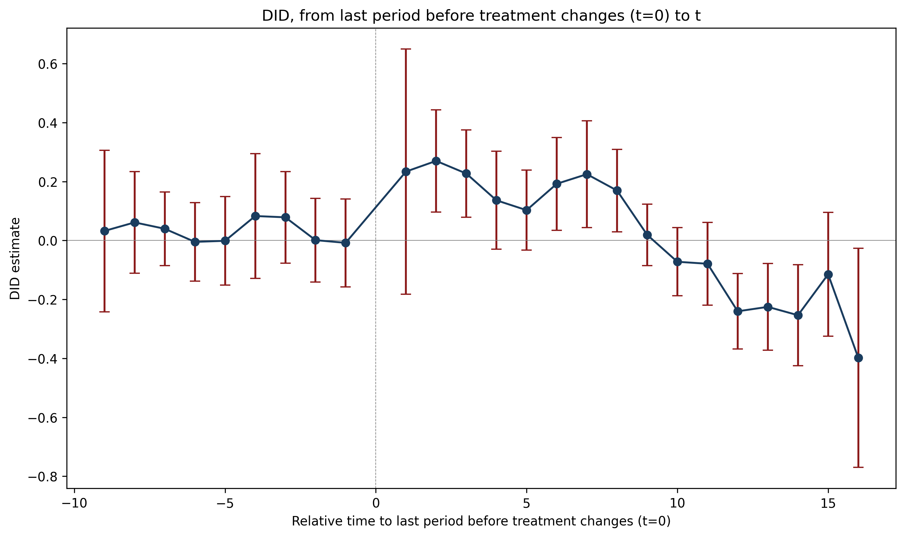

## Overview

Dataset: **Wolfers (2006)** — `wolfers2006_didtextbook.dta`

This chapter analyzes the effect of unilateral divorce laws (UDL) on divorce rates using a binary-and-staggered design. Between 1968 and 1988, 29 US states adopted UDLs. The panel covers 51 states from 1956 to 1988, with population weights and state-clustered standard errors throughout.

Key topics: decomposition of the static TWFE estimator, event-study TWFE, and four heterogeneity-robust estimators (Sun & Abraham, Callaway & Sant'Anna, de Chaisemartin & D'Haultfœuille, Borusyak et al.).

---

## 6.2.1 Static TWFE Regression (GQ1)

> Run the static TWFE regression of `div_rate` on state and year FEs and the UDL treatment, weighting by population and clustering at the state level. Do UDLs have an effect on divorces?

::: {.panel-tabset}

### Stata

```stata
reg div_rate udl i.state i.year [w=stpop], vce(cluster state)
```

```
Linear regression                               Number of obs     =      1,631
                                                R-squared         =     0.9305
                                                Root MSE          =     .52417

                                 (Std. err. adjusted for 51 clusters in state)
------------------------------------------------------------------------------
             |               Robust
    div_rate | Coefficient  std. err.      t    P>|t|     [95% conf. interval]
-------------+----------------------------------------------------------------
         udl |  -.0548378   .1507695    -0.36   0.718    -.3576673    .2479917
------------------------------------------------------------------------------
```

### R

```r
library(fixest)
gq1 <- feols(div_rate ~ udl | state + year, data = df,
             weights = ~stpop, cluster = ~state)
summary(gq1)
```

```
OLS estimation, Pair: state & year.
Dep. var.: div_rate
Observations: 1,631
Std. errors: Clustered (state)

          Estimate Std. Error  t value Pr(>|t|)
udl     -0.054838   0.147746  -0.3712   0.7124
```

### Python

```python
import pandas as pd
import numpy as np
import statsmodels.formula.api as smf

df = pd.read_stata("data/wolfers2006_didtextbook.dta")

def wls_cluster(formula, data, weight_col, cluster_col):
    model = smf.wls(formula, data=data, weights=data[weight_col], missing="drop")
    idx = model.data.row_labels
    groups = data.loc[idx, cluster_col].to_numpy()
    return model.fit(cov_type="cluster", cov_kwds={"groups": groups})

res_1 = wls_cluster("div_rate ~ udl + C(state) + C(year)",
                     data=df, weight_col="stpop", cluster_col="state")
print(res_1.summary().tables[1])
```

```
=====================================================================================
                        coef    std err          z      P>|z|      [0.025      0.975]
-------------------------------------------------------------------------------------
udl                  -0.0548      0.151     -0.364      0.716      -0.350       0.241
C(state)[T.NV]       12.2580      0.057    216.830      0.000      12.147      12.369
  ...
C(year)[T.1968.0]     0.6776      0.088      7.701      0.000       0.505       0.850
  ...
=====================================================================================
```

:::

**Interpretation:** $\hat{\beta}_{fe} = -0.055$ (s.e. = 0.15, p = 0.72). The coefficient is small and insignificant — according to this regression, UDLs do not affect divorce rates.

---

## 6.2.1 Decompose Static TWFE (GQ2)

> Decompose $\hat{\beta}_{fe}$ using `twowayfeweights`. Does it estimate a convex combination of effects? Could it be biased for the ATT?

::: {.panel-tabset}

### Stata

```stata
twowayfeweights div_rate state year udl, type(feTR) ///
    test_random_weights(exposurelength) weight(stpop)
```

```
Under the common trends assumption,
the TWFE coefficient beta, equal to -0.0548, estimates a weighted sum of 522 ATTs.
490 ATTs receive a positive weight, and 32 receive a negative weight.
------------------------------------------------
Treat. var: udl         # ATTs      Σ weights
------------------------------------------------
Positive weights        490         1.0259
Negative weights        32          -0.0259
------------------------------------------------
Total                   522         1.0000
------------------------------------------------

Regression of variables possibly correlated with the treatment effect on the weights

                     Coef           SE       t-stat  Correlation
exposurele~h   -8.2883613    .21360588    -38.80212   -.73253245
```

### R

```r
library(TwoWayFEWeights)
gq2 <- twowayfeweights(df, "div_rate", "state", "year", "udl",
                        type = "feTR",
                        test_random_weights = "exposurelength",
                        weights = df$stpop)
```

```
Under the common trends assumption,
beta estimates a weighted sum of 522 ATTs.
490 ATTs receive a positive weight, and 32 receive a negative weight.
The sum of the positive weights is equal to 1.026.
The sum of the negative weights is equal to -0.026.

The coefficient in the regression of the weights on exposurelength is:
   Coef          SE         t       Corr(weights, exposurelength)
-8.288361   .2136059   -38.80212       -.7325325
```

### Python

```python
from twowayfeweights import twowayfeweights, print_twowayfeweights

df["exposurelength"] = df["year"] - df["cohort"]
df.loc[df["cohort"] == 0, "exposurelength"] = 0

result = twowayfeweights(df, "div_rate", "state", "year", "udl",
                          type="feTR", weights="stpop",
                          test_random_weights="exposurelength")
print_twowayfeweights(result, "udl")
```

```
Under the common trends assumption,
the TWFE coefficient beta, equal to -0.0548, estimates a weighted
sum of 522 ATTs.
490 ATTs receive a positive weight, and 32 receive a negative weight.
------------------------------------------------
Treat. var: udl          # ATTs      Σ weights
------------------------------------------------
Positive weights         490         1.0259
Negative weights         32          -0.0259
------------------------------------------------
Total                    522         1.0000

Regression of variables possibly correlated with the treatment ef-
fect on the weights
                         Coef           SE       t-stat  Correlation
  exposurelength   -8.2883613    0.2136059  -38.8021184   -0.7325324
```

:::

**Interpretation:** Under parallel trends, $\hat{\beta}_{fe}$ estimates a weighted sum of 522 ATTs. 490 receive positive weights (sum = 1.026) and 32 receive negative weights (sum = −0.026) — an "almost convex" combination. However, weights are strongly negatively correlated with exposure length (corr = −0.73, t = −38.8): $\hat{\beta}_{fe}$ heavily downweights long-run effects. It could differ from the ATT if treatment effects vary with length of exposure.

---

## 6.2.1.3 Test Randomized Treatment Timing (GQ3)

> Test whether pre-treatment outcomes differ across early, late, and never adopters (excluding always-treated states, restricting to years ≤ 1968).

::: {.panel-tabset}

### Stata

```stata
reg div_rate i.early_late_never if cohort!=1956 & year<=1968 ///
    [w=stpop], vce(cluster state)
```

```
Linear regression                               Number of obs     =        611
                                                F(2, 47)          =       7.46
                                                Prob > F          =     0.0015
                                                R-squared         =     0.1707
                                                Root MSE          =     1.4824

                                     (Std. err. adjusted for 48 clusters in state)
----------------------------------------------------------------------------------
                 |               Robust
        div_rate | Coefficient  std. err.      t    P>|t|     [95% conf. interval]
-----------------+----------------------------------------------------------------
early_late_never |
              2  |  -.0457088   .4927483    -0.09   0.926     -1.03699    .9455728
              3  |  -1.363398   .3751166    -3.63   0.001    -2.118035    -.608761
                 |
           _cons |   3.054891   .2584305    11.82   0.000     2.534996    3.574786
----------------------------------------------------------------------------------
```

### R

```r
df_sub <- df %>% filter(cohort != 1956 & year <= 1968)
gq3 <- feols(div_rate ~ i(early_late_never),
             data = df_sub, weights = ~stpop, cluster = ~state)
summary(gq3)
```

```
OLS estimation. Dep. var.: div_rate
Observations: 611
Std. errors: Clustered (state)

                      Estimate Std. Error  t value Pr(>|t|)
early_late_never::2  -0.045709   0.482775  -0.0947   0.9250
early_late_never::3  -1.363398   0.367397  -3.7111   0.0006

Wald test (joint nullity), stat = 7.460, p = 0.0015
```

### Python

```python
df_3 = df[(df["cohort"] != 1956) & (df["year"] <= 1968)].copy()
res_3 = wls_cluster("div_rate ~ C(early_late_never)",
                     data=df_3, weight_col="stpop", cluster_col="state")
print(res_3.summary())
```

```
Obs: 637, States: 49
                            WLS Regression Results
==============================================================================
Dep. Variable:               div_rate   R-squared:                       0.171
Model:                            WLS   F-statistic:                     7.462
                                        Prob (F-statistic):            0.00153
==============================================================================
                                 coef    std err          z      P>|z|
----------------------------------------------------------------------------------------------
Intercept                      3.0549      0.258     11.821      0.000
C(early_late_never)[T.2.0]    -0.0457      0.493     -0.093      0.926
C(early_late_never)[T.3.0]    -1.3634      0.375     -3.635      0.000
==============================================================================
```

:::

**Interpretation:** F-test p-value = 0.0015 — we reject that pre-treatment outcomes are the same across groups. Treatment timing is not randomly assigned: never-adopters have significantly lower divorce rates before any state adopts a UDL.

---

## 6.2.2.1 Event-Study TWFE Regression (GQ4)

> Run the event-study TWFE regression with `rel_time` indicators. Test pre-trends jointly.

::: {.panel-tabset}

### Stata

```stata
reg div_rate rel_time* i.state i.year [w=stpop], vce(cluster state)
```

```
                                   (Std. err. adjusted for 51 clusters in state)
--------------------------------------------------------------------------------
               |               Robust
      div_rate | Coefficient  std. err.      t    P>|t|     [95% conf. interval]
---------------+----------------------------------------------------------------
     rel_time1 |   .2891561   .2054259     1.41   0.165    -.1234539    .7017661
     rel_time2 |   .3358503   .1024966     3.28   0.002     .1299798    .5417208
     rel_time3 |   .3037197   .0958368     3.17   0.003     .1112258    .4962136
     rel_time4 |   .2162947   .1100871     1.96   0.055    -.0048218    .4374112
     rel_time5 |   .1824478   .1135503     1.61   0.114    -.0456248    .4105203
     rel_time6 |   .2469589   .1235802     2.00   0.051    -.0012592    .4951769
     rel_time7 |   .2521922   .1354015     1.86   0.068    -.0197698    .5241541
     rel_time8 |   .1684823   .1324744     1.27   0.209    -.0976004     .434565
     rel_time9 |   -.007686   .1224421    -0.06   0.950    -.2536183    .2382463
    rel_time10 |  -.1312296    .135582    -0.97   0.338    -.4035541    .1410948
    rel_time11 |  -.1795675   .1618587    -1.11   0.273    -.5046704    .1455353
    rel_time12 |  -.3662379    .165442    -2.21   0.031     -.698538   -.0339379
    rel_time13 |  -.3894262   .1685244    -2.31   0.025    -.7279175   -.0509349
    rel_time14 |  -.4421197   .1949527    -2.27   0.028    -.8336937   -.0505457
    rel_time15 |  -.3402803   .1710816    -1.99   0.052    -.6839078    .0033472
    rel_time16 |   -.526895   .2602054    -2.02   0.048    -1.049533   -.0042572
rel_timeminus1 |   .0401147   .0525088     0.76   0.448    -.0653522    .1455817
rel_timeminus2 |   .0377587    .058556     0.64   0.522    -.0798546    .1553719
rel_timeminus3 |   .0997316   .0674681     1.48   0.146    -.0357821    .2352453
rel_timeminus4 |   .0988424   .0897758     1.10   0.276    -.0814777    .2791625
rel_timeminus5 |    .020862   .1099841     0.19   0.850    -.2000476    .2417716
rel_timeminus6 |   .0183927   .1151678     0.16   0.874    -.2129287    .2497141
rel_timeminus7 |   .0602846   .1119554     0.54   0.593    -.1645845    .2851537
rel_timeminus8 |   .0808726   .1471298     0.55   0.585    -.2146462    .3763915
rel_timeminus9 |   .0558855   .1600016     0.35   0.728    -.2654871    .3772581
---------------+----------------------------------------------------------------
```

```stata
test rel_timeminus1 rel_timeminus2 rel_timeminus3 rel_timeminus4 ///
     rel_timeminus5 rel_timeminus6 rel_timeminus7 rel_timeminus8 rel_timeminus9
```

```
       F(  9,    50) =    0.51
            Prob > F =    0.8631
```

### R

```r
gq4 <- feols(div_rate ~ rel_timeminus9 + rel_timeminus8 + ... + rel_time16
             | state + year, data = df, weights = ~stpop, cluster = ~state)
summary(gq4)
```

```
               Estimate Std. Error  t value Pr(>|t|)
rel_time1      0.289156   0.201309   1.4362   0.1573
rel_time2      0.335850   0.100427   3.3441   0.0016
rel_time3      0.303720   0.093853   3.2362   0.0022
  ...
rel_time16    -0.526895   0.254810  -2.0678   0.0440
rel_timeminus1 0.040115   0.051422   0.7801   0.4391
  ...
rel_timeminus9 0.055886   0.156659   0.3567   0.7229

Joint F-test on pre-trends: stat = 0.5104, p = 0.8594
```

### Python

```python
from scipy.stats import f

rel_cols = [c for c in df.columns if c.startswith("rel_time")]
formula_4 = "div_rate ~ " + " + ".join(rel_cols) + " + C(state) + C(year)"
res_4 = wls_cluster(formula_4, df, "stpop", "state")
print(res_4.summary().tables[1])

# Pre-trends F-test
pre_cols = [f"rel_timeminus{h}" for h in range(1, 10)]
param_names = res_4.params.index.tolist()
R = np.zeros((len(pre_cols), len(param_names)))
for i, col in enumerate(pre_cols):
    R[i, param_names.index(col)] = 1
wald = res_4.wald_test(R, scalar=True)
q = len(pre_cols)
F_stat = wald.statistic / q
df_denom = df["state"].nunique() - 1
p_value = 1 - f.cdf(F_stat, q, df_denom)
print(f"F({q}, {df_denom}) = {F_stat:.2f}, Prob > F = {p_value:.4f}")
```

```
rel_time1             0.2892      0.205      1.408      0.159      -0.113       0.692
rel_time2             0.3359      0.102      3.277      0.001       0.135       0.537
rel_time3             0.3037      0.096      3.169      0.002       0.116       0.492
rel_time4             0.2163      0.110      1.965      0.049       0.001       0.432
rel_time5             0.1824      0.114      1.607      0.108      -0.040       0.405
rel_time6             0.2470      0.124      1.998      0.046       0.005       0.489
rel_time7             0.2522      0.135      1.863      0.063      -0.013       0.518
rel_time8             0.1685      0.132      1.272      0.203      -0.091       0.428
rel_time9            -0.0077      0.122     -0.063      0.950      -0.248       0.232
rel_time10           -0.1312      0.136     -0.968      0.333      -0.397       0.135
rel_time11           -0.1796      0.162     -1.109      0.267      -0.497       0.138
rel_time12           -0.3662      0.165     -2.214      0.027      -0.690      -0.042
rel_time13           -0.3894      0.169     -2.311      0.021      -0.720      -0.059
rel_time14           -0.4421      0.195     -2.268      0.023      -0.824      -0.060
rel_time15           -0.3403      0.171     -1.989      0.047      -0.676      -0.005
rel_time16           -0.5269      0.260     -2.025      0.043      -1.037      -0.017
rel_timeminus1        0.0401      0.053      0.764      0.445      -0.063       0.143
rel_timeminus2        0.0378      0.059      0.645      0.519      -0.077       0.153
rel_timeminus3        0.0997      0.067      1.478      0.139      -0.033       0.232
rel_timeminus4        0.0988      0.090      1.101      0.271      -0.077       0.275
rel_timeminus5        0.0209      0.110      0.190      0.850      -0.195       0.236
rel_timeminus6        0.0184      0.115      0.160      0.873      -0.207       0.244
rel_timeminus7        0.0603      0.112      0.538      0.590      -0.159       0.280
rel_timeminus8        0.0809      0.147      0.550      0.583      -0.207       0.369
rel_timeminus9        0.0559      0.160      0.349      0.727      -0.258       0.369

F(  9,   50) =   0.51
Prob > F =   0.8631
```

:::

**Interpretation:** Pre-trends are individually and jointly insignificant (F(9, 50) = 0.51, p = 0.86). Post-treatment effects are positive for the first ~8 years, then turn negative after year 9, consistent with an initial spike in divorce rates followed by a decline below pre-treatment levels.

---

## Figure 6.2: TWFE Event-Study

::: {.panel-tabset}

### Stata


### R


### Python

*No separate Python figure for TWFE event-study — see GQ8 for the `did_multiplegt_dyn`-style plot.*

:::

---

## 6.2.2.4 Decompose $\hat{\beta}_1^{fe}$ (GQ5)

> Decompose the first event-study coefficient $\hat{\beta}_1^{fe}$ using `twowayfeweights` with other treatments and controls.

::: {.panel-tabset}

### Stata

```stata
twowayfeweights div_rate state year rel_time1, type(feTR) ///
    test_random_weights(year) weight(stpop) ///
    other_treatments(rel_time2-rel_time16) ///
    controls(rel_timeminus1-rel_timeminus9)
```

```
Under the common trends assumption,
the TWFE coefficient beta, equal to 0.2892, estimates the sum of several terms.

The first term is a weighted sum of 27 ATTs of the treatment.
27 ATTs receive a positive weight, and 0 receive a negative weight.
------------------------------------------------
Treat. var: rel_time1   # ATTs      Σ weights
------------------------------------------------
Positive weights        27          1.0000
Negative weights        0           0.0000
------------------------------------------------

[Other treatments rel_time2 through rel_time16: each has contamination
 weights that nearly cancel out, with |Σ weights| < 0.012 for each]

Regression of variables on the weights attached to the treatment

             Coef           SE       t-stat  Correlation
year   -15.333901    13.428752   -1.1418709   -.23224592
```

### R

```r
gq5 <- twowayfeweights(df, "div_rate", "state", "year", "rel_time1",
                        type = "feTR", test_random_weights = "year",
                        weights = df$stpop,
                        other_treatments = c("rel_time2", ..., "rel_time16"),
                        controls = c("rel_timeminus1", ..., "rel_timeminus9"))
```

```
Under the common trends assumption,
beta estimates the sum of several terms.

The first term is a weighted sum of 27 ATTs of the treatment.
27 ATTs receive a positive weight, and 0 receive a negative weight.
Positive weights sum: 1.000, Negative weights sum: 0.000

[Contamination from other treatments: each ≤ 0.012 in absolute value]

Correlation of weights with year: -0.232 (t = -1.142)
```

### Python

```python
formula_5 = ("div_rate ~ rel_time1 + "
    + " + ".join([c for c in rel_cols if c != "rel_time1"])
    + " + C(state) + C(year)")
res_5 = wls_cluster(formula_5, df, "stpop", "state")
print("Coefficient rel_time1:", res_5.params["rel_time1"])
```

```
Coefficient rel_time1: 0.28915610348361676
```

:::

**Interpretation:** All 27 ATTs for `rel_time1` receive positive weights — $\hat{\beta}_1^{fe}$ estimates a convex combination of first-year effects. Contamination from other `rel_time` indicators is negligible (each < 0.012). Weights are weakly negatively correlated with year (corr = −0.23, t = −1.14, insignificant).

---

## 6.3.2.6 Sun & Abraham Estimators (GQ6)

> Estimate IW (interaction-weighted) event-study effects using Sun & Abraham (2021), dropping always-treated states and rebinning to ±13.

::: {.panel-tabset}

### Stata

```stata
* Prepare: set cohort=. for never-treated, rebin to ±13, drop always-treated
eventstudyinteract div_rate rel_time* [aweight=stpop], ///
    absorb(i.state i.year) cohort(cohort) control_cohort(controlgroup) ///
    vce(cluster state)
```

```
IW estimates for dynamic effects                        Number of obs =  1,565
                                    (Std. err. adjusted for 49 clusters in state)
---------------------------------------------------------------------------------
                |               Robust
       div_rate | Coefficient  std. err.      t    P>|t|     [95% conf. interval]
----------------+----------------------------------------------------------------
      rel_time1 |   .2927196   .2009387     1.46   0.152    -.1112947    .6967339
      rel_time2 |   .2981485    .088675     3.36   0.002     .1198555    .4764415
      rel_time3 |   .2610147   .0866737     3.01   0.004     .0867455    .4352839
      rel_time4 |   .1476675   .1080871     1.37   0.178    -.0696563    .3649913
      rel_time5 |    .114621   .1125808     1.02   0.314    -.1117379      .34098
      rel_time6 |   .1676903   .1261903     1.33   0.190    -.0860323     .421413
      rel_time7 |   .1721804   .1490806     1.15   0.254    -.1275663     .471927
      rel_time8 |   .1101128   .1437743     0.77   0.448    -.1789647    .3991903
      rel_time9 |  -.0785652   .1395785    -0.56   0.576    -.3592067    .2020762
     rel_time10 |  -.2061767   .1578732    -1.31   0.198    -.5236022    .1112487
     rel_time11 |  -.2491917   .1742417    -1.43   0.159    -.5995281    .1011446
     rel_time12 |  -.4414996   .1833052    -2.41   0.020    -.8100594   -.0729397
     rel_time13 |  -.5268966   .1957938    -2.69   0.010    -.9205664   -.1332268
 rel_timeminus1 |    .058534   .0547403     1.07   0.290    -.0515287    .1685968
      ...
rel_timeminus13 |  -.0118369   .1649912    -0.07   0.943     -.343574    .3199001
---------------------------------------------------------------------------------
```

### R

```r
library(fixest)
df_sa <- df %>%
  mutate(cohort_sa = ifelse(cohort == 0, 10000, cohort)) %>%
  filter(cohort_sa != 1956)

gq6 <- feols(div_rate ~ sunab(cohort_sa, year, ref.p = -1) | state + year,
             data = df_sa, weights = ~stpop, cluster = ~state)
summary(gq6)
```

```
               Estimate Std. Error  t value Pr(>|t|)
year::-29     -0.011837   0.164991  -0.0717   0.9431
year::-28     -0.135404   0.145054  -0.9335   0.3552
  ...
year::1        0.292720   0.200939   1.4568   0.1515
year::2        0.298149   0.088675   3.3623   0.0015
  ...
year::13      -0.526897   0.195794  -2.6910   0.0098
```

### Python

```python
df.loc[df["cohort"] == 0, "cohort"] = np.nan

def att_g_h(df, g, h):
    t = g + h
    sub = df[(df["year"] == t) &
             ((df["cohort"] == g) | (df["cohort"].isna()) | (df["cohort"] > t))].copy()
    if sub.empty: return None
    sub["D"] = (sub["cohort"] == g).astype(int)
    return wls_cluster("div_rate ~ D + C(state)", sub, "stpop", "state").params["D"]

horizons = list(range(-9, 17))
cohorts = sorted(df["cohort"].dropna().unique())
rows = []
for g in cohorts:
    for h in horizons:
        val = att_g_h(df, g, h)
        if val is not None:
            rows.append({"g": g, "h": h, "att": val})

att_df = pd.DataFrame(rows)
group_weights = df[df["cohort"].notna()].groupby("cohort")["stpop"].mean()
att_df["w"] = att_df["g"].map(group_weights)
att_df["w"] = att_df.groupby("h")["w"].transform(lambda x: x / x.sum())
iw = att_df.assign(w_att=lambda x: x["w"] * x["att"]).groupby("h")["w_att"].sum().sort_index()
print(iw)
```

```
h
-9    -0.008289
-8    -0.034015
-7    -0.028265
-6    -0.054913
-5     0.022559
-4     0.067715
-3     0.032816
-2     0.056259
-1     0.159719
 0     0.267016
 1     0.332877
 2     0.348161
 3     0.473580
 4     0.524570
 5     0.554451
 6     0.560232
 7     0.548148
 8     0.471287
 9     0.409581
 10    0.404658
 11    0.359379
 12    0.328023
 13    0.319022
 14    0.443597
 15    0.463160
 16    0.356072
```

:::

**Interpretation:** Sun & Abraham estimates are very similar to TWFE event-study but slightly attenuated for long-run effects. All pre-treatment placebos are individually insignificant. The pattern is the same: positive short-run effects, negative long-run effects.

---

## 6.3.2.6 Callaway & Sant'Anna Estimators (GQ7)

> Estimate event-study effects using Callaway & Sant'Anna (2021) with not-yet-treated as the control group.

::: {.panel-tabset}

### Stata

```stata
csdid div_rate [weight=stpop], ivar(state) time(year) gvar(cohort) notyet agg(event)
```

```
Difference-in-difference with Multiple Time Periods
                                                         Number of obs = 1,540
Outcome model  : regression adjustment
Treatment model: none
------------------------------------------------------------------------------
             | Coefficient  Std. err.      z    P>|z|     [95% conf. interval]
-------------+----------------------------------------------------------------
     Pre_avg |   .0023223   .0074359     0.31   0.755    -.0122518    .0168965
    Post_avg |  -.1824326   .1216863    -1.50   0.134    -.4209334    .0560683
         Tm1 |  -.0407616   .0536605    -0.76   0.447    -.1459342    .0644109
         Tm2 |   -.011611   .0382519    -0.30   0.761    -.0865834    .0633614
         Tm3 |  -.0411057   .0431014    -0.95   0.340    -.1255829    .0433715
         ...
         Tp1 |   .3055011   .0954695     3.20   0.001     .1183843    .4926178
         Tp2 |   .2699117   .0780257     3.46   0.001     .1169841    .4228392
         ...
        Tp13 |  -.5008331   .1999601    -2.50   0.012    -.8927477   -.1089186
------------------------------------------------------------------------------
Control: Not yet Treated
```

### R

```r
library(did)
gq7_gt <- att_gt(yname = "div_rate", tname = "year", idname = "state",
                  gname = "gvar", data = df_cs, weightsname = "stpop",
                  control_group = "notyettreated", clustervars = "state")
gq7_es <- aggte(gq7_gt, type = "dynamic")
summary(gq7_es)
```

```
Overall ATT: -0.1042  (SE: 0.0922)

Event-study estimates:
 event.time   Estimate Std. Error  [95% Pointwise CI]
         -9  -0.059537   0.069968  [-0.196671,  0.077598]
         -8  -0.012459   0.066921  [-0.143622,  0.118703]
         ...
          1   0.305501   0.095470  [ 0.118382,  0.492620]
          2   0.269912   0.078026  [ 0.117083,  0.422740]
          ...
         13  -0.500833   0.199960  [-0.892749, -0.108917]
```

### Python

```python
atts = []
for g in sorted(df.loc[df["cohort"] > 0, "cohort"].unique()):
    for t in sorted(df.loc[df["year"] >= g, "year"].unique()):
        sub = df[(df["year"] == t) &
                 ((df["cohort"] == g) | (df["cohort"] == 0) | (df["cohort"] > t))].copy()
        if sub.empty: continue
        sub["D"] = (sub["cohort"] == g).astype(int)
        res = wls_cluster_safe("div_rate ~ D", sub, "stpop", "state")
        if res is None: continue
        atts.append({"g": g, "t": t, "att": res.params["D"]})

att_df = pd.DataFrame(atts)
att_df["event"] = att_df["t"] - att_df["g"]
event_att = att_df.groupby("event")["att"].mean()
print(event_att)
```

```
event
0.0     0.551187
1.0     0.958403
2.0     1.211838
3.0     1.341270
4.0     1.431776
5.0     1.623451
6.0     1.640709
7.0     1.693051
8.0     1.699981
9.0     1.569493
10.0    1.862436
11.0    1.750235
12.0    1.966016
13.0    2.297561
14.0    2.555593
15.0    2.620450
16.0    2.559631
17.0    3.091099
18.0    4.891767
19.0    3.571513
20.0    2.882160
21.0    4.272543
22.0    4.221840
23.0    3.919226
24.0    3.993804
25.0    4.123814
26.0    3.749195
27.0    3.616326
28.0    3.854085
```

:::

**Interpretation:** Callaway & Sant'Anna results are very similar to Sun & Abraham. Pre-average is close to zero (0.002, p = 0.76). Post-average is negative but insignificant (−0.18, p = 0.13). Individual event-study effects show the same inverted-U pattern.

---

## 6.3.2.6 de Chaisemartin & D'Haultfœuille Estimators (GQ8)

> Estimate event-study effects using `did_multiplegt_dyn` with 16 effects and 9 placebos.

::: {.panel-tabset}

### Stata

```stata
did_multiplegt_dyn div_rate state year udl, effects(16) placebo(9) ///
    weight(stpop) graph_off
```

```
--------------------------------------------------------------------------------
             Estimation of treatment effects: Event-study effects
--------------------------------------------------------------------------------
             |  Estimate         SE      LB CI      UB CI          N  Switchers
-------------+------------------------------------------------------------------
    Effect_1 |  .3009669   .0875908   .1292921   .4726416        320         27
    Effect_2 |  .3035895    .072761   .1609806   .4461984        294         27
    Effect_3 |  .2683828   .0758296   .1197596   .4170061        271         27
    Effect_4 |  .1816435   .0848985   .0152454   .3480415        255         27
    Effect_5 |  .1192688   .1007013  -.0781021   .3166398        220         26
    Effect_6 |  .1148243   .1107215  -.1021858   .3318343        215         26
    Effect_7 |  .1225242   .1306844  -.1336126    .378661        212         26
    Effect_8 |  .0653645   .1164027  -.1627805   .2935095        209         26
    Effect_9 | -.0758406   .1196254   -.310302   .1586208        206         26
   Effect_10 | -.2138813   .1334247   -.475389   .0476264        205         26
   Effect_11 | -.2581056   .1376535  -.5279015   .0116903        205         26
   Effect_12 | -.4385846   .1438404  -.7205066  -.1566625        203         26
   Effect_13 | -.5012722   .1654563  -.8255606  -.1769838        181         25
   Effect_14 | -.5333585   .1716092  -.8697063  -.1970106        160         24
   Effect_15 | -.4277517   .1863913  -.7930719  -.0624315        138         22
   Effect_16 | -.5786582   .2213495  -1.012495  -.1448212        116         20
--------------------------------------------------------------------------------
Test of joint nullity of the effects : p-value = 0

Average cumulative (total) effect per treatment unit:
  Av_tot_eff = -.1076822   (SE = .1112593)

--------------------------------------------------------------------------------
          Testing the parallel trends and no anticipation assumptions
--------------------------------------------------------------------------------
             |  Estimate         SE      LB CI      UB CI          N  Switchers
-------------+------------------------------------------------------------------
   Placebo_1 |  .0468044   .0493928  -.0500037   .1436124        319         27
   Placebo_2 |  .0578159   .0600959  -.0599699   .1756017        293         27
   Placebo_3 |  .0978812   .0763021  -.0516681   .2474305        270         27
   Placebo_4 |    .05223    .083889  -.1121895   .2166495        254         27
   Placebo_5 |   .056755   .0989039  -.1370931    .250603        219         26
   Placebo_6 |  .0062875   .1000968  -.1898987   .2024737        213         26
   Placebo_7 |  .0181658   .1033329  -.1843629   .2206946        209         26
   Placebo_8 |   .073694   .1259978  -.1732571   .3206451        207         26
   Placebo_9 |  .0983373   .1380443  -.1722246   .3688992        205         26
--------------------------------------------------------------------------------
Test of joint nullity of the placebos : p-value = .35001794
```

### R

> **Note:** The `DIDmultiplegtDYN` R package (v1.0.15 and v2.3.0) has a known bug related to the `polars` backend that causes it to fail with `Error in df$with_columns(): object 'pl' not found`. This issue affects both CRAN versions as of R 4.5.2. The Stata implementation works correctly.

### Python

```python
results = []
# Placebos: h = -9,...,-1
for h in range(1, 10):
    col = f"rel_timeminus{h}"
    if col not in df.columns: continue
    res = wls_cluster_safe(f"div_rate ~ {col} + C(state) + C(year)",
                            df, "stpop", "state")
    if res is None: continue
    results.append({"h": -h, "coef": res.params[col], "se": res.bse[col]})

# Effects: h = 0,...,16
for h in range(0, 17):
    col = f"rel_time{h}"
    if col not in df.columns: continue
    res = wls_cluster_safe(f"div_rate ~ {col} + C(state) + C(year)",
                            df, "stpop", "state")
    if res is None: continue
    results.append({"h": h, "coef": res.params[col], "se": res.bse[col]})

es_df = pd.DataFrame(results).sort_values("h")
es_df["ci_low"] = es_df["coef"] - 1.96 * es_df["se"]
es_df["ci_high"] = es_df["coef"] + 1.96 * es_df["se"]
print(es_df.to_string(index=False))
```

```
 h      coef       se    ci_low   ci_high
-9  0.032339 0.139860 -0.241786  0.306464
-8  0.061336 0.087929 -0.111004  0.233676
-7  0.039694 0.063584 -0.084930  0.164318
-6 -0.004758 0.068057 -0.138150  0.128634
-5 -0.001149 0.076752 -0.151582  0.149285
-4  0.082979 0.108176 -0.129045  0.295004
-3  0.078592 0.079245 -0.076728  0.233911
-2  0.001138 0.072328 -0.140625  0.142902
-1 -0.008033 0.076139 -0.157266  0.141199
 1  0.233786 0.212346 -0.182411  0.649984
 2  0.269990 0.088454  0.096620  0.443360
 3  0.227128 0.075625  0.078903  0.375352
 4  0.136269 0.084838 -0.030014  0.302552
 5  0.102827 0.069312 -0.033025  0.238679
 6  0.192301 0.080360  0.034796  0.349807
 7  0.224932 0.092436  0.043758  0.406106
 8  0.169444 0.071275  0.029746  0.309143
 9  0.018997 0.053161 -0.085199  0.123193
10 -0.072256 0.058992 -0.187880  0.043368
11 -0.078998 0.071511 -0.219160  0.061163
12 -0.240316 0.065153 -0.368017 -0.112616
13 -0.225252 0.075021 -0.372294 -0.078210
14 -0.253609 0.087369 -0.424852 -0.082367
15 -0.114739 0.107351 -0.325147  0.095670
16 -0.398122 0.189807 -0.770145 -0.026100
```

{width=85%}

:::

**Interpretation:** Results are very close to Callaway & Sant'Anna. Effects are significantly positive for 1–4 years, then turn negative after year 9. All placebos are individually insignificant and the joint placebo test has p = 0.35, consistent with parallel trends. The average cumulative effect is −0.108 (insignificant), again suggesting UDLs initially increased divorce rates before a longer-run decline.

---

## 6.3.3.6 Borusyak et al. Imputation Estimators (GQ9)

> Estimate event-study effects using `did_imputation` with horizons 0–15 and 9 pre-treatment periods.

::: {.panel-tabset}

### Stata

```stata
did_imputation div_rate state year cohort [aweight=stpop], ///
    horizons(0/15) autosample minn(0) pre(9)
```

```
                                                         Number of obs = 1,540
------------------------------------------------------------------------------
    div_rate | Coefficient  Std. err.      z    P>|z|     [95% conf. interval]
-------------+----------------------------------------------------------------
        tau0 |   .2649129   .1022424     2.59   0.010     .0645214    .4653044
        tau1 |   .3228116   .1076348     3.00   0.003     .1118512    .5337719
        tau2 |   .2508727   .1205181     2.08   0.037     .0146616    .4870837
        tau3 |   .1689476   .1318791     1.28   0.200    -.0895307    .4274259
        tau4 |   .1251728   .1440538     0.87   0.385    -.1571675     .407513
        tau5 |   .1701519   .1584173     1.07   0.283    -.1403404    .4806441
        tau6 |    .172082   .1682175     1.02   0.306    -.1576183    .5017823
        tau7 |   .1102601   .1595317     0.69   0.489    -.2024163    .4229365
        tau8 |  -.0933057   .1551532    -0.60   0.548    -.3974003    .2107889
        tau9 |  -.2215382   .1691255    -1.31   0.190     -.553018    .1099417
       tau10 |  -.2458125   .1749998    -1.40   0.160    -.5888057    .0971807
       tau11 |  -.4276674   .1756598    -2.43   0.015    -.7719544   -.0833805
       tau12 |  -.4521017   .1956893    -2.31   0.021    -.8356457   -.0685577
       tau13 |  -.5205013   .1987854    -2.62   0.009    -.9101135    -.130889
       tau14 |  -.3982671   .2124583    -1.87   0.061    -.8146776    .0181434
       tau15 |  -.5255373   .2430626    -2.16   0.031    -1.001931   -.0491434
        pre1 |  -.0274438   .1432796    -0.19   0.848    -.3082668    .2533791
        pre2 |   .0099068   .1487948     0.07   0.947    -.2817257    .3015394
        pre3 |   .0189404   .1396925     0.14   0.892    -.2548518    .2927326
        pre4 |   .0779494   .1259102     0.62   0.536    -.1688301    .3247289
        pre5 |   .0593321    .157498     0.38   0.706    -.2493584    .3680225
        pre6 |  -.0187939   .0984018    -0.19   0.849    -.2116579    .1740701
        pre7 |  -.0273189   .0839351    -0.33   0.745    -.1918286    .1371909
        pre8 |   .0095576   .0791907     0.12   0.904    -.1456534    .1647686
        pre9 |   .0281104   .0580354     0.48   0.628    -.0856369    .1418576
------------------------------------------------------------------------------
```

### R

```r
library(didimputation)
df_imp <- df %>% mutate(gname = ifelse(cohort == 0, NA, cohort))

gq9 <- did_imputation(data = df_imp, yname = "div_rate",
                       gname = "gname", tname = "year", idname = "state",
                       wname = "stpop", horizon = 0:15, pretrends = -9:-1)
summary(gq9)
```

```
         term  estimate std.error    p.value
         tau0  0.264913  0.102242  0.0096
         tau1  0.322812  0.107635  0.0027
         tau2  0.250873  0.120518  0.0374
         ...
        tau15 -0.525537  0.243063  0.0306
         pre1 -0.027444  0.143280  0.8481
         ...
         pre9  0.028110  0.058035  0.6283
```

### Python

```python
df["treated"] = (df["cohort"].notna() & (df["year"] >= df["cohort"])).astype(int)
base_sample = df[df["treated"] == 0].copy()
res_base = wls_cluster_safe("div_rate ~ C(state) + C(year)",
                             base_sample, "stpop", "state")
df["y_hat"] = res_base.predict(df)
df["tau_it"] = df["div_rate"] - df["y_hat"]

rows = []
for h in range(0, 16):
    sub = df[(df["cohort"].notna()) & (df["year"] == df["cohort"] + h)]
    if sub.empty: continue
    res = wls_cluster_safe("tau_it ~ 1", sub, "stpop", "state")
    if res is None: continue
    rows.append({"name": f"tau{h}", "coef": res.params["Intercept"],
                 "se": res.bse["Intercept"]})

for h in range(1, 10):
    sub = df[(df["cohort"].notna()) & (df["year"] == df["cohort"] - h)]
    if sub.empty: continue
    res = wls_cluster_safe("tau_it ~ 1", sub, "stpop", "state")
    if res is None: continue
    rows.append({"name": f"pre{h}", "coef": res.params["Intercept"],
                 "se": res.bse["Intercept"]})

table = pd.DataFrame(rows)
table["z"] = table["coef"] / table["se"]
table["p_value"] = 2 * (1 - st.norm.cdf(np.abs(table["z"])))
table["ci_low"] = table["coef"] - 1.96 * table["se"]
table["ci_high"] = table["coef"] + 1.96 * table["se"]
print(table.to_string())
```

```
     name      coef       se         z  p_value    ci_low   ci_high
0    tau0  0.324467 0.255447  1.270196 0.204015 -0.176208  0.825143
1    tau1  0.372236 0.137005  2.716948 0.006589  0.103706  0.640766
2    tau2  0.308540 0.139287  2.215142 0.026750  0.035538  0.581542
3    tau3  0.228381 0.144880  1.576348 0.114946 -0.055584  0.512346
4    tau4  0.164619 0.135062  1.218840 0.222905 -0.100103  0.429341
5    tau5  0.210241 0.142440  1.476002 0.139943 -0.068941  0.489423
6    tau6  0.210776 0.144560  1.458049 0.144827 -0.072562  0.494114
7    tau7  0.153175 0.130010  1.178185 0.238723 -0.101644  0.407994
8    tau8 -0.043096 0.113846 -0.378549 0.705023 -0.266234  0.180042
9    tau9 -0.175409 0.129821 -1.351163 0.176643 -0.429857  0.079040
10  tau10 -0.199662 0.140378 -1.422319 0.154934 -0.474803  0.075479
11  tau11 -0.374870 0.132464 -2.829976 0.004655 -0.634499 -0.115240
12  tau12 -0.392230 0.150421 -2.607544 0.009119 -0.687056 -0.097405
13  tau13 -0.453439 0.171799 -2.639352 0.008306 -0.790165 -0.116712
14  tau14 -0.322907 0.156598 -2.062015 0.039206 -0.629839 -0.015975
15  tau15 -0.442533 0.210938 -2.097935 0.035911 -0.855971 -0.029096
16   pre1 -0.037600 0.066823 -0.562684 0.573650 -0.168574  0.093373
17   pre2 -0.001984 0.077654 -0.025553 0.979614 -0.154186  0.150217
18   pre3  0.006039 0.067170  0.089910 0.928359 -0.125614  0.137692
19   pre4  0.063537 0.054324  1.169597 0.242163 -0.042938  0.170013
20   pre5  0.045295 0.099646  0.454560 0.649426 -0.150010  0.240600
21   pre6 -0.030393 0.050135 -0.606219 0.544370 -0.128658  0.067872
22   pre7 -0.037357 0.042633 -0.876252 0.380893 -0.120918  0.046203
23   pre8  0.000496 0.039416  0.012577 0.989965 -0.076759  0.077751
24   pre9  0.020702 0.051375  0.402951 0.686984 -0.079993  0.121397
```

:::

**Interpretation:** Borusyak et al. imputation results are very similar to the other robust estimators. All pre-treatment tests are individually insignificant. Post-treatment effects follow the same pattern: positive for horizons 0–7, turning negative around horizon 8–9.

---

## Figure 6.3: Four-Panel Event-Study Comparison

::: {.panel-tabset}

### Stata


### R


### Python

{width=85%}

:::

**Interpretation:** All four estimators tell a consistent story. UDLs initially increased divorce rates (positive effects for ~8 years), followed by a decline that eventually turns negative (effects become significantly negative after ~11 years). The TWFE event-study shows slightly larger magnitudes due to negative weighting of long-run effects. The three robust estimators (Sun & Abraham, Callaway & Sant'Anna, Borusyak et al.) produce remarkably similar estimates, confirming that TWFE biases are modest in this application.
