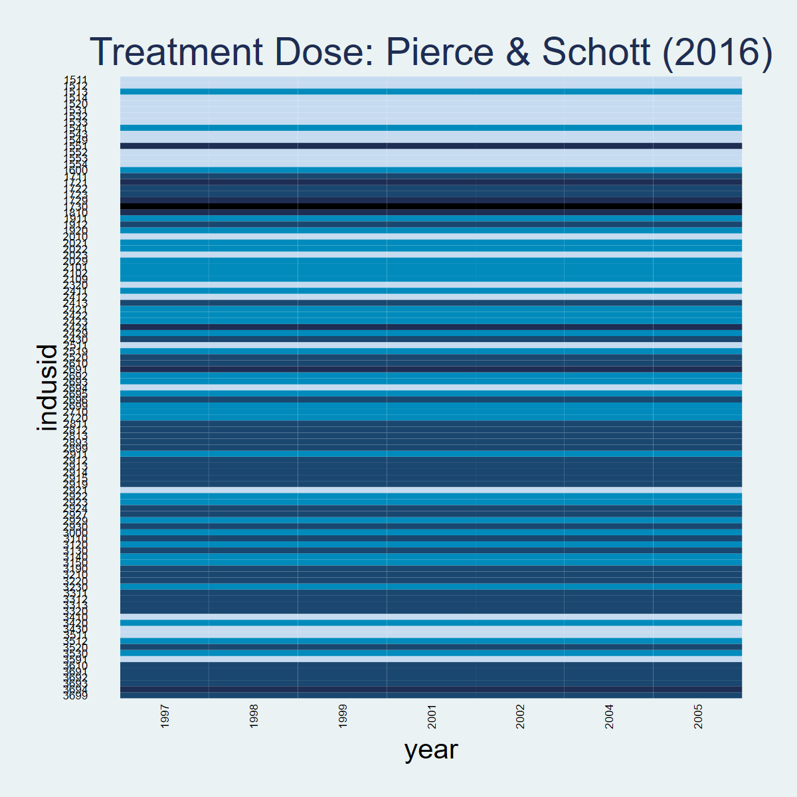
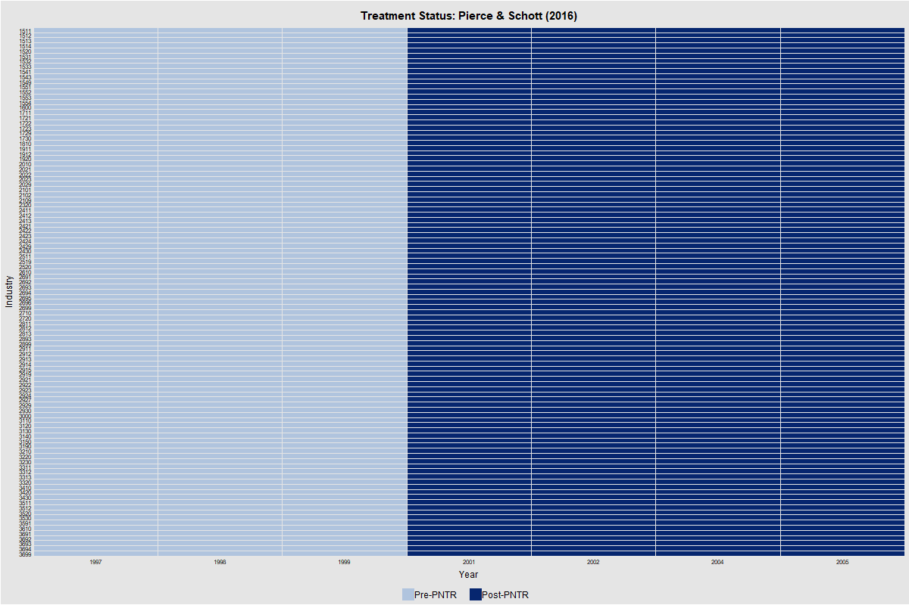
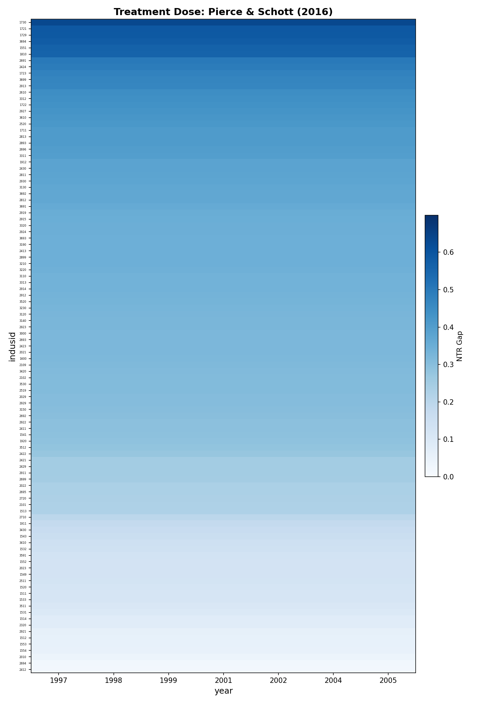

## Overview

Dataset: **Pierce & Schott (2016)** — `pierce_schott_didtextbook.dta` (103 industries, 22 variables)

This chapter applies the **Heterogeneous Adoption Design (HAD)** framework to study how China's permanent normal trade relations (PNTR) status affected US manufacturing employment. The key feature: treatment is **continuous** (the NTR gap, ranging from 0.02 to 0.64), not binary. All 103 US industries are "treated" — there are no pure control groups, but industries with near-zero NTR gaps serve as quasi-stayers.

**Packages used:**

| Task | Stata | R | Python |
|------|-------|---|--------|
| OLS + HC2 SE | `reg, vce(hc2)` | `sandwich` + `lmtest` | `statsmodels` (HC2) |
| Weight decomposition | `twowayfeweights` (SSC) | `TwoWayFEWeights` (CRAN) | Not available for `fdTR` |
| Stute linearity test | `stute_test` (GitHub) | `StuteTest` (GitHub) | Manual implementation |
| Treatment visualization | `panelview` (SSC) | `panelView` (CRAN) | `matplotlib` (manual) |
| F-test | `test` (built-in) | `car::linearHypothesis` | `scipy` + `f_test` |

**R installation notes:**

- `StuteTest`: `remotes::install_github("chaisemartinPackages/stute_test/R")`
- Stata `stute_test`: `net install stute_test, from("https://raw.githubusercontent.com/chaisemartinPackages/stute_test/main/Stata/dist/git")`

**Note on Stute test p-values:** CvM test statistics are identical across Stata, R, and Python (closed-form computation). Bootstrap p-values differ slightly across platforms due to different random number generators, even with the same seed. This is expected and does not affect qualitative conclusions.

---

## PanelView

::: {.panel-tabset}

### Stata

```stata
preserve
reshape long delta deltalintrend, i(indusid) j(year)
panelview delta ntrgap, i(indusid) t(year) type(treat) ///
    title("Treatment Dose: Pierce & Schott (2016)") legend(off)
graph export "$FIGDIR\ch07_panelview_stata.png", replace width(1200)
restore
```



### R

```r
library(panelView)
df_long$treated <- ifelse(df_long$year >= 2001, 1, 0)
panelview(delta ~ treated, data = df_long,
          index = c("indusid", "year"), type = "treat",
          main = "Treatment Status: Pierce & Schott (2016)")
```



### Python

```python
import matplotlib.pyplot as plt
import matplotlib.colors as mcolors

cmap = plt.cm.Blues
norm = mcolors.Normalize(vmin=0, vmax=df['ntrgap'].max() * 1.1)
# Heatmap: each row = industry (sorted by ntrgap), each column = year
# Color intensity = NTR gap (continuous treatment dose)
```



:::

---

## GQ1 (§7.3.1): TWFE Regressions

> Regress $\Delta_{2000}^t Y_g$ on $D_g$ (NTR gap) for $t \in \{2001, 2002, 2004, 2005\}$, with HC2 standard errors.

::: {.panel-tabset}

### Stata

```stata
reg delta2001 ntrgap, vce(hc2)
reg delta2002 ntrgap, vce(hc2)
reg delta2004 ntrgap, vce(hc2)
reg delta2005 ntrgap, vce(hc2)
```

```
--- 2001 ---  N = 103, R² = 0.0237
             |             Robust HC2
   delta2001 | Coefficient  std. err.      t    P>|t|     [95% conf. interval]
-------------+----------------------------------------------------------------
      ntrgap |  -.0612112   .0401833    -1.52   0.131    -.1409241    .0185017
       _cons |  -.0141423   .0129623    -1.09   0.278     -.039856    .0115714

--- 2002 ---  N = 103, R² = 0.1263
      ntrgap |  -.2598747   .0754512    -3.44   0.001    -.4095496   -.1101999
       _cons |  -.0550989   .0220561    -2.50   0.014    -.0988522   -.0113456

--- 2004 ---  N = 103, R² = 0.0857
      ntrgap |  -.5397825   .1527447    -3.53   0.001    -.8427868   -.2367782
       _cons |  -.0868008   .0524821    -1.65   0.101    -.1909111    .0173095

--- 2005 ---  N = 103, R² = 0.0707
      ntrgap |  -.5317591   .1666765    -3.19   0.002    -.8624004   -.2011179
       _cons |  -.1056161   .0536739    -1.97   0.052    -.2120906    .0008584
```

### R

```r
library(haven); library(sandwich); library(lmtest)
df <- as.data.frame(read_dta("data/pierce_schott_didtextbook.dta"))
for (yr in c(2001, 2002, 2004, 2005)) {
    fit <- lm(as.formula(paste0("delta", yr, " ~ ntrgap")), data = df)
    print(coeftest(fit, vcov = vcovHC(fit, type = "HC2")))
}
```

```
--- 2001 ---  N = 103, R² = 0.02366
             Estimate Std. Error t value Pr(>|t|)
(Intercept) -0.0141423  0.0129623 -1.0910   0.2779
ntrgap      -0.0612112  0.0401833 -1.5233   0.1308

--- 2002 ---  N = 103, R² = 0.12631
(Intercept) -0.0550989  0.0220561 -2.4981   0.0141
ntrgap      -0.2598747  0.0754512 -3.4443   0.0008

--- 2004 ---  N = 103, R² = 0.08567
(Intercept) -0.0868008  0.0524821 -1.6539   0.1012
ntrgap      -0.5397825  0.1527447 -3.5339   0.0006

--- 2005 ---  N = 103, R² = 0.07072
(Intercept) -0.1056161  0.0536739 -1.9677   0.0518
ntrgap      -0.5317591  0.1666765 -3.1904   0.0019
```

### Python

```python
import statsmodels.api as sm
for year in [2001, 2002, 2004, 2005]:
    y = df[f'delta{year}']
    X = sm.add_constant(df['ntrgap'])
    res = sm.OLS(y, X).fit(cov_type='HC2')
```

```
--- 2001 ---  N = 103, R² = 0.02366
  Variable                     Coef      Std.Err          t      P>|t|
  const                  -0.0141423    0.0129623     -1.091     0.2753
  ntrgap                 -0.0612112    0.0401833     -1.523     0.1277

--- 2002 ---  N = 103, R² = 0.12631
  const                  -0.0550989    0.0220561     -2.498     0.0125
  ntrgap                 -0.2598747    0.0754512     -3.444     0.0006

--- 2004 ---  N = 103, R² = 0.08567
  const                  -0.0868008    0.0524821     -1.654     0.0981
  ntrgap                 -0.5397825    0.1527447     -3.534     0.0004

--- 2005 ---  N = 103, R² = 0.07072
  const                  -0.1056161    0.0536739     -1.968     0.0491
  ntrgap                 -0.5317591    0.1666765     -3.190     0.0014
```

:::

**Interpretation:** The NTR gap has a significant negative effect on manufacturing employment growth starting from 2002. The effect grows over time: a 10 pp increase in the NTR gap is associated with roughly 5 pp lower employment growth by 2004–2005.

---

## GQ2 (§7.3.1): Decompose TWFE Weights

> Use `twowayfeweights` with `type(fdTR)` to assess whether $\hat{\beta}_{fe}$ estimates a convex combination of effects.

::: {.panel-tabset}

### Stata

```stata
twowayfeweights delta2001 indusid cons ntrgap ntrgap, type(fdTR)
```

```
Under the common trends assumption,
the TWFE coefficient beta, equal to -0.0612, estimates a weighted sum of 103 ATTs.
62 ATTs receive a positive weight, and 41 receive a negative weight.
------------------------------------------------
Treat. var: ntrgap      # ATTs      Σ weights
------------------------------------------------
Positive weights        62          1.3190
Negative weights        41          -0.3190
------------------------------------------------
Total                   103         1.0000
------------------------------------------------
```

### R

```r
library(TwoWayFEWeights)
# Workaround: fdTR with constant time variable crashes in R.
# Create a 2-period panel and use feTR (equivalent with T=2).
df_panel <- rbind(
    data.frame(indusid = df$indusid, time = 1, Y = 0, D = 0),
    data.frame(indusid = df$indusid, time = 2, Y = df$delta2001, D = df$ntrgap)
)
gq2 <- twowayfeweights(df_panel, "Y", "indusid", "time", "D",
                        type = "feTR", summary_measures = TRUE)
```

```
Under the common trends assumption,
the TWFE coefficient beta, equal to -0.0612, estimates a weighted sum of 103 ATTs.
62 ATTs receive a positive weight, and 41 receive a negative weight.

Treat. var: D       ATTs    Σ weights
Positive weights      62        1.319
Negative weights      41       -0.319
Total                103            1

Summary Measures:
  min σ(Δ) compatible with β_fe and Δ_TR = 0: 0.0317
  min σ(Δ) compatible with opposite sign: 0.0642
```

### Python

```python
# twowayfeweights type=fdTR not fully supported in Python.
# See Stata/R tabs for verified results.
```

```
NOTE: twowayfeweights type=fdTR not fully supported in Python.
See Stata/R tabs for verified results.
```

:::

**Interpretation:** 41 out of 103 industry ATTs receive negative weights, summing to −0.3190. The TWFE estimator does *not* estimate a convex combination of effects. However, the textbook notes this is expected in the HAD framework and motivates the Stute linearity tests below.

---

## GQ3 (§7.3.3): Test Random Assignment of Treatment Dose

> Regress the NTR gap on pre-treatment employment levels (1997–2000) and test their joint significance.

::: {.panel-tabset}

### Stata

```stata
reg ntrgap lemp1997 lemp1998 lemp1999 lemp2000, vce(hc2)
test lemp1997 lemp1998 lemp1999 lemp2000
```

```
             |             Robust HC2
      ntrgap | Coefficient  std. err.      t    P>|t|     [95% conf. interval]
-------------+----------------------------------------------------------------
    lemp1997 |  -.0219594   .1325814    -0.17   0.869    -.2850629    .2411441
    lemp1998 |   .6043265   .3103595     1.95   0.054    -.0115719    1.220225
    lemp1999 |  -.2260641   .4573776    -0.49   0.622    -1.133715    .6815867
    lemp2000 |  -.3418326   .2938878    -1.16   0.248    -.9250434    .2413782
       _cons |   .1204804   .1396417     0.86   0.390     -.156634    .3975949

F(4, 98) = 2.39     Prob > F = 0.0560
```

### R

```r
library(car)
m3 <- lm(ntrgap ~ lemp1997 + lemp1998 + lemp1999 + lemp2000, data = df)
coeftest(m3, vcov = vcovHC(m3, type = "HC2"))
linearHypothesis(m3, c("lemp1997=0","lemp1998=0","lemp1999=0","lemp2000=0"),
                 vcov. = vcovHC(m3, type = "HC2"))
```

```
             Estimate Std. Error t value Pr(>|t|)
(Intercept)  0.1204804  0.1396417  0.8628   0.3904
lemp1997    -0.0219594  0.1325814 -0.1656   0.8688
lemp1998     0.6043265  0.3103595  1.9472   0.0544
lemp1999    -0.2260641  0.4573776 -0.4943   0.6222
lemp2000    -0.3418326  0.2938878 -1.1631   0.2476

F(4, 98) = 2.3901     Pr(>F) = 0.05597
```

### Python

```python
X_vars = ['lemp1997', 'lemp1998', 'lemp1999', 'lemp2000']
y = df['ntrgap']; X = sm.add_constant(df[X_vars])
res = sm.OLS(y, X).fit(cov_type='HC2')
# F-test for joint significance
```

```
  Variable                     Coef      Std.Err          t      P>|t|
  const                   0.1204804    0.1396417      0.863     0.3883
  lemp1997               -0.0219594    0.1325814     -0.166     0.8684
  lemp1998                0.6043265    0.3103595      1.947     0.0515
  lemp1999               -0.2260641    0.4573776     -0.494     0.6211
  lemp2000               -0.3418326    0.2938878     -1.163     0.2448

F(4, 98) = 2.3901     Prob > F = 0.0560
```

:::

**Interpretation:** The joint F-test yields $p = 0.056$, marginally insignificant at 5%. Pre-treatment employment levels are not strong predictors of the NTR gap, consistent with (approximate) random assignment of the treatment dose.

---

## GQ4 (§7.3.4.3): Stute Tests of Linearity

> Test whether $E[\Delta Y | D]$ is linear in $D$ using the Stute (1997) Cramér–von Mises test, for each post-treatment year and jointly.

::: {.panel-tabset}

### Stata

```stata
stute_test delta2001 ntrgap, seed(1)
stute_test delta2002 ntrgap, seed(1)
stute_test delta2004 ntrgap, seed(1)
stute_test delta2005 ntrgap, seed(1)

preserve
reshape long delta deltalintrend, i(indusid) j(year)
stute_test delta ntrgap indusid year if year>=2001, seed(1)
restore
```

```
Cross-sectional:
   Variable       |   t stat    p-value
   delta2001      |  .0004426      .042
   delta2002      |  .0011319      .134
   delta2004      |  .0039215      .478
   delta2005      |  .0033582      .716

Panel Joint Test:
             |    t stat    p-value
        2001 |  .0004426       .042
        2002 |  .0011319       .134
        2004 |  .0039215       .478
        2005 |  .0033582       .716
Joint Stute test: 0.0089 (0.5400)
```

### R

```r
library(StuteTest)
for (yr in c(2001, 2002, 2004, 2005))
    stute_test(df = df, Y = paste0("delta", yr), D = "ntrgap", seed = 1)

# Panel joint test
df_panel_gq4 <- df_long %>% filter(year >= 2001)
stute_test(df = df_panel_gq4, Y = "delta", D = "ntrgap",
           group = "indusid", time = "year", seed = 1)
```

```
Cross-sectional:
   Variable       |   t stat    p-value
   delta2001      |  0.0004426    0.054
   delta2002      |  0.0011319    0.152
   delta2004      |  0.0039215    0.480
   delta2005      |  0.0033582    0.684

Panel Joint Test:
             |    t stat    p-value
        2001 |  0.0004426    0.064
        2002 |  0.0011319    0.130
        2004 |  0.0039215    0.484
        2005 |  0.0033582    0.660
Joint Stute test: 0.0089 (0.5500)
```

### Python

```python
# Manual CvM implementation (stute_test_cvm)
for year in [2001, 2002, 2004, 2005]:
    stat, pv = stute_test_cvm(f'delta{year}', 'ntrgap', df, order=1, seed=1)
# Panel joint test via stute_test_panel()
```

```
Cross-sectional:
   Variable       |   CvM stat    p-value
   delta2001      |  0.0004426      0.075
   delta2002      |  0.0011319      0.116
   delta2004      |  0.0039215      0.483
   delta2005      |  0.0033582      0.717

Panel Joint Test:
             |    CvM stat    p-value
        2001 |  0.0004426      0.075
        2002 |  0.0011319      0.116
        2004 |  0.0039215      0.483
        2005 |  0.0033582      0.717
Joint        |  0.0088542      0.547
```

:::

**Interpretation:** Linearity is not rejected at conventional levels for 2002–2005 (all $p > 0.10$). For 2001, the p-value is borderline ($\approx 0.04$–$0.08$ depending on bootstrap draw). The joint test ($p \approx 0.54$) does not reject linearity.

---

## GQ5 (§7.3.4.5): Pre-Trend Tests (Without Linear Trends)

> Test for pre-trends by regressing $\Delta_{2000}^t Y_g$ on $D_g$ for $t \in \{1999, 1998, 1997\}$.

::: {.panel-tabset}

### Stata

```stata
reg delta1999 ntrgap, vce(hc2)
reg delta1998 ntrgap, vce(hc2)
reg delta1997 ntrgap, vce(hc2)
```

```
--- delta1999 ---  N = 103, R² = 0.0325
      ntrgap |   .0580708   .0279591     2.08   0.040     .0026074    .1135341
       _cons |  -.0051607   .0086782    -0.59   0.553    -.0223759    .0120544

--- delta1998 ---  N = 103, R² = 0.0616
      ntrgap |   .1407052   .0547983     2.57   0.012     .0320002    .2494102
       _cons |  -.0107783   .0162652    -0.66   0.509    -.0430442    .0214875

--- delta1997 ---  N = 103, R² = 0.0307
      ntrgap |   .1625066   .0712845     2.28   0.025     .0210973    .3039160
       _cons |  -.0353406   .0211379    -1.67   0.098    -.0772726    .0065913
```

### R

```r
for (yr in c(1999, 1998, 1997)) {
    fit <- lm(as.formula(paste0("delta", yr, " ~ ntrgap")), data = df)
    print(coeftest(fit, vcov = vcovHC(fit, type = "HC2")))
}
```

```
--- delta1999 ---  N = 103, R² = 0.03251
(Intercept) -0.0051607  0.0086782 -0.5947   0.5534
ntrgap       0.0580708  0.0279591  2.0770   0.0403

--- delta1998 ---  N = 103, R² = 0.06156
(Intercept) -0.0107783  0.0162652 -0.6627   0.5091
ntrgap       0.1407052  0.0547983  2.5677   0.0117

--- delta1997 ---  N = 103, R² = 0.03068
(Intercept) -0.0353406  0.0211379 -1.6719   0.0976
ntrgap       0.1625066  0.0712845  2.2797   0.0247
```

### Python

```python
for year in [1999, 1998, 1997]:
    y = df[f'delta{year}']
    X = sm.add_constant(df['ntrgap'])
    res = sm.OLS(y, X).fit(cov_type='HC2')
```

```
--- delta1999 ---  N = 103, R² = 0.03251
  const                  -0.0051607    0.0086782     -0.595     0.5521
  ntrgap                  0.0580708    0.0279591      2.077     0.0378

--- delta1998 ---  N = 103, R² = 0.06156
  const                  -0.0107783    0.0162652     -0.663     0.5075
  ntrgap                  0.1407052    0.0547983      2.568     0.0102

--- delta1997 ---  N = 103, R² = 0.03068
  const                  -0.0353406    0.0211379     -1.672     0.0945
  ntrgap                  0.1625066    0.0712845      2.280     0.0226
```

:::

**Interpretation:** All three pre-treatment coefficients are **significant and positive**, indicating pre-trends: industries with higher NTR gaps had faster employment growth before PNTR. This motivates adding industry-specific linear trends (GQ6–GQ9).

---

## GQ6 (§7.3.4.5): Pre-Trend Tests WITH Linear Trends

> Repeat GQ5 using the detrended outcome $\tilde{\Delta}_{2000}^t Y_g$ (netting out industry-specific linear trends).

::: {.panel-tabset}

### Stata

```stata
reg deltalintrend1998 ntrgap, vce(hc2)
reg deltalintrend1997 ntrgap, vce(hc2)
```

```
--- deltalintrend1998 ---  N = 103, R² = 0.0046
      ntrgap |  -.0245637   .0339253    -0.72   0.471    -.0918623    .0427349
       _cons |   .0004569   .0119279     0.04   0.970    -.0232047    .0241186

--- deltalintrend1997 ---  N = 103, R² = 0.0050
      ntrgap |  -.0463651   .0444009    -1.04   0.299    -.1344446    .0417144
       _cons |   .0250192   .0153636     1.63   0.107    -.0054579    .0554964
```

### R

```r
for (yr in c(1998, 1997)) {
    fit <- lm(as.formula(paste0("deltalintrend", yr, " ~ ntrgap")), data = df)
    print(coeftest(fit, vcov = vcovHC(fit, type = "HC2")))
}
```

```
--- deltalintrend1998 ---  N = 103, R² = 0.00455
(Intercept)  0.0004569  0.0119279  0.0383   0.9695
ntrgap      -0.0245637  0.0339253 -0.7241   0.4707

--- deltalintrend1997 ---  N = 103, R² = 0.00503
(Intercept)  0.0250192  0.0153636  1.6285   0.1065
ntrgap      -0.0463651  0.0444009 -1.0442   0.2989
```

### Python

```python
for year in [1998, 1997]:
    y = df[f'deltalintrend{year}']
    X = sm.add_constant(df['ntrgap'])
    res = sm.OLS(y, X).fit(cov_type='HC2')
```

```
--- deltalintrend1998 ---  N = 103, R² = 0.00455
  const                   0.0004569    0.0119279      0.038     0.9694
  ntrgap                 -0.0245637    0.0339253     -0.724     0.4690

--- deltalintrend1997 ---  N = 103, R² = 0.00503
  const                   0.0250192    0.0153636      1.628     0.1034
  ntrgap                 -0.0463651    0.0444009     -1.044     0.2964
```

:::

**Interpretation:** After including industry-specific linear trends, all pre-trend coefficients become **small and insignificant** ($p > 0.29$). The trends successfully absorb the pre-existing differential growth.

---

## GQ7 (§7.3.4.5): Stute Tests of Mean Independence (With Linear Trends)

> Test whether $E[\tilde{\Delta} Y | D] = \text{const}$ (mean independence, order 0) for the detrended pre-period outcomes.

::: {.panel-tabset}

### Stata

```stata
stute_test deltalintrend1998 ntrgap, order(0) seed(1)
stute_test deltalintrend1997 ntrgap, order(0) seed(1)

preserve
reshape long delta deltalintrend, i(indusid) j(year)
stute_test deltalintrend ntrgap indusid year if inlist(year, 1997, 1998), order(0) seed(1)
restore
```

```
Cross-sectional:
   Variable            |   t stat    p-value
   deltalintrend1998   |  .0004249      .302
   deltalintrend1997   |  .0007520      .508

Panel Joint Test:
        1997 |   .0007520      .508
        1998 |  .0004249       .302
Joint Stute test: 0.0012 (0.4720)
```

### R

```r
stute_test(df = df, Y = "deltalintrend1998", D = "ntrgap", order = 0, seed = 1)
stute_test(df = df, Y = "deltalintrend1997", D = "ntrgap", order = 0, seed = 1)
# Panel joint test
stute_test(df = df_pre_lt, Y = "deltalintrend", D = "ntrgap",
           group = "indusid", time = "year", order = 0, seed = 1)
```

```
Cross-sectional:
   Variable            |   t stat    p-value
   deltalintrend1998   |  0.0004249    0.284
   deltalintrend1997   |  0.0007520    0.506

Panel Joint Test:
        1997 |  0.0007520    0.514
        1998 |  0.0004249    0.294
Joint Stute test: 0.0012 (0.4660)
```

### Python

```python
for year in [1998, 1997]:
    stat, pv = stute_test_cvm(f'deltalintrend{year}', 'ntrgap', df, order=0, seed=1)
# Panel joint test via stute_test_panel()
```

```
Cross-sectional:
   Variable            |   CvM stat    p-value
   deltalintrend1998   |  0.0004249      0.334
   deltalintrend1997   |  0.0007520      0.566

Panel Joint Test:
        1997 |  0.0007520      0.566
        1998 |  0.0004249      0.334
Joint        |  0.0011769      0.530
```

:::

**Interpretation:** Mean independence is not rejected for either year ($p > 0.28$) or jointly ($p \approx 0.47$). The detrended pre-period outcomes are uncorrelated with the treatment dose, supporting the identifying assumptions.

---

## GQ8 (§7.3.4.5): TWFE With Industry-Specific Linear Trends

> Regress the detrended outcome $\tilde{\Delta}_{2000}^t Y_g$ on $D_g$ for post-treatment years.

::: {.panel-tabset}

### Stata

```stata
reg deltalintrend2001 ntrgap, vce(hc2)
reg deltalintrend2002 ntrgap, vce(hc2)
reg deltalintrend2004 ntrgap, vce(hc2)
reg deltalintrend2005 ntrgap, vce(hc2)
```

```
--- deltalintrend2001 ---  N = 103, R² = 0.0000
      ntrgap |  -.0031404   .0390586    -0.08   0.936    -.0806222    .0743413
       _cons |  -.0193030   .0139040    -1.39   0.168    -.0468848    .0082788

--- deltalintrend2002 ---  N = 103, R² = 0.0335
      ntrgap |  -.1437332   .0754461    -1.91   0.060    -.2933979    .0059315
       _cons |  -.0654203   .0242514    -2.70   0.008    -.1135286   -.0173120

--- deltalintrend2004 ---  N = 103, R² = 0.0262
      ntrgap |  -.3074995   .1518755    -2.02   0.046    -.6087796   -.0062194
       _cons |  -.1074437   .0551099    -1.95   0.054    -.2167668    .0018795

--- deltalintrend2005 ---  N = 103, R² = 0.0133
      ntrgap |  -.2414053   .1675180    -1.44   0.153    -.5737160    .0909053
       _cons |  -.1314196   .0581374    -2.26   0.026    -.2467485   -.0160907
```

### R

```r
for (yr in c(2001, 2002, 2004, 2005)) {
    fit <- lm(as.formula(paste0("deltalintrend", yr, " ~ ntrgap")), data = df)
    print(coeftest(fit, vcov = vcovHC(fit, type = "HC2")))
}
```

```
--- deltalintrend2001 ---  N = 103, R² = 0.00005
(Intercept) -0.0193030  0.0139040 -1.3883   0.1681
ntrgap      -0.0031404  0.0390586 -0.0804   0.9361

--- deltalintrend2002 ---  N = 103, R² = 0.03349
(Intercept) -0.0654203  0.0242514 -2.6976   0.0082
ntrgap      -0.1437332  0.0754461 -1.9051   0.0596

--- deltalintrend2004 ---  N = 103, R² = 0.02615
(Intercept) -0.1074437  0.0551099 -1.9496   0.0540
ntrgap      -0.3074995  0.1518755 -2.0247   0.0455

--- deltalintrend2005 ---  N = 103, R² = 0.01326
(Intercept) -0.1314196  0.0581374 -2.2605   0.0259
ntrgap      -0.2414053  0.1675180 -1.4411   0.1527
```

### Python

```python
for year in [2001, 2002, 2004, 2005]:
    y = df[f'deltalintrend{year}']
    X = sm.add_constant(df['ntrgap'])
    res = sm.OLS(y, X).fit(cov_type='HC2')
```

```
--- deltalintrend2001 ---  N = 103, R² = 0.00005
  const                  -0.0193030    0.0139040     -1.388     0.1650
  ntrgap                 -0.0031404    0.0390586     -0.080     0.9359

--- deltalintrend2002 ---  N = 103, R² = 0.03349
  const                  -0.0654203    0.0242514     -2.698     0.0070
  ntrgap                 -0.1437332    0.0754461     -1.905     0.0568

--- deltalintrend2004 ---  N = 103, R² = 0.02615
  const                  -0.1074437    0.0551099     -1.950     0.0512
  ntrgap                 -0.3074995    0.1518755     -2.025     0.0429

--- deltalintrend2005 ---  N = 103, R² = 0.01326
  const                  -0.1314196    0.0581374     -2.261     0.0238
  ntrgap                 -0.2414053    0.1675180     -1.441     0.1496
```

:::

**Interpretation:** After including linear trends, the effects are **substantially attenuated** compared to GQ1. Only 2004 is significant at 5% ($\hat{\beta} = -0.3075$, $p = 0.046$). The 2005 effect is no longer significant ($p = 0.153$). The linear trends absorb part of the treatment effect, consistent with the treatment effect being partially confounded by pre-existing differential trends.

---

## GQ9 (§7.3.4.5): Stute Tests of Linearity (With Linear Trends)

> Test linearity of $E[\tilde{\Delta} Y | D]$ for the detrended post-treatment outcomes.

::: {.panel-tabset}

### Stata

```stata
stute_test deltalintrend2001 ntrgap, seed(1)
stute_test deltalintrend2002 ntrgap, seed(1)
stute_test deltalintrend2004 ntrgap, seed(1)
stute_test deltalintrend2005 ntrgap, seed(1)

preserve
reshape long delta deltalintrend, i(indusid) j(year)
stute_test deltalintrend ntrgap indusid year if year>=2001, seed(1)
restore
```

```
Cross-sectional:
   Variable            |   t stat    p-value
   deltalintrend2001   |  .0002961      .378
   deltalintrend2002   |  .0018016      .062
   deltalintrend2004   |  .0050583      .384
   deltalintrend2005   |  .0047902      .530

Panel Joint Test:
        2001 |  .0002961       .378
        2002 |  .0018016       .062
        2004 |  .0050583       .384
        2005 |  .0047902       .530
Joint Stute test: 0.0119 (0.4020)
```

### R

```r
for (yr in c(2001, 2002, 2004, 2005))
    stute_test(df = df, Y = paste0("deltalintrend", yr), D = "ntrgap", seed = 1)
# Panel joint test
stute_test(df = df_post_lt, Y = "deltalintrend", D = "ntrgap",
           group = "indusid", time = "year", seed = 1)
```

```
Cross-sectional:
   Variable            |   t stat    p-value
   deltalintrend2001   |  0.0002961    0.388
   deltalintrend2002   |  0.0018016    0.050
   deltalintrend2004   |  0.0050583    0.318
   deltalintrend2005   |  0.0047902    0.580

Panel Joint Test:
        2001 |  0.0002961    0.386
        2002 |  0.0018016    0.050
        2004 |  0.0050583    0.330
        2005 |  0.0047902    0.496
Joint Stute test: 0.0119 (0.3640)
```

### Python

```python
for year in [2001, 2002, 2004, 2005]:
    stat, pv = stute_test_cvm(f'deltalintrend{year}', 'ntrgap', df, order=1, seed=1)
# Panel joint test via stute_test_panel()
```

```
Cross-sectional:
   Variable            |   CvM stat    p-value
   deltalintrend2001   |  0.0002961      0.409
   deltalintrend2002   |  0.0018016      0.055
   deltalintrend2004   |  0.0050583      0.373
   deltalintrend2005   |  0.0047902      0.559

Panel Joint Test:
        2001 |  0.0002961      0.409
        2002 |  0.0018016      0.055
        2004 |  0.0050583      0.373
        2005 |  0.0047902      0.559
Joint        |  0.0119463      0.431
```

:::

**Interpretation:** Linearity is generally not rejected. The 2002 result is borderline ($p \approx 0.05$–$0.06$), but the joint test does not reject ($p \approx 0.40$). Overall, the linear specification is adequate for the detrended outcomes.

---

## Quasi-Stayer Test

> Test whether quasi-stayers exist: compute $QS = D_{(1)} / (D_{(2)} - D_{(1)})$ where $D_{(1)}$ and $D_{(2)}$ are the two smallest NTR gap values.

::: {.panel-tabset}

### Stata

```stata
sort ntrgap
display "D(1) = " ntrgap[1]
display "D(2) = " ntrgap[2]
display "QS = " ntrgap[1]/(ntrgap[2]-ntrgap[1])
```

```
D(1) = 0.0202847
D(2) = 0.0235831
QS = D(1)/(D(2)-D(1)) = 6.1498877
```

### R

```r
ntrgap_sorted <- sort(df$ntrgap)
d1 <- ntrgap_sorted[1]; d2 <- ntrgap_sorted[2]
QS <- d1 / (d2 - d1)
```

```
D(1) = 0.02028472
D(2) = 0.02358311
QS = D(1)/(D(2)-D(1)) = 6.1498877
```

### Python

```python
ntrgap_sorted = np.sort(df['ntrgap'].values)
d1, d2 = ntrgap_sorted[0], ntrgap_sorted[1]
qs = d1 / (d2 - d1)
```

```
D(1) = 0.02028472
D(2) = 0.02358311
QS = D(1)/(D(2)-D(1)) = 6.1498877
```

:::

**Interpretation:** $QS = 6.15 < 19 = 1/\alpha - 1$ at $\alpha = 0.05$, so we **fail to reject** the null that quasi-stayers exist. This supports the use of the HAD framework: the industry with the smallest NTR gap (0.020) can plausibly serve as a quasi-control group.
